# AegisVision Architecture

> **The canonical architecture reference for AegisVision.** Read this once
> end-to-end before making non-trivial changes.

This document describes how the AegisVision platform is structured, why it is
structured that way, and which architectural rules are load-bearing. The
**why** is critical: any rule below that can be summarised as *"we decided
this once and forgot the reason"* will be repealed the first time someone
hits a sharp corner. Every rule here has a reason, usually scar tissue from
prior CV-platform incidents.

---

## Table of contents

1. [The five non-negotiables](#the-five-non-negotiables)
2. [Two-plane separation](#two-plane-separation)
3. [The data plane in detail](#the-data-plane-in-detail)
4. [The control plane in detail](#the-control-plane-in-detail)
5. [The intelligence tier](#the-intelligence-tier)
6. [Adaptive autonomy tier](#adaptive-autonomy-tier)
7. [Storage architecture](#storage-architecture)
8. [Identity, authn, authz](#identity-authn-authz)
9. [Multi-tenancy model](#multi-tenancy-model)
10. [Bus architecture](#bus-architecture)
11. [Observability architecture](#observability-architecture)
12. [Deployment architecture](#deployment-architecture)
13. [Failure-mode analysis](#failure-mode-analysis)
14. [Capacity model](#capacity-model)
15. [Anti-patterns we explicitly refuse](#anti-patterns-we-explicitly-refuse)

---

## The five non-negotiables

These are the architectural commitments from which everything else follows.
If you find yourself wanting to change one of them, file an ADR; do not slip
the change into a feature PR.

1. **The control plane never sees a frame.**
   Per-frame work runs in the data plane. Temporal, Postgres, gRPC stream
   managers, and the agent runtime do not get bytes of imagery. They get
   *references* (claim-check URNs, ADR-0008).
2. **The data plane never persists per-step history.**
   Per-frame work is stateless beyond the operator buffer. Anything worth
   remembering becomes an event, gets a URN, and is persisted by the event
   tier (event-service + ClickHouse).
3. **GPUs are MIG-partitioned by default.**
   Production inference does not "share" a GPU softly. Slices are reserved
   through the `gpu-scheduler`'s reservation ledger (ADR-0003).
4. **Agents do not auto-execute consequential actions.**
   Tier-3 tools (`promote_model`, `override_retention`, `force_failover`,
   etc.) cannot complete without an approval routed through
   `policy-gate-service`. The agent runtime refuses these in code, not just
   in prompts (ADR-0014, ADR-0017).
5. **Every public answer about platform state must cite its source.**
   The agent's `query_knowledge` tool returns cited snippets from the
   knowledge service. Hallucinated identifiers are a P0 bug (ADR-0020).

---

## Two-plane separation

The platform separates concerns along the **frequency axis**, not the
domain axis. Anything that runs *per-frame* (i.e. 5–30 Hz × N streams) lives
in the data plane. Anything that runs *per-event* (i.e. tens-of-Hz at the
busiest) lives in the control plane.

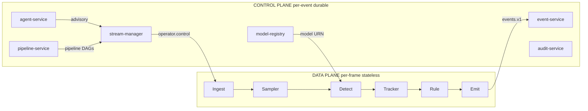

The data plane is **synchronous, lock-free, and short-lived**. It cannot
afford a Postgres roundtrip per frame. The control plane is **transactional,
durable, and slow** (relative to per-frame). It can afford Postgres + gRPC +
optimistic concurrency control.

**Why this matters.** The single most common failure mode in CV platforms
is per-frame work creeping into the control plane (a "just-this-one
Postgres lookup" inside a detector). It blows up under load, melts cache
locality, and makes scheduling nondeterministic. The platform structurally
prevents this by giving the data plane *no access* to control-plane
storage. The dataplane-runner does not have a Postgres client. It does
not have a Temporal SDK. It has bus + claim-check + Triton + nothing else.

**ADR-0001** formalises this. **ADR-0008** makes the corollary explicit:
no frames on the bus. Every bus message carries a URN; the bytes live in
the claim-check store.

---

## The data plane in detail

The data plane runs in the `dataplane-runner` service. It composes a small
number of operators into a per-stream DAG:

| Operator | Purpose |
| --- | --- |
| `ingest` | Pull frames from RTSP / RTMP / file / WebRTC. |
| `sampler` | Down-sample to the target rate (per-stream, per-tenant). |
| `detect` | Run inference (Triton client behind `Detector` interface). |
| `tracker` | Bytetrack / DeepSORT — assign stable IDs to detections. |
| `rule` | Apply rule predicates (dwell, count, zone-enter, line-cross). |
| `emit` | Publish to `events.v1` on the bus. |

Operators talk via in-process channels with bounded buffers. Frames are
**descriptors**, not bytes. The bytes live in the claim-check store
(object storage; pluggable via `pkg/dataplane/claimcheck`). A frame
descriptor is roughly:

```go
type Frame struct {
    StreamID   string
    TenantID   string
    SeqNum     uint64
    Timestamp  time.Time
    BytesURN   string   // claim-check URN, e.g. "cc://t-7/s-1/seq-94312"
    Width      int
    Height     int
    PixFormat  string
}
```

The runner is **horizontally scaled by stream sharding**. Each runner pod
owns a deterministic subset of streams; the stream-manager dispatches
control messages to the correct shard via `operator.control.<shard-id>`.
This is the same sharding model NATS JetStream uses for partitioning, so
the bus does the heavy lifting.

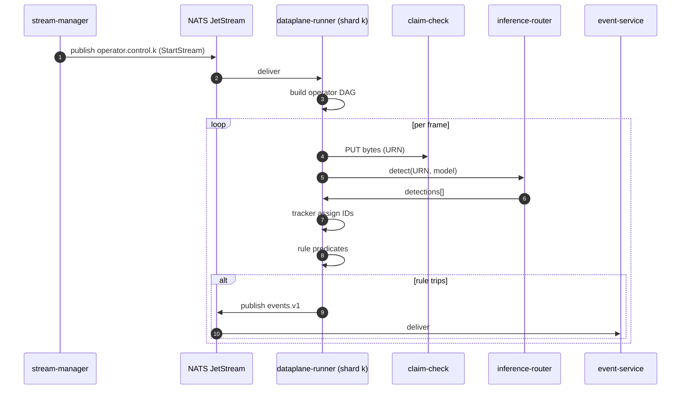

**Why operators?** Composing six small operators is easier to reason about
than one big function. Operators are individually unit-testable
(`pkg/dataplane/operators`). The DAG runner lives in
`pkg/dataplane/dag`. Adding a new operator (face-blur, license-plate
redactor, OCR, etc.) is a single file in `pkg/dataplane/operators/`.

**Why bytetrack vs DeepSORT?** Both are in the operator library; the
choice is per-pipeline in the protobuf model. The default is bytetrack
because it's simpler and has fewer model dependencies.

---

## NVIDIA Triton — the inference substrate

Every `detect` operator in the data plane talks to **NVIDIA Triton
Inference Server** through the `inference-router`. Triton is the
canonical model-serving runtime in AegisVision and the platform is
shaped around it.

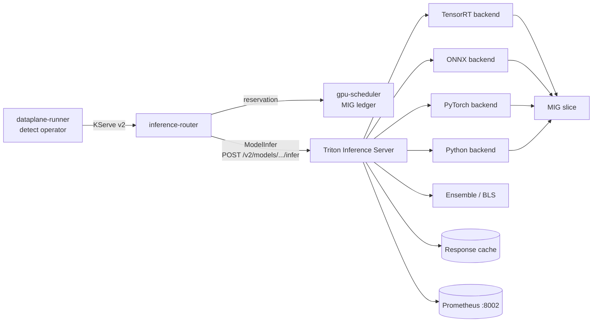

**Why Triton, not "roll your own server".** Triton ships the
production-grade pieces that you would otherwise have to build:

| Requirement | What Triton gives you |
| --- | --- |
| Dynamic batching across concurrent requests | `dynamic_batching` block per model in `config.pbtxt`. |
| Response caching for deterministic models | Triton response cache + per-request `parameters.cache_key`. |
| Multiple framework backends in one process | TensorRT, ONNX Runtime, PyTorch (LibTorch), TensorFlow, Python, ensemble, BLS. |
| Model warm-up before first request | `model_warmup` in `config.pbtxt`. |
| Live model load / unload | `--model-control-mode=explicit` + `POST /v2/repository/models/{name}/load`. |
| Per-model and per-tenant rate limiting | `--rate-limit=execution_count` and per-model rate-limiter resources. |
| Built-in Prometheus metrics | `:8002/metrics` — request counts, queue duration, compute time, response-cache hit/miss. |
| KServe v2 wire protocol | HTTP and gRPC; we use both. |

**MIG-aware scheduling.** Every Triton pod runs on a node selected by
`aegisvision.io/pool: gpu-inference`, requests a single MIG slice
(`nvidia.com/mig-1g.10gb` by default), and **never** runs on a shared
GPU. The `gpu-scheduler` ledger reserves slices before
`inference-router` issues the `ModelInfer` call; reservations are
released on completion or on a deadline expiration. The same
reservation envelope binds canary candidates and shadow-inference
runs so a noisy candidate cannot starve baseline traffic.

**Production model-control.** In production-shape values the Triton
chart starts with `--model-control-mode=explicit` so a freshly-started
Triton pod loads **no** models. Models are loaded by `model-registry`
via the Triton management API, recorded in the registry, and warmed
before the canary controller is allowed to send candidate traffic. The
benefit: model-load storms (a Triton anti-pattern that kills cold
nodes) are impossible by construction. The dev-shape values use
`--model-control-mode=poll` for ergonomics in single-binary tests.

**Dynamic batching defaults.** Every model checked into the
template's reference repository ships a `dynamic_batching` block in
its `config.pbtxt` with `preferred_batch_size: [4, 8]` and
`max_queue_delay_microseconds: 2000`. These are tuning starts — see
[`docs/triton.md`](./docs/triton.md) for the calibration procedure.

**Response cache.** Triton's response cache is enabled by default
(`--response-cache-byte-size=1073741824` = 1 GiB). For models where
cache is unsafe (per-frame detectors) the cache is disabled in the
model `config.pbtxt`. The `inference-router` surfaces
`triton_response_cache_hit{model,version}` on every response so cost
accounting can credit cached calls correctly.

**Telemetry.** Triton's Prometheus endpoint is scraped via the chart's
`ServiceMonitor` on `:8002`. We alert on:

- `nv_inference_queue_duration_us` p99 above SLO → KEDA scales out.
- `nv_inference_request_failure` > 0 → page on-call.
- `nv_gpu_utilization` saturating combined with high queue duration →
  capacity warning, prefetch the next shard.
- `nv_inference_compute_infer_duration_us` regression > 20% → drift
  the canary controller.

**Failure modes the platform plans for.**

| Failure | Detection | Reaction |
| --- | --- | --- |
| Triton model evicted under cache pressure | Cold-start `compute_input_duration_us` spike | `prefetch-service` warms ahead of demand; `inference-router` retries once. |
| Triton OOM on a MIG slice | Pod restarts | PDB caps concurrent eviction; `gpu-scheduler` reissues reservations. |
| Triton model-load storm on cold node | `--model-control-mode=explicit` + `model-registry` rate-limit | Storm is impossible by construction. |
| Response-cache thrash on a high-cardinality model | Hit rate drop alarm | Disable cache for that model in its `config.pbtxt`. |
| Queue duration spike | KEDA HPA on `nv_inference_queue_duration_us` | Scale out before glass-to-event SLO burns. |

The full operating manual is in [`docs/triton.md`](./docs/triton.md);
the production runbook is in
[`docs/runbooks/triton.md`](./docs/runbooks/triton.md); the chaos
experiment is `deploy/chaos/triton-model-evict.yaml`.

---

## The control plane in detail

The control plane is built around a set of CRUD-and-revision services,
each owning one resource family. They share *nothing* in memory; they
communicate via gRPC (per ADR-0007 — protobuf-everywhere).

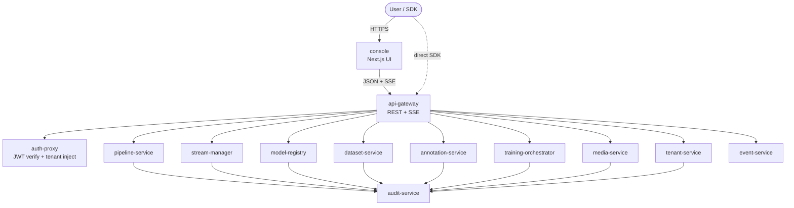

**Resource model.** Each resource has:

- An **opaque public ID** (`pl_abc123`, `str_xyz789`).
- A **revision history** (pipelines have revisions; models have versions).
- **Optimistic concurrency** via an `etag`.
- **Idempotency-Key** on every mutating endpoint.
- An **audit record** for every state transition.

**Errors.** All public errors use **RFC 9457 `application/problem+json`**.
Constructed via `pkg/platform/problem`. Trailers include `trace-id` so an
operator can pivot from a customer report straight into Tempo.

**Pagination.** Opaque, signed, HMAC-keyed cursors. Never offset. The
cursor encodes (sort_key, sort_value, etag) and is signed with
`AEGIS_CURSOR_KEY` (≥ 32 bytes). Constructed via
`pkg/platform/pagination`. The signing means a tampered cursor is
rejected; the opacity means clients can't depend on the encoding.

**Idempotency.** Wired via `pkg/platform/middleware/idempotency`. Caches
the *full response* (status + headers + body) for 24h. Replays within
that window are byte-identical. This is critical for SDKs that retry on
network failure (every SDK we ship retries on 502/503/504 by default).

**Why does api-gateway proxy SSE rather than the SDK reading event-service
directly?** Three reasons. First, the SDK only needs one URL. Second, the
gateway can apply per-tenant rate limits to SSE the same way it does to
REST. Third, the gateway enforces auth uniformly.

---

## The intelligence tier

The intelligence tier wraps the platform with agents, RAG, and an LLM
gateway. The critical architectural property: **there is exactly one LLM
endpoint**.

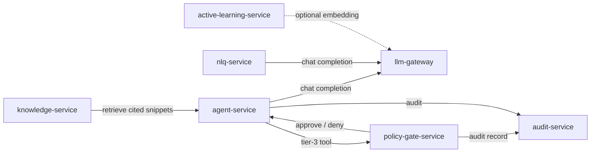

**Why one gateway?** Six reasons:

1. **Safety in one place.** The sanitizer + PII redactor + refusal
   threshold lives in `pkg/llm/safety`. If we had N call sites, the
   safety layer would diverge.
2. **Token accounting in one place.** Per-tenant accounting via
   `cost-accounting`.
3. **Rate limit in one place.** Per-tenant + per-model.
4. **Backend swap.** Today: hosted OpenAI / Anthropic / Bedrock / local
   vLLM / Triton+TRT-LLM. Callers don't know.
5. **Audit in one place.** Every prompt + response goes to
   `audit-service`.
6. **Refusal in one place.** `pkg/llm/safety` enforces a refusal
   threshold; the agent runtime checks the response and won't continue
   if refused.

**Why must the agent cite?** Because the alternative is a confidently
wrong answer that names a stream-ID that doesn't exist. We have seen
this happen on every CV platform that did not enforce citation. The
`knowledge-service` returns snippets with their source path; the agent
prompt template includes the snippets verbatim; refused responses
without citations are surfaced as errors by the agent runtime (ADR-0020).

**Bounded autonomy.** The agent has tools, each with a **risk tier**:

| Tier | Examples | Behaviour |
| --- | --- | --- |
| 0 | `query_knowledge`, `read_event_stream`, `describe_pipeline` | Auto-execute. |
| 1 | `summarise`, `compare`, `predict_dwell` | Auto-execute. |
| 2 | `retrain_advisory`, `propose_canary_plan` | Auto-execute, generates a *proposal*. |
| 3 | `promote_model`, `override_retention`, `force_failover` | Route through `policy-gate-service`. Refused in code if no gate. |

The runtime *refuses* tier-3 execution without a resolved gate. This
isn't a prompt instruction — it's a code path in `pkg/agent/agent.go`
that returns an error before the tool fires. The agent then waits on
`gate.resolved.<request-id>` (subscribed by `agent-service` in `main.go`)
and auto-resumes when the human approves. This is documented in
[`docs/agents.md`](./docs/agents.md).

---

## Adaptive autonomy tier

On top of the intelligence tier sits the *adaptive autonomy* tier:
canary, shadow, drift, SLO, prefetch.

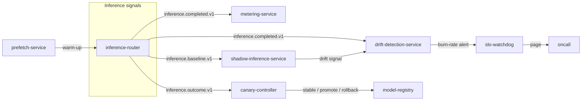

**Canary controller** (ADR-0023). Uses Wilson's lower-bound proportion
test on a binomial outcome (correct vs incorrect). Requires a *minimum
sample size* before any decision (typically 1000 outcomes). If the
lower bound on the new model's success rate is below the baseline by
more than the configured margin, **automatic rollback** fires. Promotion
is **always gated** — the controller can recommend promotion, but the
actual model-registry update routes through `policy-gate-service`.

**Shadow inference** (ADR-0024). Same-URN comparison. Candidate model
runs on the same frame URN as the baseline; the candidate's detection
never reaches the tenant; only the comparison metric does. Critically:
**shadow never publishes a tenant-facing detection**. The wiring goes
candidate → shadow-inference-service → observation table, baseline →
event-service → tenant.

**Drift detection** (ADR-0025). Sliding-window JS / KL / TVD divergence
on class distributions vs a reference distribution. The reference is
established at training time and stored in `model-registry`. Drift
fires a metric, not a tenant-facing event — operators decide what to
do.

**SLO watchdog** (ADR-0025). Google SRE workbook implementation:
multi-window burn-rate. Two windows (1h fast / 6h slow); page when both
burn rates exceed thresholds. False-positive resistant by design.

**Prefetch service** (ADR-0026). A 7×24 EMA grid per stream tracks
"likelihood of needing this model at this hour-of-week." Warm-ups are
dispatched at a configurable horizon (typically 10 min) ahead of
expected demand. This buys you cold-start latency without paying for
hot models all day.

---

## Storage architecture

Two storage tiers, each chosen for the shape of the data.

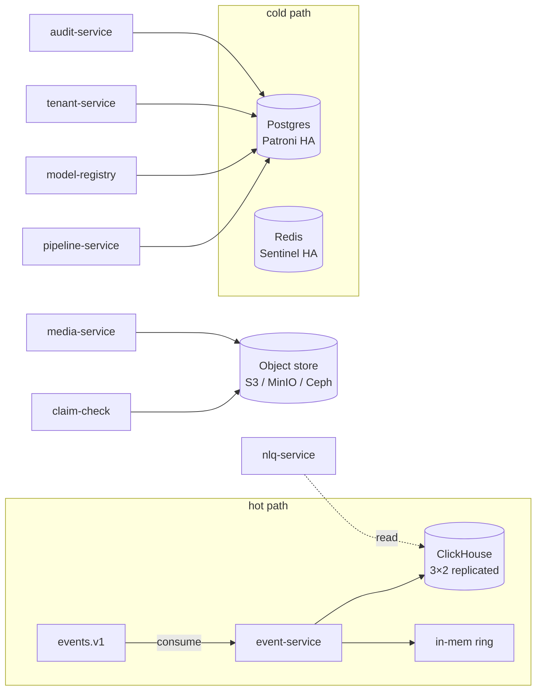

**ClickHouse** (ADR-0002). Detections + events firehose. Columnar,
replicated 3×2 via the ClickHouse Operator. Backed up daily via
`clickhouse-backup` with SSE-KMS at rest. Schema migrations gated.

**Postgres** (Patroni HA). Metadata: pipelines, models, datasets,
annotations, tenants, projects, members, audit records. Per-tenant
schema for the largest tenants; shared schema with `tenant_id` for the
rest. WAL-G + SSE-KMS for backups. Restore drill quarterly via
`tools/dr-drills/postgres-restore.sh`.

**Redis Sentinel.** Rate limit counters + idempotency cache. Sized to
fit hot working set. *Not* a system of record — losing Redis loses
counters for the current window, not data.

**Object store.** Claim-check store + media recordings + datasets +
model artifacts. SSE-KMS per-tenant. Crypto-shredding deletion is a
key destruction (ADR-0014).

**Why three storage tiers?** Different shapes, different access
patterns, different cost profiles. ClickHouse is *fast at scans*,
*slow at point updates*. Postgres is *fast at point updates*, *slow at
scans*. Object store is *cheap at GB*, *slow per-object*. Picking one
for everything makes one of these axes painful.

---

## Identity, authn, authz

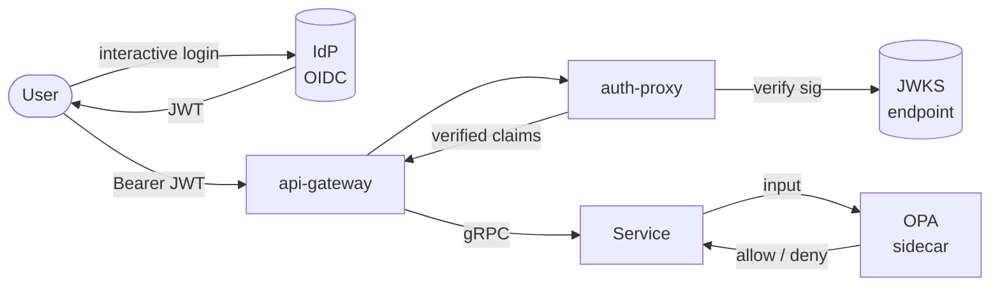

**JWT verification.** HS* (HMAC) is **deliberately not supported** —
sharing the signing key with every verifier defeats the point of OIDC.
The platform verifies against the IdP's JWKS endpoint and caches keys
with the standard rotation discipline.

**OPA.** Each service runs an OPA sidecar evaluating a policy from
`/v1/data/aegisvision/<service>`. The policy is per-service Rego; the
default-deny pattern is enforced. Policies live in `deploy/helm/<svc>/templates/opa-policy.yaml`.

**SPIRE.** Workload identity. Every pod gets a SPIFFE ID; mesh
authorization in Istio uses these IDs (e.g.
`cluster.local/ns/aegis-system/sa/api-gateway`).

**Tenant injection.** `auth-proxy` reads the JWT's `tenant_id` claim
and injects it into every downstream gRPC call as a metadata header.
Services treat the header as authoritative; the gateway is the only
component that decides which tenant a request belongs to.

---

## Multi-tenancy model

The platform is **multi-tenant by default**, single-tenant by
deployment choice.

**At the data layer:**

- Postgres uses **`tenant_id` as the leading column** in every index.
- ClickHouse uses **`tenant_id` as the first sort key**.
- Object store uses **per-tenant prefixes** with per-tenant KMS keys.

**At the compute layer:**

- The dataplane-runner shards by `(tenant_id, stream_id)`.
- The inference-router applies a per-tenant model allow-list.
- Triton model instances are tagged with a `tenant_id` instance group
  for high-value tenants; the rest share a pool.

**At the network layer:**

- Each tenant can opt into a per-tenant namespace for advanced
  multi-tenant isolation. Otherwise they share `aegis-system`.

**Crypto-shredding** (ADR-0014). Each tenant has a Vault transit key.
Destroying that key renders the tenant's encrypted bytes unreadable —
including in backups. This is how we satisfy GDPR Article 17
deletion requests at scale: no per-row scan, no backup mutation, one
key destruction.

---

## Bus architecture

The platform uses a **dual-bus** model: NATS JetStream for low-latency
+ Kafka for durable replay.

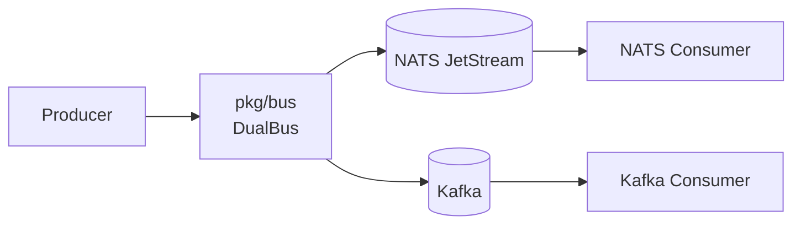

**Why two?** NATS is fast (<1 ms locally), Kafka is durable
(replay-on-demand, indefinite retention). The dual-bus is in
`pkg/bus/dualbus.go`. A subject like `inference.completed.v1` is
published to both; low-latency consumers (metering, drift detection)
read from NATS; long-tail analytics reads from Kafka.

**Subject taxonomy.** Subjects are versioned (`.v1` suffix) and
domain-scoped:

- `operator.control.<shard>` — stream-manager → dataplane-runner.
- `events.v1` — dataplane-runner → event-service.
- `inference.completed.v1` — inference-router → metering, drift,
  cost-accounting.
- `inference.baseline.v1` — inference-router → shadow-inference.
- `inference.outcome.v1` — feedback → canary-controller.
- `gate.requested.<request-id>` — policy-gate-service → human UI.
- `gate.resolved.<request-id>` — policy-gate-service → agent-service.
- `model.promoted.v1` — model-registry → canary-controller +
  prefetch-service.
- `tenant.deleted.v1` — tenant-service → crypto-shred fan-out.

**Critical invariant: no frames.** Nothing in this list ever carries
imagery bytes. Frame references travel as claim-check URNs in
`events.v1`. (ADR-0008. Violations are P0.)

**5-test integration smoke** (`tools/integration/integration_test.go`)
asserts this taxonomy holds: every subject above has a producer and a
consumer, and the wildcard pairs match. Drift triggers a test failure
in CI before deploy.

---

## Observability architecture

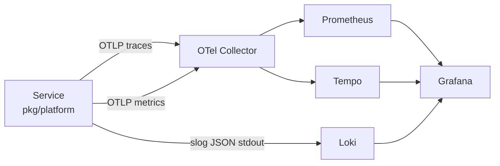

**Logs.** Structured (`slog`), JSON, stdout. Every log line carries
`tenant_id`, `request_id`, `trace_id`. The platform forbids
unstructured `fmt.Print*` for non-CLI code.

**Metrics.** **RED** (rate / errors / duration). Plus a small number of
service-specific gauges. Every service ships a `ServiceMonitor`.
Per-tenant cardinality is bounded; we never put unbounded user input
into a metric label.

**Traces.** OpenTelemetry over OTLP. The api-gateway samples 100% of
errors and 1% of successes by default; per-tenant overrides exist for
high-value debugging. Trace IDs flow through bus messages via a
`trace-id` header in `bus.Message`.

**Dashboards.** Stock Grafana dashboards in
`deploy/platform/observability/grafana/`. Categories:

- Per-service RED dashboards (auto-generated from `pkg/platform/metrics`).
- Glass-to-event latency (end-to-end).
- Bus subject health (lag, redelivery rate, consumer count).
- GPU utilization (per MIG slice).
- LLM token + cost per tenant.
- Canary decision board.
- Drift heatmap.
- SLO burn-rate.

---

## Deployment architecture

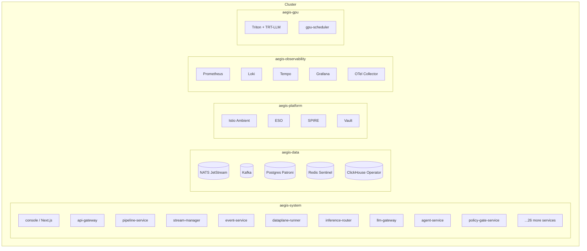

**Helm charts.** Each service has a chart under `deploy/helm/<svc>`.
Every chart includes:

- `Deployment` (or `StatefulSet`).
- `Service`.
- `ServiceAccount`.
- `AuthorizationPolicy` (Istio, ALLOW list).
- `PeerAuthentication` (mTLS STRICT).
- `NetworkPolicy` (default-deny).
- `ServiceMonitor` (Prometheus scrape).
- `HorizontalPodAutoscaler`.
- `PodDisruptionBudget`.
- `OPA Policy` ConfigMap (where applicable).

The **conformance test** in `tools/conformance/` asserts all of the
above for every chart. Adding a chart without these fields fails CI.

**ArgoCD ApplicationSet** in `deploy/argocd/applicationset.yaml`
reconciles all 39 charts from one git source.

**Edge profile.** A reduced operator set (`deploy/helm/edge-profile`)
runs on k3s for on-prem / edge. Outbox-based sync to core. See
`services/edge-gateway`.

---

## Failure-mode analysis

Every architectural decision is graded against the failure modes it is
designed to survive.

| Failure | Impact w/o protection | Mitigation |
| --- | --- | --- |
| NATS pod kill | Bus offline | JetStream 3-replica + chaos drill in `deploy/chaos/nats-pod-kill.yaml` |
| Kafka broker loss | Durable bus offline | 3-broker MSK / Strimzi cluster + chaos drill |
| Postgres primary loss | Control plane offline | Patroni failover + WAL-G PITR + chaos `postgres-failover.yaml` + DR drill `postgres-restore.sh` |
| ClickHouse rolling restart | Event tail | Replicated 3×2 + chaos `clickhouse-rolling-restart.yaml` + DR `clickhouse-restore.sh` |
| GPU OOM | Inference 5xx | MIG slicing + `gpu-scheduler` reject + chaos `gpu-oom-reject.yaml` |
| AZ partition | Multi-zone outage | Cross-AZ replicas + chaos `az-partition.yaml` |
| Triton model evict | Cold start | Predictive prefetch + `inference-router` retry + chaos `triton-model-evict.yaml` |
| LLM upstream timeout | Agent stuck | Per-tool deadline + `llm-gateway-timeout` chaos drill |
| Policy gate down | Tier-3 work blocked | Multi-replica + chaos `policy-gate-down.yaml` (by design — refuse > unsafe) |
| Webhook 5xx | Tenant-facing 5xx | Idempotent retry + DLQ + chaos `webhook-receiver-5xx.yaml` |

Each chaos experiment has an **assertion** baked in. Failing the
assertion fails CI when chaos drills run nightly against staging.

---

## Capacity model

Targets the platform was designed against.

| Dimension | Target | How achieved |
| --- | --- | --- |
| Streams per cluster | 10,000 | Sharded dataplane-runner, NATS subject-shard partitioning |
| Detections / sec | 1,000,000 | ClickHouse 3×2 + columnar inserts + batch buffer |
| Concurrent agent sessions | 1,000 | agent-service stateless + Redis session checkpoint |
| Glass-to-event p95 | < 300 ms | Operator runtime, no Postgres in hot path, NATS local-affinity |
| Glass-to-event p95 (measured local) | 2.7 ms | (above + small dev cluster) |
| Tenant onboarding time | < 5 min | tenant-service + ESO + Vault transit key + namespace template |
| Air-gapped install time | < 30 min | tools/airgap/install.sh against pre-loaded registry |
| Quarterly DR drill time | < 4 h | tools/dr-drills/run-quarterly.sh |

Load tests in `tools/loadtest/`:

- `streams-10k.js` — 10,000 concurrent streams against a staging
  cluster.
- `agents-1k.js` — 1,000 concurrent agent sessions.
- `slo-gate.js` — SLO gate (fail-the-build if p95 > target).

---

## Anti-patterns we explicitly refuse

- **Image bytes on Kafka / NATS.** ADR-0008. Use claim-check.
- **Per-frame Postgres calls.** ADR-0001. Use an event.
- **Per-frame Temporal activities.** ADR-0001. Temporal is control plane only.
- **A second agent runtime in `autonomy-orchestrator`.** ADR-0022. Open a session against `agent-service`.
- **A force-promote endpoint on `canary-controller`.** ADR-0023. Promotion routes through `policy-gate-service`.
- **Random firehose draw in `active-learning-service`.** ADR-0019. Use uncertainty + diversity.
- **Plain-LLM answers about platform facts.** ADR-0020. Cite or refuse.
- **Auto-execution of tier-3 tools by the agent.** ADR-0014 / 0017. Gate or refuse.
- **HMAC-signed JWTs.** Sharing the signing key with verifiers defeats OIDC.
- **`auth.AllowAll` outside dev / test.** The platform panics if it sees this with `AEGIS_OPA_ENDPOINT` unset.
- **`fmt.Println` for service logs.** Use `slog` via `pkg/platform/logging`.
- **Offset pagination.** Cursor only, signed, opaque.
- **Mutating endpoint without `Idempotency-Key`.** Middleware enforces.
- **A new transport without a protobuf contract.** ADR-0007.

---

## Where to go next

- [`SETUP_GUIDE.md`](./SETUP_GUIDE.md) — set up locally, on a cluster, or
  air-gapped.
- [`docs/adr/`](./docs/adr/) — the 30 ADRs that shape these choices.
- [`docs/runbooks/`](./docs/runbooks/) — operate it.
- [`docs/compliance/`](./docs/compliance/) — show your auditor.
- Each service's `README.md` — operate that service in detail.
