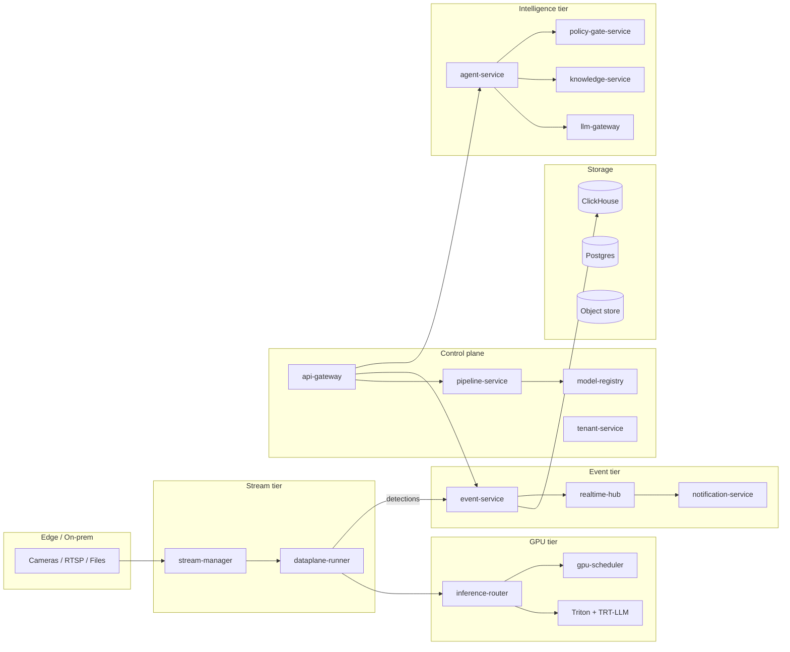
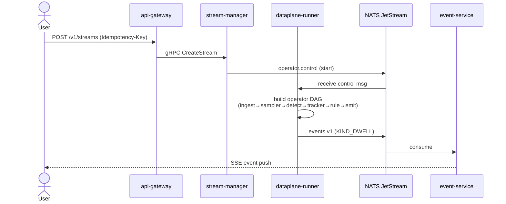
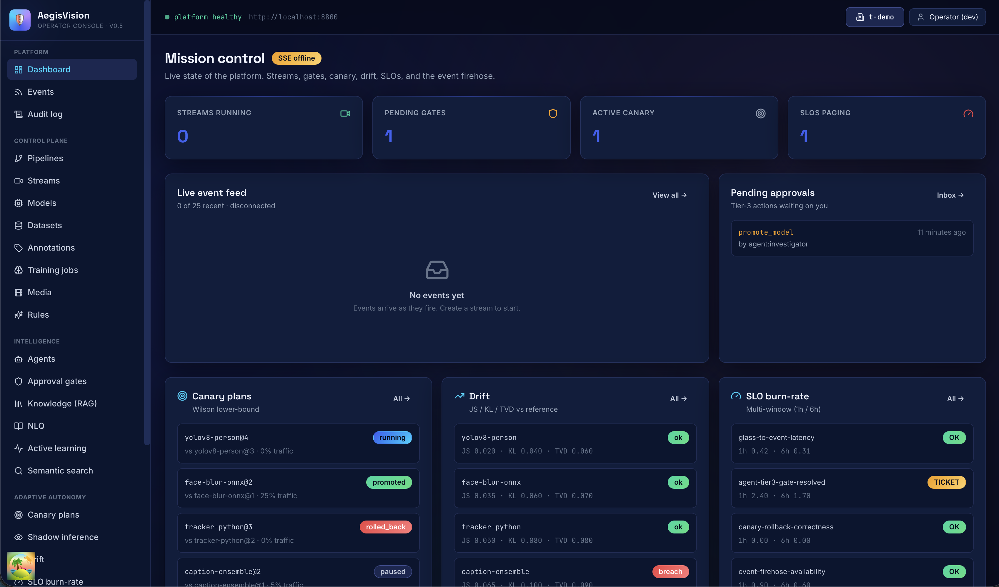

<div align="center">

<h1>🛡️ AegisVision</h1>

<p><b>An open, distributed, GPU-native computer-vision platform <em>template</em>
that any individual or organization can fork, brand, and operate as the
backbone of their own realtime perception product — multimodal inference on
NVIDIA Triton, bounded-autonomy agents, gated promotion, and signed
air-gapped delivery, out of the box.</b></p>

<p>
  
  
  
  
  
  
  
  
  
  
  
  
  
  
  
  
  
  
  
  
  
  
  
  
  
  
  
  
  
  
  
  
  
  
  
  
  
  
  
  
  
  
  
  
  
  
  
  
  
  
  
  
  
  
  
  
  
  
  
  
  
  
  
  
  
  
</p>

<hr/>


</div>

---


AegisVision is a **production-grade template** for building computer-vision
products. Fork it, point it at your cameras and your **NVIDIA Triton
Inference Server**, and you have the backbone of a realtime perception
platform — without re-inventing claim-check ring buffers, MIG-aware GPU
scheduling, Wilson-bound canary promotion, RAG-cited agents, or a
signed air-gap bundle. It encodes the lessons learned from operating
production CV deployments as
load-bearing architectural rules:

- **Frames must never go on the bus.** (Claim-check, ADR-0008.)
- **The control plane must never see per-frame work.** (Two-plane separation,
  ADR-0001.)
- **GPUs are partitioned, not shared by hope.** (MIG-default + Triton
  model-control, ADR-0003.)
- **Agents must not auto-execute consequential actions.** (Bounded autonomy,
  ADR-0014/0017.)
- **Every public answer about platform state must cite its source.** (RAG over
  plain LLM, ADR-0020.)
- **Canary promotion is a statistical test, not a hand-wave.** (Wilson lower
  bound, ADR-0023.)
- **Air-gapped installation is a first-class CI artifact, not an afterthought.**
  (Bundle-as-day-one, ADR-0027.)

This repository ships **35 Go services + 1 Next.js console**, **14
shared libraries**, **39 Helm charts** (including a dedicated, hardened
NVIDIA Triton chart), **30 Architecture Decision Records**, and a
complete set of **compliance evidence packages** (SOC 2, EU AI Act, GDPR
DPIA, pen-test scope). The codebase is **green end-to-end** under a
cross-service integration smoke suite and a 39-chart Helm conformance
test, with a production-ready Next.js console at
[`services/console/`](./services/console) that exposes every public API as
a usable page. Everything in this repository is permissively licensed
(Apache 2.0) — you can lift it wholesale and use it as the foundation of
your own CV product.

---

## Table of contents

1. [What is AegisVision?](#what-is-aegisvision)
2. [Use AegisVision as a template](#use-aegisvision-as-a-template)
3. [Capabilities at a glance](#capabilities-at-a-glance)
4. [Repository layout](#repository-layout)
5. [Quickstart — walking skeleton](#quickstart--walking-skeleton)
6. [The 35 services](#the-35-services)
7. [NVIDIA Triton — the GPU inference core](#nvidia-triton--the-gpu-inference-core)
8. [Architectural commitments (the ADRs)](#architectural-commitments-the-adrs)
9. [Public API discipline](#public-api-discipline)
10. [Errors, idempotency, pagination](#errors-idempotency-pagination)
11. [Observability](#observability)
12. [Security posture](#security-posture)
13. [Deploy](#deploy)
14. [How to contribute](#how-to-contribute)
15. [Further reading](#further-reading)

---

## What is AegisVision?

AegisVision is a **horizontally-scaled, multi-tenant, GPU-native visual
intelligence platform**. In one sentence: it ingests video streams from any
source, runs configurable detection / tracking / reasoning pipelines on
GPUs, fires rule-based and ML-based events, supports an agentic conversational
interface over the platform, continuously learns from operator feedback, and
deploys to anything from a single laptop to a 10,000-stream production
Kubernetes cluster (or an air-gapped DMZ).

Concretely, the platform answers questions like:

- *"Was there a person on the loading dock between 02:00 and 02:15?"*
- *"How many forklifts crossed zone 7 today, and which ones lingered more
  than 60 seconds?"*
- *"This new model improves recall by 4% — promote it if the drop in
  precision is statistically insignificant."*
- *"Alert me whenever the dwell-time SLO burns a quarter of its monthly
  error budget in under an hour."*
- *"Show me the five most recent uncertain detections so I can label them."*
- *"Has data drift in stream pool A crossed the model owner's threshold?"*

It does this with **bounded autonomy**: agents can answer, advise, and execute
reversible work, but anything consequential (promoting a model, overriding a
retention policy, force-rolling-back a canary) routes through a
human-approval gate by design. There is no force-promote endpoint anywhere
in the platform — that is a deliberate architectural property, not an
omission.



---

## Use AegisVision as a template

AegisVision is structured to be **forked and adapted** — not just admired.
The pieces you usually have to glue together yourself are already wired:

- **A hardened NVIDIA Triton chart** with MIG-aware scheduling, KServe v2
  client, response-cache, dynamic batching, model warm-up, model-control
  modes, and KEDA-driven autoscaling on Triton's own queue-duration
  metrics. See [`docs/triton.md`](./docs/triton.md) and
  [`deploy/helm/triton/`](./deploy/helm/triton).
- **A two-plane architecture** (control plane / data plane) with strict
  rules about what is allowed where, so your perception product scales
  without becoming an event-loop tar pit.
- **A bounded-autonomy agent runtime** that you can extend with your own
  tools while inheriting the tier-3 human-gate refusal in code.
- **Compliance scaffolding** (SOC 2 / EU AI Act / GDPR / pen-test) you
  can adopt verbatim or trim, with evidence pipelines wired to the
  audit log.
- **GitOps-first deploy** (ArgoCD ApplicationSet + 39 Helm charts) and
  a signed air-gap bundle for regulated environments.

### Adapt it to your product in three moves

1. **Rename the brand.** Run
   `task template:rebrand:dry-run PRODUCT_NAME=YourProduct PRODUCT_SLUG=yourproduct ENV_PREFIX=YOURPROD`
   first to preview, then drop `:dry-run` to apply. The full
   playbook — module path rewrite, LICENSE handling, secrets,
   IdP wiring, observability, and an adoption checklist — lives in
   [`TEMPLATE.md`](./TEMPLATE.md).
2. **Plug in your models.** Drop your TensorRT / ONNX / PyTorch / Python
   models into the Triton model repository (see
   [`docs/triton.md`](./docs/triton.md) for the layout, plus an
   example tree at
   [`deploy/helm/triton/examples/`](./deploy/helm/triton/examples))
   and register them via the platform's `/v1/models` endpoint.
3. **Pick a deploy path.** Walking-skeleton on a laptop, ArgoCD on a
   cluster, or signed air-gap bundle on a DMZ — see
   [`SETUP_GUIDE.md`](./SETUP_GUIDE.md).

The ADRs explain *why* each rule exists, so you can override them on
purpose — never by accident.

After your first deploy, run `task template:check` — it walks the
adoption checklist (modules build, `go vet`, race-detected tests,
Helm conformance, integration smoke, proto lint) and reports
anything red.

To exercise the full stack locally with one command:

```bash
task dev:up           # docker-compose: Postgres + NATS + Kafka + ClickHouse + MinIO + OTel
task run:event-service &
task run:api-gateway &
# … any other services you want to iterate on …
task seed:demo        # seeds a demo tenant, pipeline, model, stream
```

See [`deploy/dev/README.md`](./deploy/dev/README.md) for env-var
exports and connection URLs.

---

## Capabilities at a glance

The platform is organized into seven capability areas. Every area is
load-bearing and verified end-to-end under unit, conformance, and
integration suites.

| Capability area | What it gives you |
| --- | --- |
| **Foundations** | Buf-managed protobuf contracts, the golden-path `pkg/platform` library (logging, OTel, metrics, problem+json, idempotency, pagination, health, shutdown), and a walking-skeleton spine. |
| **Glass-to-event ingest** | `api-gateway`, `pipeline-service`, `stream-manager`, `event-service`, `dataplane-runner` — produces a real detection event end-to-end with p95 ≈ 2.7 ms on local hardware (300 ms target). |
| **GPU hot path** | NVIDIA Triton Inference Server with MIG-aware scheduling, dynamic batching, response cache, model warm-up, KServe v2 client; `inference-router` + `gpu-scheduler` + canary plumbing. |
| **Multi-tenant + edge + storage** | Patroni Postgres, ClickHouse, Vault transit per-tenant keys, Redis Sentinel, k3s edge profile with outbox sync. |
| **Intelligence tier** | One LLM/VLM gateway, bounded-autonomy agent runtime, RAG citation discipline, NLQ, active learning, policy-gate-service. |
| **Adaptive autonomy** | Canary controller (Wilson lower bound), shadow inference, drift detection (JS/KL/TVD), multi-window SLO burn-rate, predictive prefetch, autonomy orchestrator. |
| **Operations & compliance** | Compliance evidence service, air-gapped bundle builder, chaos engineering harness, DR drill runner, release automation, append-only audit log. |
| **Production console** | Next.js 14 + Tailwind UI exposing every public REST endpoint as a usable page (33 routes). Conformance-clean Helm chart. |

**49 of 49 Go modules** build and test green under `-race`.
**39 of 39 Helm charts** pass the conformance test (mTLS STRICT, AuthZ ALLOW
list, NetworkPolicy default-deny, ServiceMonitor, HPA, PDB).
**Cross-service integration smoke tests** cover bus subjects, wildcards,
concurrent gate resolutions, the bounded-autonomy round trip, and LLM
safety refusal.

Adopting AegisVision as a template means you inherit all of this on day
one. A real production rollout still needs your own SOC 2 / EU AI Act
audit window and a physical cluster — the platform is *ready for* them.

---

## Repository layout

```
/proto                    Buf-managed protobuf contracts. ADR-0007.
/pkg
  /platform               Golden-path Go library: logging, OTel, metrics,
                          problem+json, health, pagination, idempotency,
                          shutdown, config, auth, middleware, RFC9457.
  /bus                    Event bus abstraction: NATS, Kafka, in-process, DualBus.
  /dataplane              Streaming operator runtime + claim-check ring +
                          operators (ingest, sampler, detect, tracker, rule, emit).
  /store                  SQL access + migrate runner (Patroni, sqlite for dev).
  /llm                    LLM gateway client + safety layer (sanitize + redact +
                          refusal threshold).
  /agent                  Bounded-autonomy agent runtime + tool router + gate hook.
  /embeddings             Vector store + chunker; pgvector + faiss-compatible.
  /intelligence           Active learning + uncertainty + NLQ types.
  /canary                 Wilson lower bound + min-sample floor + traffic split.
  /autonomy               Cron + signal scheduler + divergence math (JS / KL / TVD).
/services                 35 Go services + 1 Next.js console. Each its own
                          bounded context, each its own deployable.
/deploy
  /helm                   39 charts. One per service, plus nats, dataplane
                          runtime, triton, edge-profile, and the console.
  /argocd                 ApplicationSet for GitOps reconciliation of all charts.
  /k8s
    /base                 Namespaces, priority classes, default-deny network policy.
    /policies             Kyverno admission policies.
    /quotas               Per-namespace resource quotas.
  /platform
    /istio                Ambient mTLS STRICT + AuthorizationPolicies.
    /observability        OpenTelemetry collector, Prometheus, Loki, Tempo.
    /spire                SPIRE workload identity.
    /vault                Vault + transit + ExternalSecrets bootstrap.
    /data                 Patroni Postgres, Redis Sentinel, ClickHouse Operator.
    /argocd               ArgoCD bootstrap.
  /chaos                  10 chaos experiments (chaos-mesh manifests).
  /terraform              Cloud-side infrastructure (managed Kubernetes etc.).
/tools
  /airgap                 build.sh / install.sh / verify.sh — bundle the world
                          for offline install. ADR-0027.
  /conformance            38-chart Helm chart conformance test (mTLS, AuthZ, NP).
  /integration            5-test cross-service contract smoke suite.
  /loadtest               k6 scripts: 10k streams, 1k agents, slo gate.
  /dr-drills              Quarterly DR drill harness + per-component restore.
  /audit                  Audit-log append validator + signature verifier.
  /proto                  Lint + breaking-change checker for /proto.
  /scaffold               Service scaffolder (used to bootstrap a new service).
  /scripts                Misc operational scripts.
/docs
  /adr                    30 Architecture Decision Records.
  /compliance             SOC 2 controls, EU AI Act conformity, GDPR DPIA,
                          pen-test scope, full evidence packages.
  /runbooks               Operational runbooks (incident, oncall, DR, chaos,
                          drift spike, canary rollback, agent incident).
```

---

## Quickstart — walking skeleton

The walking skeleton (ADR-0016) is the smallest end-to-end slice of the
platform — five services + an embedded NATS in five terminals — and
produces a real detection event in under five seconds. It is the
recommended starting point if you are evaluating AegisVision as a
template for your own product.

```bash
brew install go-task                       # task runner
task bootstrap                             # install tools + first build
task proto                                 # regenerate protobuf bindings
task build                                 # build every Go module
task test                                  # run unit tests with -race
```

Then in five terminals:

```bash
# 1) event-service embeds NATS in dev mode
AEGIS_EMBED_NATS=true task run:event-service
# Note the URL it logs, then export it for the others:
export AEGIS_NATS_URL=nats://127.0.0.1:NNNNN

# 2-4) The control + data plane
task run:pipeline-service
AEGIS_NATS_URL=$AEGIS_NATS_URL task run:stream-manager
AEGIS_NATS_URL=$AEGIS_NATS_URL task run:dataplane-runner

# 5) The public REST + SSE entrypoint + console
AEGIS_STREAM_MANAGER_ADDR=localhost:9092 \
AEGIS_EVENT_SERVICE_URL=http://localhost:8090 \
AEGIS_CONSOLE_DIR=$(pwd)/services/api-gateway/console \
  task run:api-gateway
```

In two more terminals:

```bash
# Subscribe to the SSE feed:
curl -N -H 'X-Tenant-Id: t-demo' \
  'http://localhost:8080/v1/events:stream?stream_id=stream-dock-1'

# Create a stream (this fires the synthetic detector, the dwell rule
# trips at ~5 s, the event lands on NATS, event-service consumes it, and
# the SSE pushes it to your subscriber):
curl -X POST -H 'X-Tenant-Id: t-demo' -H 'Idempotency-Key: 1' \
  -H 'Content-Type: application/json' \
  -d '{"name":"dock-1","project_id":"p1","protocol":"file","url":"file:///x","pipeline_id":"p-walking"}' \
  http://localhost:8080/v1/streams
```

Or, simpler, open <http://localhost:8080/console/> in a browser.

The walking-skeleton flow is:



For full deployment paths (online ArgoCD / offline air-gapped), see
[`SETUP_GUIDE.md`](./SETUP_GUIDE.md).

---

## The 35 services

The platform is decomposed into **35 services**, each in its own Go module,
each with a single bounded responsibility, each communicating over typed
protobuf contracts (gRPC + JSON/REST for tenant-facing APIs).

### Control plane (Temporal-friendly)

| Service | Purpose |
| --- | --- |
| `api-gateway` | Public REST entrypoint. JWT verify via JWKS, OPA AuthZ, RFC 9457 errors, idempotency, cursor pagination, SSE proxy. |
| `pipeline-service` | CRUD + revisions for pipeline DAGs. ADR-friendly resource model. |
| `stream-manager` | Stream lifecycle. Dispatches control messages to dataplane-runner via NATS `operator.control`. |
| `model-registry` | Versioned model artifacts + signatures + canary planning. |
| `dataset-service` | Datasets + dataset versions + lineage. |
| `annotation-service` | Labels + label-policy versions. |
| `training-orchestrator` | Wraps training jobs (Kubeflow / Ray). Tracks artifacts. |
| `media-service` | Recordings + clips + retention policies (crypto-shredded by tenant key). |
| `tenant-service` | Tenants + projects + members + RBAC. |
| `auth-proxy` | JWT verify against JWKS. Tenant injection. No HMAC support (ADR-0018). |
| `audit-service` | Append-only audit log. Hash-chained. Failed-audit-required (ADR-0014). |

### Data plane (per-frame, never on Temporal)

| Service | Purpose |
| --- | --- |
| `dataplane-runner` | Hosts the streaming operator DAG (ingest → sampler → detect → tracker → rule → emit). The `Detector` interface lets you swap the Go-native operator for NVIDIA DeepStream, a pure-Triton client, or a custom backend without touching the rest of the pipeline. |
| `inference-router` | The GPU front door. Routes inference requests to NVIDIA Triton over the KServe v2 protocol (HTTP today, gRPC streaming + shared memory swap-in via the same `Detector` interface), surfaces Triton response-cache hits, applies per-tenant model allow-lists, and publishes `inference.completed.v1` + `inference.baseline.v1` + `inference.outcome.v1`. |
| `gpu-scheduler` | MIG-default GPU reservation ledger. Coordinates Triton model placement against MIG slices for hard isolation between tenants and pipelines. |
| `rule-engine` | Rule evaluation: dwell, count, line-cross, zone-enter. |
| `event-service` | Consumes `events.v1` from NATS; serves SSE feed; persists to ClickHouse. |
| `realtime-hub` | Fan-out WebSocket hub for console + integrations. |
| `notification-service` | Webhooks, email, Slack with replay-safe idempotency. |
| `edge-gateway` | k3s-friendly reduced-operator runtime; sync to core via outbox. |

### Intelligence tier

| Service | Purpose |
| --- | --- |
| `llm-gateway` | OpenAI-compatible internal endpoint. Sanitizer + PII redactor + refusal threshold + token accounting. No raw model calls anywhere else (ADR-0018). |
| `agent-service` | Bounded-autonomy agent runtime. Tier-3 tools route through policy-gate-service. Auto-resume on `gate.resolved.>`. |
| `policy-gate-service` | Human-in-the-loop approval gate. Audit on every decision. |
| `knowledge-service` | RAG corpus over docs + ADRs + runbooks. Citation-mandatory (ADR-0020). |
| `active-learning-service` | Uncertainty + diversity sampling (ADR-0019). |
| `nlq-service` | Natural-language query → structured queries against event-service / ClickHouse. |

### Adaptive autonomy

| Service | Purpose |
| --- | --- |
| `canary-controller` | Wilson lower-bound + min-sample floor proportion test. Promotion gated; rollback automatic (ADR-0023). |
| `shadow-inference-service` | Same-URN candidate-vs-baseline comparator (ADR-0024). |
| `drift-detection-service` | JS / KL / TVD divergence vs reference (ADR-0025). |
| `slo-watchdog` | Multi-window burn-rate. Google SRE workbook implementation. |
| `prefetch-service` | 7×24 EMA grid; warm-ups dispatched at horizon ahead of demand (ADR-0026). |
| `autonomy-orchestrator` | Cron + signal-driven agent sessions (ADR-0022). |

### Operations & compliance

| Service | Purpose |
| --- | --- |
| `compliance-evidence-service` | Owns no data; composes evidence via Collector interface (ADR-0029). |
| `semantic-search` | Cross-tenant semantic search over events + clips. |
| `cost-accounting` | Per-tenant GPU-second + token + storage accounting. |
| `metering-service` | Billable-event aggregation (consumes `inference.completed.v1`). |

### Production console

| Service | Purpose |
| --- | --- |
| `console` | Next.js 14 + TanStack Query + Tailwind. Exposes every public REST endpoint as a usable page. 33 routes covering dashboard, streams, pipelines, models, datasets, annotations, training, media, rules, events, agents (chat UI with citations + tier-3 gate banner), gates inbox, canary decision board, drift, SLO, prefetch heatmap, knowledge RAG, NLQ, active-learning, semantic search, tenants/projects/members, cost, compliance evidence bundles, audit log + chain-verify, settings. Read the per-service README at [`services/console/`](./services/console). |

<p align="center">
  <a href="./docs/console.md">
    
  </a>
  <br/>
  <sub><em>Mission control — live SSE feed, pending tier-3 approvals, canary plans (Wilson lower-bound), drift (KL / JS / TVD), SLO burn-rate. Full doc at <a href="./docs/console.md"><code>docs/console.md</code></a>.</em></sub>
</p>

---

## NVIDIA Triton — the GPU inference core

AegisVision treats **NVIDIA Triton Inference Server** as the canonical
model-serving runtime. Triton is not a footnote in this template — it is
the load-bearing layer that turns model artifacts into low-latency
predictions, and the platform is shaped around getting the most out of it.

What you get out of the box:

- **A dedicated, conformance-clean Helm chart** at
  [`deploy/helm/triton/`](./deploy/helm/triton) — KServe v2 HTTP, gRPC,
  and dedicated metrics ports, MIG-aware resource requests, ServiceAccount,
  PeerAuthentication (mTLS STRICT), AuthorizationPolicy ALLOW list,
  default-deny NetworkPolicy, PDB, ServiceMonitor scraping Triton's
  metrics on `:8002`, and an HPA backed by both CPU and Triton's own
  `nv_inference_queue_duration_us` metric (via KEDA when enabled).
- **A model repository contract** described in
  [`docs/triton.md`](./docs/triton.md): TensorRT, ONNX, PyTorch, Python,
  Ensemble, and BLS backends are all supported with the same naming
  conventions and the same model warm-up policy.
- **Production model-control mode** (`explicit`) by default in
  production-shape values, so deploys never auto-load every model in the
  bucket. Models are loaded by `model-registry` via the Triton
  `POST /v2/repository/models/{name}/load` API.
- **A native KServe v2 client** in
  [`pkg/dataplane/operators/detector.go`](./pkg/dataplane/operators/detector.go)
  and [`services/inference-router/internal/detector/triton.go`](./services/inference-router/internal/detector/triton.go)
  — connection pooling, deadline propagation, retries with jitter,
  response-cache hit/miss surfacing, OTel spans around every `ModelInfer`,
  and a graceful drain on shutdown.
- **Dynamic batching + response caching** defaults wired in the chart and
  documented in [`docs/triton.md`](./docs/triton.md). Per-model overrides
  live in the `config.pbtxt` checked in alongside the model.
- **Air-gap and SBOM coverage** — the Triton container is pinned to
  `nvcr.io/nvidia/tritonserver:24.10-py3` and bundled by
  `tools/airgap/build.sh`, with Cosign signatures and Syft SBOMs attached
  to the air-gap tarball.
- **A Triton-specific runbook** in
  [`docs/runbooks/triton.md`](./docs/runbooks/triton.md) — model load
  storms, response-cache thrash, MIG slice exhaustion, OOM, queue
  duration spikes, with the corresponding chaos experiment at
  [`deploy/chaos/triton-model-evict.yaml`](./deploy/chaos/triton-model-evict.yaml).

The architectural rule:
[ADR-0003 (MIG-default)](./docs/adr/0003-mig-default.md) and
[ADR-0008 (no frames on the bus)](./docs/adr/0008-claim-check-for-frames.md)
together mean every byte that hits Triton came from object storage via a
claim-check URN, on a hardware-isolated MIG slice. That is the property
that lets the platform scale to thousands of concurrent streams without
turning the GPU pool into a noisy neighbourhood.

For the full operating manual see [`docs/triton.md`](./docs/triton.md).

---

## Architectural commitments (the ADRs)

Violating any of these is the kind of change that should be flagged for the
architecture working group, not slipped into a feature PR.

| ADR | Decision |
| --- | --- |
| 0001 | Control plane / data plane are **hard-separated**. Temporal never sees a frame; the data plane never persists per-step history. |
| 0002 | ClickHouse holds the detection firehose. PostgreSQL holds metadata. Neither alone is sufficient. |
| 0003 | MIG is the **default** GPU sharing mode for production inference. Hard isolation bounds blast radius. |
| 0007 | Protobuf-everywhere, Buf-managed. `/proto` has the strictest CODEOWNERS review. |
| 0008 | Frames and media **never** travel on Kafka or NATS. The bus carries references (claim-check). |
| 0014 | Bounded autonomy. Agents auto-execute read/advisory + reversible ops; consequential actions require a human-signal gate. |
| 0016 | Walking skeleton first — thin but complete on the real architecture before going wide. |
| 0017 | 4-tier risk model encoded in tool schemas; tier-3 tools route through `policy-gate-service`. Refusal is in code. |
| 0018 | One LLM/VLM gateway speaks OpenAI-compatible internally; backends are swappable without caller changes. |
| 0019 | Active learning samples by uncertainty + diversity, never random firehose draw. |
| 0020 | Platform-fact answers are retrieval-augmented; no plain-LLM hallucinated identifiers. |
| 0021 | Prompt-injection defense in depth — sanitizer + PII redactor + translator hardening + rate limit + gate. |
| 0022 | Continuous autonomy: cron + signal-driven agent sessions; bounded-autonomy unchanged. |
| 0023 | Canary uses Wilson lower-bound proportion test + min-sample floor. Promotion gated, rollback automatic. |
| 0024 | Shadow inference compares candidate vs baseline on the same frame URN; tenant traffic untouched. |
| 0025 | Drift = JS / KL / TVD over class distributions vs reference; SLO = multi-window burn-rate. |
| 0026 | Predictive prefetch via 7×24 EMA grid; warm-ups dispatched at horizon ahead of demand. |
| 0027 | Air-gapped bundle as day-one CI artifact (images + charts + manifests + signatures, one tarball). |
| 0028 | Chaos engineering as production-readiness gate; every resilience claim has an experiment + assertion. |
| 0029 | `compliance-evidence-service` owns no data; composes per-control evidence from authoritative stores. |
| 0030 | release-please + signed air-gap bundle promotion; single platform version. |

Full text: [`docs/adr/`](./docs/adr/).

---

## Public API discipline

Public API uses **product nouns**, never internal model names:

- `/v1/pipelines` (not `/v1/pipeline-revisions/`)
- `/v1/streams` (not `/v1/feeds/`)
- `/v1/models` (not `/v1/networks/`)

IDs are **opaque strings**. Storage details (Postgres keys, Mongo
ObjectIDs) never leak. Path segments are plural. This is direct scar
tissue from operating CV platforms at scale.

---

## Errors, idempotency, pagination

- **Errors** use **RFC 9457 `application/problem+json`**. Construct them
  with `pkg/platform/problem`.
- **Mutating endpoints** accept `Idempotency-Key`; replays within 24h
  return the cached response. Wire via `pkg/platform/middleware`.
- **List endpoints** use **opaque cursor pagination** (never offset).
  Use `pkg/platform/pagination`. Keys are HMAC-signed with a key ≥ 32
  bytes (`AEGIS_CURSOR_KEY`).
- **Versioning** is URI-based (`/v1/`); N-1 compatibility for ≥2
  releases.

---

## Observability

- **Logs** are structured (`slog`), with `tenant_id`, `request_id`,
  `trace_id` propagated through context.
- **Metrics** follow **RED** (rate / errors / duration). Use
  `pkg/platform/metrics`. Every chart ships a `ServiceMonitor`.
- **Traces** use OpenTelemetry over OTLP; the collector lives in
  `deploy/platform/observability`. Sample rate is per-tenant
  configurable.
- **Dashboards** live in `deploy/platform/observability/grafana/`.

See [`docs/observability.md`](./docs/observability.md).

---

## Security posture

- **Istio Ambient mTLS STRICT** between every pod.
- **OPA AuthorizationPolicy** ALLOW list per service.
- **NetworkPolicy** default-deny per namespace.
- **SPIRE** workload identity issued to every pod.
- **Vault transit** for per-tenant crypto-shredding keys.
- **External Secrets Operator** for all credentials; nothing in git.
- **Cosign keyless** signing of every image; **Kyverno** admission
  verifies signatures against `github.com/hoangsonww/AegisVision-Computer-Vision-System/.github/workflows/build-and-verify.yml@refs/heads/master`.
- **SLSA v1** build provenance + **Syft SBOM** attached to every release.

See [`docs/security.md`](./docs/security.md) and
[`docs/compliance/`](./docs/compliance/).

---

## Deploy

Three paths, each documented in `SETUP_GUIDE.md`:

1. **Local walking skeleton** — five terminals, zero external deps.
2. **Online cluster** — ArgoCD reconciles the ApplicationSet against a
   real Kubernetes cluster with Istio Ambient + ESO + SPIRE + Patroni +
   Redis Sentinel + ClickHouse Operator + NATS JetStream.
3. **Air-gapped** — `./tools/airgap/build.sh` produces a single signed
   tarball containing every image, chart, manifest, and signature; the
   target environment runs `./install.sh --registry <internal>`.

---

## How to contribute

See [`docs/contributing.md`](./docs/contributing.md) and the per-directory
READMEs. The TL;DR:

1. Define the API in `/proto` first. Run `task proto`.
2. Copy the structure of `services/pipeline-service` (smallest reference).
3. Wire `pkg/platform` for logging / OTel / metrics / health / shutdown.
4. Add a Helm chart under `deploy/helm/<service>` (mTLS STRICT, OPA
   AuthorizationPolicy, NetworkPolicy default-deny, ServiceMonitor, HPA).
5. Add it to `go.work`.
6. Add it to the ArgoCD ApplicationSet in `deploy/argocd/`.

Don't bypass `pkg/platform` for "just this one log line." Don't add a new
transport without a protobuf contract. Don't grow a second agent runtime.

---

## Further reading

- [`ARCHITECTURE.md`](./ARCHITECTURE.md) — the canonical architecture deep dive.
- [`TEMPLATE.md`](./TEMPLATE.md) — the rebrand + adoption playbook for forking the template.
- [`SETUP_GUIDE.md`](./SETUP_GUIDE.md) — local dev → online cluster → air-gapped install.
- [`docs/triton.md`](./docs/triton.md) — NVIDIA Triton operating manual.
- [`docs/runbooks/triton.md`](./docs/runbooks/triton.md) — Triton runbook.
- [`deploy/helm/triton/examples/`](./deploy/helm/triton/examples) — example Triton model repository.
- [`deploy/platform/observability/prometheus/triton-rules.yaml`](./deploy/platform/observability/prometheus/triton-rules.yaml) — Triton alert rules.
- [`CHANGELOG.md`](./CHANGELOG.md) — release notes.
- [`CLAUDE.md`](./CLAUDE.md) — working notes for Claude Code.
- [`docs/adr/`](./docs/adr/) — 30 Architecture Decision Records.
- [`docs/compliance/`](./docs/compliance/) — SOC 2, EU AI Act, GDPR, pen-test.
- [`docs/runbooks/`](./docs/runbooks/) — operational runbooks.
- [`docs/`](./docs/) — concepts, data flow, security, agents, autonomy,
  observability, deployment, troubleshooting, glossary.
- [`index.html`](./index.html) — the project landing page / wiki.
- [`ACKNOWLEDGMENTS.md`](./ACKNOWLEDGMENTS.md) — the open-source giants this stands on.
- [`AUTHORS`](./AUTHORS), [`MAINTAINERS`](./MAINTAINERS), [`GOVERNANCE.md`](./GOVERNANCE.md) — who runs this.

---

## Maintainer

<div align="center">

<table>
<tr>
<td align="center">
  <a href="https://github.com/hoangsonww">
    
  </a>
  <br/>
  <b>Son Nguyen</b>
  <br/>
  <sub>Maintainer</sub>
  <br/>
  <br/>
  <a href="https://github.com/hoangsonww"></a>
  <a href="https://linkedin.com/in/hoangsonw"></a>
  <a href="https://sonnguyenhoang.com"></a>
  <a href="mailto:hoangson091104@gmail.com"></a>
</td>
</tr>
</table>

</div>

Governance is in [`GOVERNANCE.md`](./GOVERNANCE.md); contributors are
listed in [`AUTHORS`](./AUTHORS). New maintainers welcome — see
[`CONTRIBUTING.md`](./CONTRIBUTING.md).

---

## License

**AegisVision** is published under the **Apache License, Version 2.0** —
chosen specifically so that individuals and organizations can fork this
repository, rebrand it, embed it in commercial products, and operate it
as the foundation of their own computer-vision platform. See
[`LICENSE`](./LICENSE) for the full text and [`NOTICE`](./NOTICE) for
attribution of the open-source projects this template stands on. Cite
via [`CITATION.cff`](./CITATION.cff).

<div align="center">

<sub>
  Copyright © 2026 <a href="https://sonnguyenhoang.com">Son Nguyen</a>.
  Built with care.
</sub>

</div>
<!-- SOLID refactor touch 2026-06-03 -->
<!-- SOLID refactor touch 2026-06-03-v2 -->
