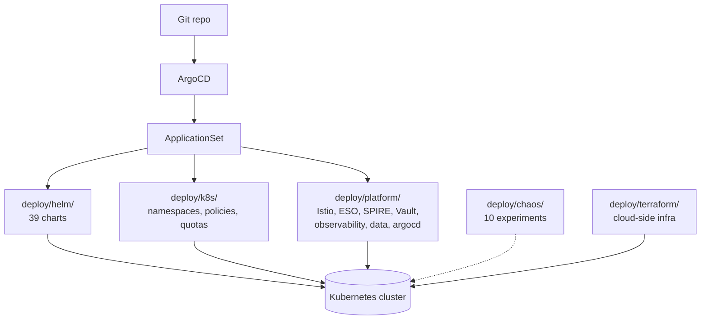

# deploy/

> **Everything required to deploy AegisVision to a Kubernetes cluster.**

This directory carries the operational shape of the platform: Helm charts,
Kustomize bases, ArgoCD bootstrapping, chaos experiments, Terraform for
cloud-side infra. It is what the air-gapped bundle archives, signs, and
ships.



---

## Contents

| Directory | Purpose |
| --- | --- |
| [`helm/`](./helm) | **39 Helm charts.** One per service + nats, dataplane runtime, triton, edge-profile, and the production Next.js console. |
| [`argocd/`](./argocd) | ArgoCD `ApplicationSet` that reconciles every chart. |
| [`k8s/`](./k8s) | Cluster-level: namespaces, priority classes, default-deny network policies, Kyverno admission policies, resource quotas. |
| [`platform/`](./platform) | Platform-tier: Istio Ambient mTLS, External Secrets Operator, SPIRE workload identity, Vault transit + secrets, observability (Prom + Loki + Tempo + Grafana + OTel collector), data tier (Patroni Postgres, Redis Sentinel, ClickHouse Operator, NATS, Kafka), and an ArgoCD bootstrap. |
| [`chaos/`](./chaos) | **10 chaos experiments** (chaos-mesh manifests). Each ships with an assertion. ADR-0028. |
| [`terraform/`](./terraform) | Cloud-side infra: managed Kubernetes, KMS, IAM, S3 buckets, etc. |

---

## Helm chart shape (every chart conforms)

Every chart under `helm/` includes:

- `Deployment` (or `StatefulSet`)
- `Service`
- `ServiceAccount`
- `AuthorizationPolicy` (Istio, ALLOW list)
- `PeerAuthentication` (mTLS STRICT)
- `NetworkPolicy` (default-deny)
- `ServiceMonitor` (Prometheus scrape)
- `HorizontalPodAutoscaler`
- `PodDisruptionBudget`
- `OPA Policy` ConfigMap (where applicable)

The conformance test in `tools/conformance/` asserts all of the above
for every chart. Adding a chart without these fields fails CI.

```bash
(cd tools/conformance && go test -count=1 ./...)
# → ok
```

---

## Deployment paths

### Online (ArgoCD, the default)

```bash
# Step 1: cluster baseline
kubectl apply -f k8s/base
kubectl apply -f k8s/policies
kubectl apply -f k8s/quotas

# Step 2: platform tier
kubectl apply -f platform/istio/
kubectl apply -f platform/spire/
kubectl apply -f platform/external-secrets/
kubectl apply -f platform/vault/
kubectl apply -f platform/observability/
kubectl apply -f platform/data/

# Step 3: ArgoCD + ApplicationSet
kubectl apply -f platform/argocd/
kubectl apply -f argocd/applicationset.yaml
```

ArgoCD then syncs every chart in `helm/`. See [`SETUP_GUIDE.md`](../SETUP_GUIDE.md) for the full walk-through.

### Air-gapped

```bash
./../tools/airgap/build.sh --version 0.5.0
# → dist/aegisvision-airgap-0.5.0.tar.zst (~6–8 GiB)

# Transfer the bundle, then on the target:
./install.sh --registry=registry.dmz.internal
```

The bundle archives this entire `deploy/` directory + every image +
SBOMs + signatures.

### Edge (k3s)

```bash
helm install aegis-edge helm/edge-profile -n aegis-edge --create-namespace
```

Edge runs a reduced operator set; the core cluster receives outbox
sync from edge via `edge-gateway`.

---

## Security posture (deploy-time)

- **Istio Ambient mTLS STRICT.** Every pod-to-pod call is mTLS.
- **OPA AuthorizationPolicy** per service, ALLOW list with SPIFFE IDs.
- **NetworkPolicy** default-deny in every namespace; explicit allows per chart.
- **SPIRE** workload identity issued at admission.
- **Vault transit** for per-tenant crypto-shredding keys.
- **External Secrets Operator** for credentials; **nothing** is in git.
- **Kyverno** admission verifies cosign signatures against the build workflow.
- **Pod Security Standards** restricted profile cluster-wide.
- **No privileged pods.** No host networking. No host paths.

---

## Per-chart configuration

Each chart's `values.yaml` documents its configuration. The most
important values for each service are in its `services/<svc>/README.md`.

---

## Chaos experiments

Ten experiments live in [`chaos/`](./chaos):

| Experiment | What it injects |
| --- | --- |
| `nats-pod-kill.yaml` | Random NATS pod kill |
| `kafka-broker-loss.yaml` | Kafka broker partition |
| `postgres-failover.yaml` | Patroni primary kill |
| `clickhouse-rolling-restart.yaml` | Rolling restart |
| `gpu-oom-reject.yaml` | GPU OOM kill |
| `az-partition.yaml` | Zone-level network partition |
| `triton-model-evict.yaml` | Force model evict |
| `llm-gateway-timeout.yaml` | Inject timeout on LLM upstream |
| `policy-gate-down.yaml` | Take gate offline (verify refuse > unsafe) |
| `webhook-receiver-5xx.yaml` | Notification target returns 5xx |

Each ships with an assertion encoded in the manifest annotations.
Failing the assertion fails the chaos drill.

---

## Terraform

[`terraform/`](./terraform) provisions the cloud-side primitives we
*assume* exist before the cluster install:

- Managed Kubernetes (EKS / GKE / AKS).
- KMS keys (one platform-wide, one per high-value tenant).
- S3 buckets (claim-check store, media, model artifacts, DR backups).
- IAM roles (IRSA / Workload Identity).
- VPC + subnets + NAT.
- Route 53 / Cloud DNS for the platform domain.

`terraform/main.tf` and its `README.md` are the source of truth.

---

## Day-2

After a successful install, day-2 operations live in
[`docs/runbooks/`](../docs/runbooks/). Highlights:

- **DR drill**: `../tools/dr-drills/run-quarterly.sh` (quarterly).
- **Chaos game day**: see `docs/runbooks/chaos-game-day.md`.
- **Tenant onboarding**: see `docs/runbooks/oncall.md`.
- **Incident response**: see `docs/runbooks/incident-response.md`.
- **Canary rollback**: see `docs/runbooks/canary-rollback.md`.
- **Drift spike**: see `docs/runbooks/drift-spike.md`.
- **Agent incident**: see `docs/runbooks/agent-incident.md`.
- **DR (BCDR plan)**: see `docs/runbooks/dr.md`.

---

## Common operations

```bash
# Sync everything via ArgoCD.
argocd app sync aegis-platform --prune

# Inspect a service's posture.
kubectl describe authorizationpolicy api-gateway -n aegis-system
kubectl describe peerauthentication api-gateway -n aegis-system
kubectl describe networkpolicy api-gateway -n aegis-system

# See current cosign-verified images.
kubectl get pods -n aegis-system -o wide

# Bounce a deployment after a config change.
kubectl rollout restart deploy/api-gateway -n aegis-system
```
