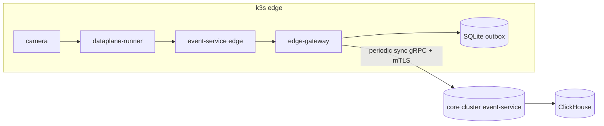

# edge-profile

> **Reduced-operator Helm chart for k3s edge boxes.**

This chart deploys a *minimal* AegisVision footprint suitable for:

- NVIDIA Jetson AGX Orin / Orin Nano.
- Industrial PCs (x86 with one consumer GPU).
- Vehicles + drones (when paired with `services/edge-gateway`).
- Air-gapped on-prem racks.

The full platform stays on the **core cluster**; the edge profile syncs
to it via the outbox in `services/edge-gateway`.

---

## What runs on the edge

- `stream-manager` (reduced — local streams only).
- `dataplane-runner` (full — operator DAG, ingest, sampler, detect, tracker, rule, emit).
- `event-service` (with outbox to core).
- `inference-router` (with local Triton or synthetic detector).
- `edge-gateway` (does the sync to core).

What **doesn't** run on the edge:

- LLM gateway / agent / policy gate.
- Canary controller / drift / shadow / SLO.
- Compliance evidence service.
- Heavy storage (Patroni, ClickHouse) — outbox is local SQLite/BoltDB.

---

## Install

```bash
# On the edge box (e.g. NVIDIA Jetson AGX Orin):
curl -sfL https://get.k3s.io | sh -

# Apply the edge profile.
helm install aegis-edge deploy/helm/edge-profile -n aegis-edge --create-namespace \
  --set core.grpcEndpoint=core.example.com:443 \
  --set core.tokenSecretRef=core-sync

# Wire outbox-sync token (replace with your real token):
kubectl -n aegis-edge create secret generic core-sync \
  --from-literal=core-grpc=core.example.com:443 \
  --from-literal=core-token="$(cat /run/secrets/edge-token)"
```

---

## Configuration (`values.yaml`)

| Key | Purpose | Default |
| --- | --- | --- |
| `core.grpcEndpoint` | Core cluster gRPC endpoint. | — |
| `core.tokenSecretRef` | Name of the K8s secret holding the outbox token. | `core-sync` |
| `outbox.maxBytes` | Hard cap on the local outbox; refuses to accept when full. | `10Gi` |
| `outbox.path` | Local outbox path on the host. | `/var/lib/aegis/outbox` |
| `inference.detector` | `triton` / `synthetic` / `tflite`. | `triton` |
| `inference.tritonUrl` | If `triton`. | `http://localhost:8000` |
| `dataplane.shards` | How many shards this edge owns. | `1` |
| `nodeSelector` | Pin to GPU nodes. | `{}` |

---

## Per-edge sync



The outbox commits **locally first**; sync follows. On partition, edge keeps
producing events; sync drains on recovery.

---

## See also

- [`../../../services/edge-gateway/README.md`](../../../services/edge-gateway/README.md)
- [`../../../SETUP_GUIDE.md`](../../../SETUP_GUIDE.md) — Path E (edge install).
- [`../../README.md`](../../README.md) — deploy/ directory overview.
