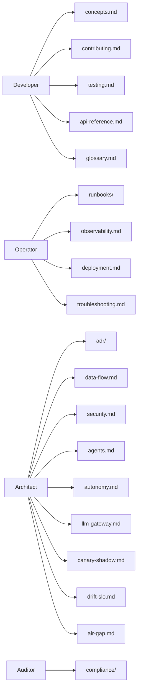

# docs/

> **The platform's prose layer.** Architecture decisions, concept guides,
> runbooks, compliance evidence, contributor guides.

This directory is intentionally not service-by-service. Each service's
README documents *that* service. `docs/` documents the platform —
ideas that cross service boundaries.

---

## What's in here

---

## Subdirectories

| Path | Audience | Contents |
| --- | --- | --- |
| [`adr/`](./adr) | architects | 30 Architecture Decision Records. |
| [`compliance/`](./compliance) | auditors | SOC 2, EU AI Act, GDPR DPIA, pen-test scope + evidence templates. |
| [`runbooks/`](./runbooks) | oncall | Incident response, DR, chaos game day, drift spike, canary rollback, agent incident, oncall. |

## Concept docs

| Doc | Topic |
| --- | --- |
| [`concepts.md`](./concepts.md) | Pipelines, streams, models, datasets, rules, events — the resource model. |
| [`data-flow.md`](./data-flow.md) | End-to-end glass-to-event flow with sequence diagrams. |
| [`security.md`](./security.md) | mTLS, OPA, SPIRE, Vault, Cosign, SLSA, Kyverno. |
| [`observability.md`](./observability.md) | Logs, metrics, traces, dashboards, alerts. |
| [`agents.md`](./agents.md) | Bounded autonomy + tier model + citation discipline. |
| [`autonomy.md`](./autonomy.md) | Continuous autonomy via cron + signals; drift; SLO burn-rate. |
| [`llm-gateway.md`](./llm-gateway.md) | Why one gateway. Safety layer. Backend swap. |
| [`canary-shadow.md`](./canary-shadow.md) | Wilson lower bound + same-URN shadow inference. |
| [`drift-slo.md`](./drift-slo.md) | JS / KL / TVD divergence + multi-window burn-rate. |
| [`air-gap.md`](./air-gap.md) | The bundle, day-one. Why it isn't a retrofit. |
| [`api-reference.md`](./api-reference.md) | Public REST API reference. |
| [`console.md`](./console.md) | The production Next.js console — what every page does + how to extend it. |
| [`deployment.md`](./deployment.md) | Online + air-gapped + edge install. |
| [`testing.md`](./testing.md) | Unit + integration + conformance + chaos + load + console build. |
| [`troubleshooting.md`](./troubleshooting.md) | Common failures + diagnostic paths. |
| [`contributing.md`](./contributing.md) | How to add a service, change a contract, ship a chart, extend the console. |
| [`glossary.md`](./glossary.md) | Terminology. |

---

## How to read

- **First time on the platform?** Start with [`concepts.md`](./concepts.md), then [`data-flow.md`](./data-flow.md).
- **Operating a cluster?** Start with [`deployment.md`](./deployment.md), then [`runbooks/`](./runbooks/).
- **About to make an architectural change?** Read [`adr/`](./adr/) first.
- **Going through an audit?** [`compliance/`](./compliance/).
- **Contributing code?** [`contributing.md`](./contributing.md) + [`testing.md`](./testing.md).
