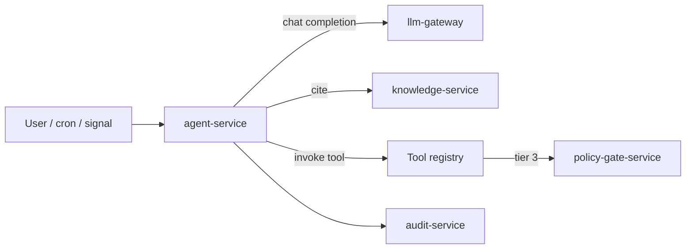
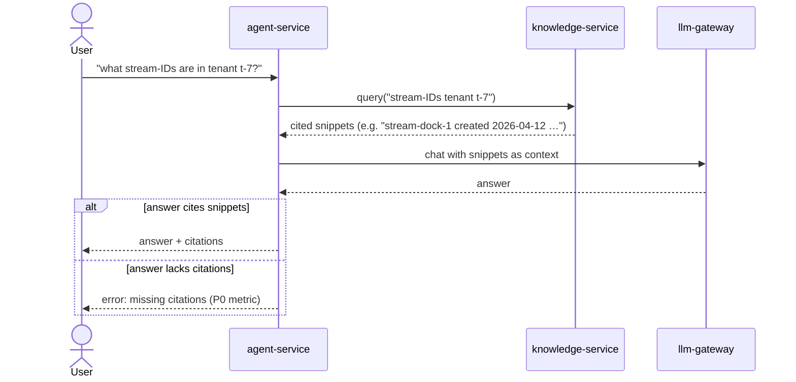
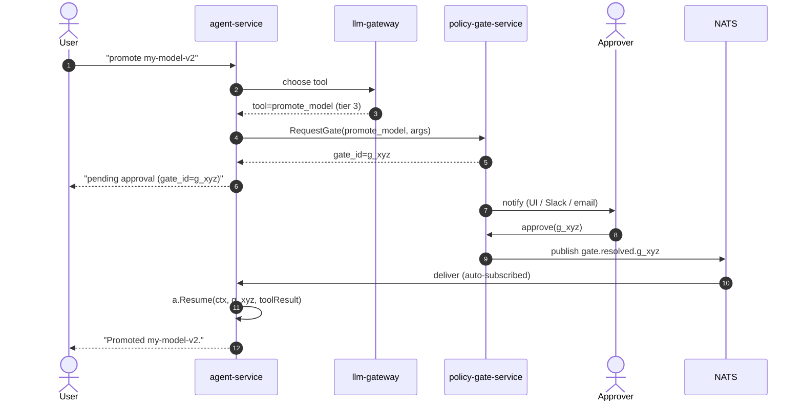

# Agents

> **Bounded autonomy + citation discipline + one runtime.**
> ADR-0014, ADR-0017, ADR-0020, ADR-0022.

This document describes the AegisVision agent: what it can and cannot
do, why the constraints look the way they do, and how to build agentic
flows safely.

---

## The agent at a glance



The agent receives a *goal*, plans steps via `llm-gateway`, invokes
*tools* (each typed, each tiered), and either returns a cited answer or
pauses pending a gate.

---

## The four risk tiers

| Tier | Examples | Behaviour |
| --- | --- | --- |
| 0 | `query_knowledge`, `read_event_stream`, `describe_pipeline`, `list_models`, `get_canary_state` | Auto-execute. Read-only. |
| 1 | `summarise`, `compare_distributions`, `predict_dwell` | Auto-execute. Advisory. |
| 2 | `propose_retrain`, `propose_canary_plan`, `propose_retention_change` | Auto-execute — returns a *proposal*, no side effect. |
| 3 | `promote_model`, `override_retention`, `force_failover`, `delete_dataset` | **Refused in code** without a resolved gate. |

The tier is part of the tool's schema, not metadata. Implementation
in `pkg/agent/agent.go`:

```go
if tool.Tier == Tier3 && req.GateID == "" {
    return Result{}, ErrTier3NeedsGate
}
```

You can't prompt your way past it.

---

## Why bounded, not full autonomy

The honest reason: every prior CV-platform that gave an agent full
autonomy made a wrong call on a model promotion or a retention change
that was unrecoverable. AegisVision was designed *after* watching
those incidents.

Bounded autonomy is the empirical answer:

- **Tier 0/1** — agent reads + advises. Cheap, fast, low-risk.
- **Tier 2** — agent proposes. Humans review the proposal.
- **Tier 3** — agent *cannot* execute without a gate. The gate is the
  point.

The runtime is in code, not prompts. Prompts can be jailbroken; code
paths cannot.

---

## Citation discipline (ADR-0020)



The `knowledge-service` tool returns **snippets with their source
path** (e.g. `docs/adr/0003-mig-default.md`). The agent's response
template embeds them; a response without citations is surfaced as an
error.

This is the difference between *real* stream-IDs and *hallucinated*
ones.

---

## How tier-3 actually completes



The `agent-service` `main.go` subscribes to `gate.resolved.>` on
startup; when a resolution arrives it reconstructs the session and
resumes. `aegis_agent_auto_resumed_total` counts these.

If `policy-gate-service` is down, tier-3 work stops. **By design.**
Refuse > unsafe.

---

## Continuous autonomy (ADR-0022)

`autonomy-orchestrator` does *not* implement its own agent runtime.
Each cron fire or signal opens a **regular agent-service session**
with a role + goal + step budget. The tier constraints bind exactly
as for interactive sessions.

This is the standing answer to "should we just put a loop in
autonomy-orchestrator?" — no. ADR-0022.

---

## Anti-patterns

- **Don't add a second agent runtime.** ADR-0022.
- **Don't promote answers without citations.** ADR-0020.
- **Don't put a tier-3 tool into a tier-2 schema to dodge the gate.**
  The tier is reviewed in PR.
- **Don't trust the prompt.** The refusal is in code.
- **Don't call LLMs directly.** ADR-0018.

---

## Where to drive the agent from

- **Console UI** — `/agents` lists sessions; `/agents/[id]` is the chat
  page with citation rendering and a clear tier-3 gate banner.
  See [`console.md`](./console.md).
- **REST API** — `POST /v1/agents/sessions` to open, `POST /v1/agents/sessions/{id}/messages` to send.
  See [`api-reference.md`](./api-reference.md).
- **Cron / signal** — `autonomy-orchestrator` opens regular agent-service
  sessions on schedule (ADR-0022). Same constraints bind.

## See also

- [`llm-gateway.md`](./llm-gateway.md) — the one gateway.
- [`autonomy.md`](./autonomy.md) — cron + signals.
- [`console.md`](./console.md) — the chat UI.
- [`runbooks/agent-incident.md`](./runbooks/agent-incident.md) — when something goes wrong.
- ADR-0014, ADR-0017, ADR-0020, ADR-0022.
