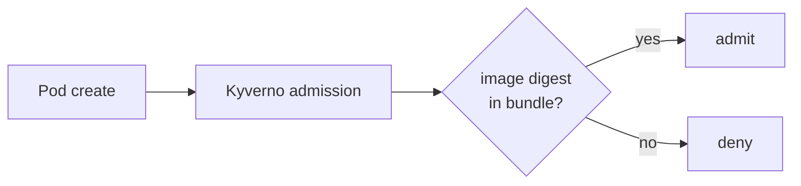

# Air-gap

> **Day-one, not retrofit.** ADR-0027.

This doc describes how AegisVision is shipped to disconnected
environments — DMZ, classified, regulated, edge — and why it's
day-one rather than something we built later.

---

## The constraint

The air-gapped customers we target (defense, intelligence, regulated
healthcare, critical infrastructure) cannot:

- Pull container images from the public internet.
- Update Helm charts from external repos.
- Reach Cosign keyless signing / Rekor on the internet.
- Egress for telemetry.

What they *can* do:

- Run a fully signed bundle, verified offline.
- Push images to an internal registry.
- Apply manifests with a kubeconfig.

ADR-0027 turns "the air-gap install" into a **first-class CI
artifact** — produced by every release, signed, verified, and tested
end-to-end. Doing this from day one means we never have to retrofit
internal services that assumed they could `curl` something.

---

## What's in the bundle

```
aegisvision-airgap-<version>.tar.zst
├── manifest.json              # bundle manifest + cosign signatures
├── README.md                  # operator install guide
├── install.sh                 # one-shot bootstrap script (idempotent)
├── verify.sh                  # signature + checksum verification
├── images/                    # OCI layout — every service image + console
├── charts/                    # tarballed Helm charts (39, including console)
├── manifests/                 # platform K8s manifests (Istio, Kyverno, ESO, SPIRE)
├── policies/                  # Kyverno + OPA policies
├── crds/                      # CRDs the platform depends on
├── sboms/                     # SPDX SBOMs per image
├── signatures/                # cosign bundle (signatures + attestations)
└── checksums.txt              # SHA-256 of every file
```

Bundle size: ~6–8 GiB.

---

## Build

`./tools/airgap/build.sh --version 0.5.0 --registry-out ghcr.io/...`
runs on a CI runner with internet. The script:

1. `crane pull`s every image to local OCI layout.
2. `helm package`s every chart.
3. Collects manifests + CRDs + policies.
4. Generates SBOMs with `syft`.
5. Pulls cosign signatures + transparency log entries.
6. Computes checksums.
7. Generates a SLSA v1 provenance.
8. Signs the bundle with `cosign sign-blob`.
9. `zstd`-compresses everything.

---

## Transfer

The bundle is moved to the target environment via the customer's
approved transfer mechanism. Common ones:

- CD-ROM / DVD-R.
- One-way data diode.
- Registered USB.
- Cross-domain solution.

What doesn't happen: any direct network connection between build
and target.

---

## Verify

`./verify.sh` on the target:

1. Computes bundle SHA-256, compares to `checksums.txt`.
2. Verifies the cosign bundle signature.
3. Validates SLSA v1 provenance.
4. For each image, verifies the cosign signature against the bundled
   public key + Rekor entries.

If any step fails, the install does not proceed.

---

## Install

```bash
./install.sh \
  --registry=registry.dmz.internal \
  --kubeconfig=$HOME/.kube/airgap.cluster
```

What it does:

1. `crane push`es every image to the internal registry.
2. `kubectl apply`s CRDs (Istio, Kyverno, ESO, SPIRE, ArgoCD).
3. Applies platform manifests.
4. `helm install`s every chart in dependency order.
5. Waits for readiness on api-gateway.
6. Reports installed versions in `installed.json`.

Total time on a 6-node cluster: ~30 min including platform-tier
bootstrap.

---

## Re-verification at runtime

`verify.sh` is also exposed as a **Kyverno admission webhook** config
that rejects any image whose digest is not in the bundle's manifest.
Defence against pulling unsigned images post-install.



---

## Why a release-please separation

`release-please` cuts the version + CHANGELOG (ADR-0030). The bundle
is the *artifact* of a release — built by a dedicated workflow
(`release-airgap.yml`) only when `release-please` lands a tagged
release. This split keeps the artifact build off the critical path of
every PR but ties it durably to versioned releases.

---

## Anti-patterns

- **Retrofitting air-gap support.** Always day-one.
- **Assuming internet egress.** Every internal service must work
  offline.
- **Skipping signature verification at runtime.** Kyverno enforces it.
- **A bundle for "just one thing."** A release is one bundle, single
  platform version. ADR-0030.

---

## See also

- [`SETUP_GUIDE.md`](../SETUP_GUIDE.md) — Path D.
- [`security.md`](./security.md) — supply chain.
- [`tools/airgap/README.md`](../tools/airgap/README.md).
- ADR-0027, ADR-0030.
