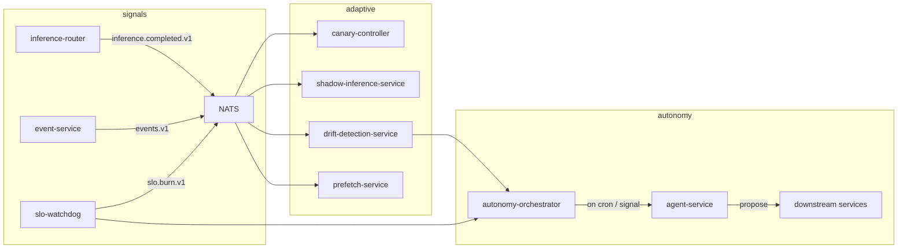
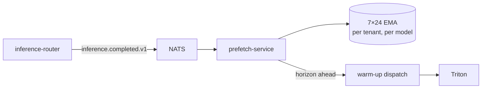
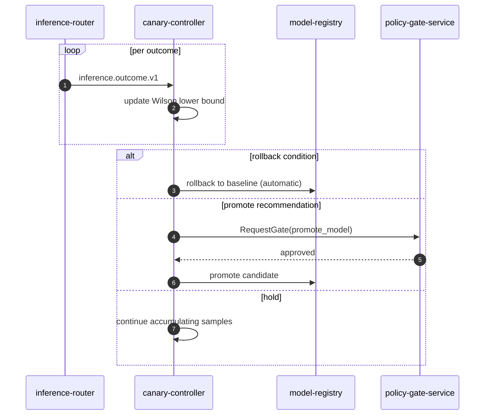
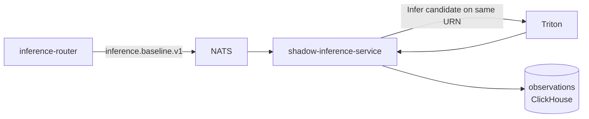

# Autonomy

> **Continuous autonomy + drift + SLO + prefetch.**
> ADR-0022, ADR-0025, ADR-0026.

This doc covers the *adaptive* tier of the platform — the
self-improving loops that run without a human in the driver's seat
moment-to-moment, but still bind to the bounded-autonomy constraints
when they touch consequential state.

---

## The shape

Five loops:

1. **Canary** — Wilson lower bound + min-sample floor. ADR-0023.
2. **Shadow** — same-URN comparison. ADR-0024.
3. **Drift** — JS / KL / TVD divergence. ADR-0025.
4. **SLO** — multi-window burn-rate. ADR-0025.
5. **Prefetch** — 7×24 EMA grid. ADR-0026.

Plus one orchestrator: `autonomy-orchestrator` (ADR-0022).

---

## Why no second agent runtime

`autonomy-orchestrator` does *not* implement its own loop. Each cron
fire or bus signal opens a **regular agent-service session** with a
role, a goal, and a step budget. Every constraint that binds
interactive sessions — tiered tools, refusal-in-code, citation
discipline — binds scheduled autonomy.

ADR-0022 is the standing answer to "should we just put a loop in
autonomy-orchestrator?" — no.

---

## Drift detection

Three divergence metrics computed in `pkg/autonomy/divergence.go`:

- **JS** (Jensen-Shannon) — symmetric, bounded, smooth. Good default.
- **KL** (Kullback-Leibler) — asymmetric, sensitive to tail mass shifts.
- **TVD** (Total Variation Distance) — bounded, interpretable as
  probability mass moved.

Window: 1 hour, sliding by 5 minutes. Reference: the model's
training-time empirical distribution from `model-registry`.

Alerts fire on configurable thresholds per metric → `drift.alert.v1`
→ consumed by `autonomy-orchestrator` (which opens an agent session
to investigate) and `slo-watchdog` (which integrates with the SLO
burn).

---

## SLO burn-rate

Standard MWMBR (Multi-Window, Multi-Burn-Rate):

| SLO | Window fast | Window slow | Page if both |
| --- | --- | --- | --- |
| Glass-to-event p95 < 300 ms | 1h | 6h | fast > 14.4, slow > 6 |
| api-gateway 99.9% / month | 1h | 6h | fast > 14.4, slow > 6 |
| Inference latency p95 < 500 ms | 1h | 6h | fast > 14.4, slow > 6 |
| LLM gateway 99.5% / month | 1h | 6h | fast > 14.4, slow > 6 |

False-positive resistant by design.

---

## Prefetch (ADR-0026)

The grid is `(hour_of_week) → predicted_calls_per_minute`. EMA
half-life ~2 weeks. Warm-ups dispatched at the horizon (default 10
min) ahead of cells that exceed the threshold.

This buys you cold-start latency without paying for hot models all day.

---

## Canary loop

There is **no force-promote endpoint**. ADR-0023. Promotion always
routes through `policy-gate-service`.

---

## Shadow inference

Candidate results **never reach the tenant**. Only the comparison
metric flows downstream. ADR-0024.

---

## Anti-patterns

- **A second agent runtime.** ADR-0022 — no.
- **Force-promote.** ADR-0023 — no.
- **Random drift threshold.** Use per-metric thresholds from the
  model's reference distribution, not magic numbers.
- **Sample-floor bypass.** Wilson + min-sample floor is the canary
  contract.

---

## Where to watch it from

The console has a page per loop:

- **`/canary`** + `/canary/[id]` — plan list + Wilson decision board.
- **`/shadow`** — same-URN comparison overview.
- **`/drift`** — JS / KL / TVD table with breach badges.
- **`/slo`** — MWMBR burn-rate cards.
- **`/prefetch`** — 7×24 EMA heatmap.

See [`console.md`](./console.md).

## See also

- [`agents.md`](./agents.md) — the bounded-autonomy contract.
- [`canary-shadow.md`](./canary-shadow.md) — canary + shadow design.
- [`drift-slo.md`](./drift-slo.md) — divergence + burn-rate.
- [`console.md`](./console.md) — the UI pages above.
- ADR-0022, ADR-0023, ADR-0024, ADR-0025, ADR-0026.
