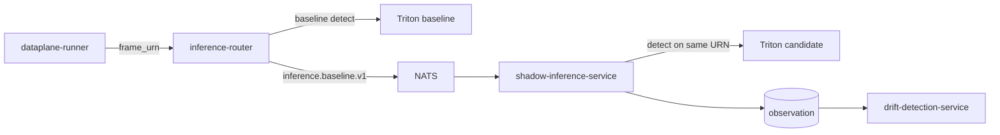
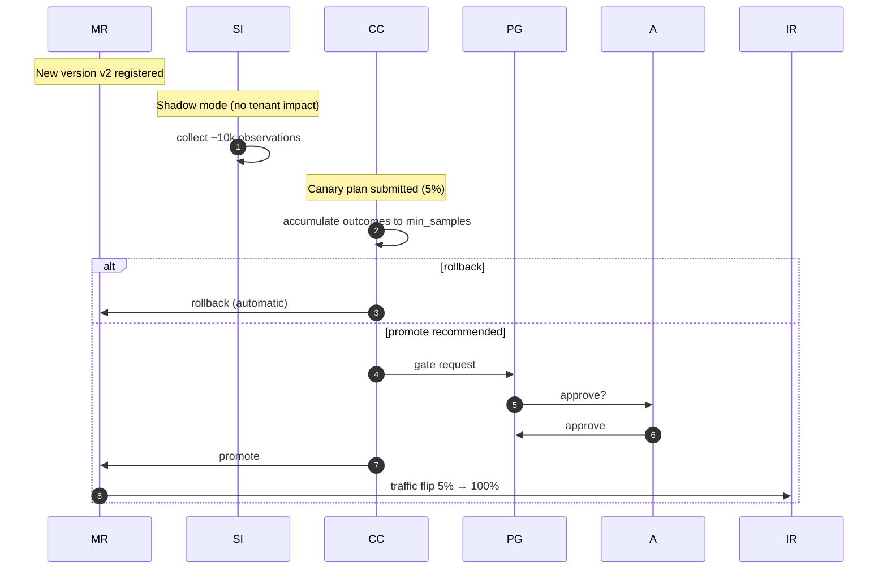

# Canary + Shadow

> **Two orthogonal ways to evaluate a candidate model.** ADR-0023 +
> ADR-0024.

This doc explains how AegisVision evaluates new model versions. The
two mechanisms answer different questions:

- **Canary** — *Does it work in production?* Real traffic, real
  tenants, statistical decision.
- **Shadow** — *Does it agree with the baseline?* Same frames, both
  models, no tenant impact.

They are complementary. A typical promotion uses both.

---

## Canary (ADR-0023)

A canary plan splits a small fraction of real traffic to a candidate
model. The controller decides **promote / hold / rollback** based on
a **Wilson lower-bound proportion test** with a **minimum sample
floor**.

### The math

For each arm, we observe successes $s$ over total $n$. The Wilson
lower bound at significance $\alpha$ is:

$$\hat{p}_{LB} = \frac{\hat{p} + \frac{z^2}{2n} - z\sqrt{\frac{\hat{p}(1-\hat{p})}{n} + \frac{z^2}{4n^2}}}{1 + \frac{z^2}{n}}$$

with $\hat{p} = s/n$ and $z = z_{1-\alpha}$.

Decision rules (defaults):

- **Min samples**: $n \geq 1000$ per arm. Below floor → hold.
- **Rollback**: candidate lower bound is more than 2.0 pp below
  baseline → auto-rollback.
- **Promote recommendation**: candidate lower bound is at least 0.5 pp
  above baseline → emit tier-3 gate request.
- **Hold**: otherwise.

Implementation: `pkg/canary/`.

### Why Wilson

Naive z-test confidence intervals are unbounded near 0/1 and
ill-behaved at small $n$. Wilson handles small samples and edge
cases without exploding.

### Traffic split

```go
func ShouldRouteToCandidate(streamID, planID string, trafficPct int) bool {
    h := hash(streamID + ":" + planID)
    return h % 100 < trafficPct
}
```

Stable hash → a stream stays on its arm for the duration of the plan.

### The gate

Promotion **always** routes through `policy-gate-service`. There is no
force-promote endpoint. ADR-0023 specifically refuses to ship one.

---

## Shadow (ADR-0024)



For every successful Infer, `inference-router` publishes
`inference.baseline.v1` (URN + baseline model + result).
`shadow-inference-service` runs the candidate against the **same
URN**, compares against the baseline result, and writes the
comparison.

Key invariant: **the candidate result never reaches the tenant**.
Only the comparison metric flows downstream. This is what makes
shadow safe — you can evaluate a brand-new architecture without any
risk to production detection accuracy.

### What we compare

| Metric | Meaning |
| --- | --- |
| `iou_bbox_mean` | Mean IoU between bbox sets. |
| `class_agreement` | Fraction of detections where baseline + candidate agree on class. |
| `candidate_added` | Classes the candidate found that the baseline didn't. |
| `candidate_dropped` | Classes the baseline found that the candidate didn't. |
| `latency_delta_ms` | Candidate latency - baseline latency. |

### Same-URN matters

Comparing different frames tells you nothing about model quality. The
claim-check store (`pkg/dataplane/claimcheck`) makes same-URN
comparison cheap: the bytes are already there.

---

## When to use which

| Question | Tool |
| --- | --- |
| "Does it agree with baseline on the data we've already seen?" | shadow |
| "Does it work on *fresh* tenant traffic?" | canary |
| "Is it faster on the same image?" | shadow (latency_delta) |
| "Does the new model improve precision/recall as measured by tenant outcomes?" | canary (outcome bus) |
| "Are there regressions on a corner case?" | shadow (candidate_added / candidate_dropped) |

Production rollouts typically run shadow first (no risk) for some
window, then canary (small real-traffic slice) under Wilson, then
gated promotion.

---

## Combined sequence



---

## Anti-patterns

- **Force-promote.** ADR-0023.
- **Sample-floor bypass.** Wilson + floor is the contract.
- **Shadow → tenant.** Shadow never publishes a tenant-facing detection.
- **Random traffic split.** Stable hash; arms must be consistent.

---

## Where to drive it from

- **Console UI** — `/canary` lists plans with status pills; `/canary/[id]`
  is the decision board (Wilson lower bound metrics, pause/resume/cancel,
  promote-via-gate button). See [`console.md`](./console.md).
- **REST API** — `POST /v1/canary-plans` to submit; `GET /v1/canary-plans/{id}/state` to monitor.

## See also

- [`autonomy.md`](./autonomy.md) — adaptive autonomy overview.
- [`drift-slo.md`](./drift-slo.md) — divergence + burn-rate.
- [`console.md`](./console.md) — the canary decision board.
- [`pkg/canary/README.md`](../pkg/canary/README.md) — the math.
- [`services/canary-controller/README.md`](../services/canary-controller/README.md).
- [`services/shadow-inference-service/README.md`](../services/shadow-inference-service/README.md).
- ADR-0023, ADR-0024.
