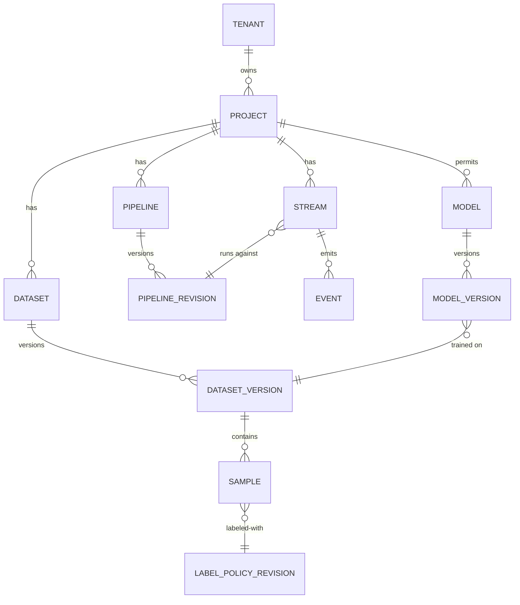
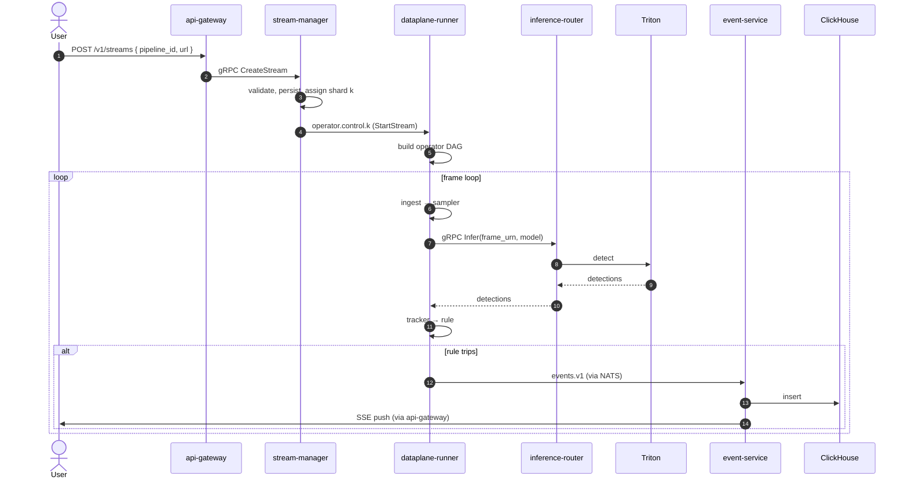
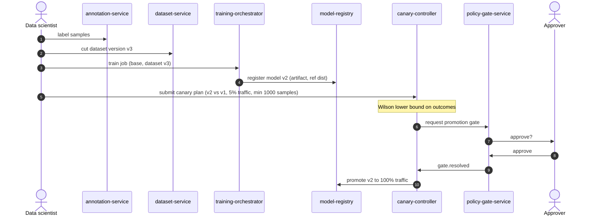

# Concepts

> **The vocabulary of AegisVision.** Read this once.

This document defines the resources, relationships, and lifecycle of
the platform — the *mental model* you need before any other doc makes
sense.

---

## Resources

### Tenant

The top-level isolation boundary. Every other resource belongs to
exactly one tenant. Tenants have a Vault transit key (crypto-shredding,
ADR-0014), a model allow-list, a plan, and a retention policy.

### Project

Grouping inside a tenant. Lets a tenant separate environments (prod /
staging), business lines, or teams. Members have project-scoped roles.

### Pipeline

A *recipe*. An ordered DAG of operators: `ingest → sampler → detect →
tracker → rule → emit`. Pipelines are **immutable per revision**.
Editing produces a new `PipelineRevision`. Streams reference a specific
revision; promoting a new revision is a deliberate, audited action.

### Stream

A producer of frames. Examples:

- `rtsp://camera-7/stream`
- `file:///recordings/2026-05-21/dock-1.mkv`
- `webrtc://browser-upload/xxx`
- `synthetic://noop` (dev / tests)

A stream picks a project, a pipeline revision, and a model. The data
plane runs the pipeline against the stream until paused or deleted.

### Model

A computer-vision model identity. Has **versions**; each version is an
immutable artifact (object-store URL + cosign signature). Models have
a **reference distribution** (for drift detection) and a **canary
plan** (for promotion).

### Dataset

A named collection of samples (frames + labels). Datasets have
**versions**. Lineage records which dataset version trained which
model version.

### Sample

One labeled frame. Carries a `frame_urn` (claim-check), a list of
labels (via `annotation-service`), and source provenance (which
stream, when).

### Label Policy

The schema of what classes / attributes exist. **Immutable per
revision** — a model trained against "car" continues to refer to
"car" even after a future revision renames it to "vehicle."

### Event

The output of the data plane. An event is *the thing the platform
tells you about*. Kinds: `DETECTION`, `RULE`, `DWELL`, `COUNT`,
`INFER`. Persisted to ClickHouse + fanned out via SSE / WebSocket.

### Detection

A model output (bounding box + class + confidence) on a single frame.
Detections become events when a rule trips. They are also fed
downstream to drift detection.

### Rule

A predicate over detections. `dwell(class=person, zone=A, min_ms=5000)`
fires an event when a person remains in zone A for ≥ 5s. Composable
with `AND` / `OR` / `NOT`. See [`services/rule-engine/README.md`](../services/rule-engine/README.md).

### Pipeline Revision

A specific version of a pipeline DAG. `Stream.pipeline_revision_id`
points at one. Promoting a new revision is an audited action.

### Canary Plan

A statistical comparison of two model versions against the same
streams. Wilson lower-bound proportion test + minimum sample floor +
margin. See [`services/canary-controller/README.md`](../services/canary-controller/README.md).

### Gate

A human-in-the-loop approval request. Required for tier-3 agent tools
and tier-3 actions (model promotion, retention override, force
failover). Routed through `policy-gate-service`.

### Audit Record

Append-only, hash-chained log entry. Every mutating action writes
one. See [`services/audit-service/README.md`](../services/audit-service/README.md).

---

## Lifecycle: a stream from creation to event

This is **the** canonical flow. Every other interaction is a variation
on it.

---

## Lifecycle: a model from training to promotion

There is **no force-promote endpoint**. ADR-0023.

---

## What's *not* a resource (and why)

- **Frames.** Frames are not platform resources — they are bytes in
  the claim-check store, referenced by URN. Storing a frame as a
  resource would put bytes on the bus (ADR-0008).
- **Inference calls.** Inference is a *per-frame*, *per-event* signal.
  It's a bus message, not a resource.
- **Detections (raw).** Raw detections become events when a rule
  trips. The raw firehose goes to ClickHouse but isn't a
  CRUD-managed resource.

---

## Where next

- [`data-flow.md`](./data-flow.md) — sequence diagrams across the platform.
- [`api-reference.md`](./api-reference.md) — REST endpoints.
- [`glossary.md`](./glossary.md) — terminology.
