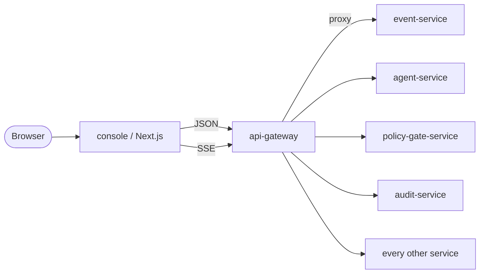

# Console

> **The production UI.** Next.js 14 + TanStack Query + Tailwind. One app,
> 33 routes, every public AegisVision feature usable from a browser.

The minimal walking-skeleton HTML console at
`services/api-gateway/console/` is a deliberately stripped-down vanilla
HTML+JS demo bundled with the 5-service skeleton. The **production
console** lives at [`services/console/`](../services/console) and is the
surface end-users, operators, and auditors interact with.

---

## Position in the architecture



The console is a **pure browser app** rendered by a Next.js standalone
server. It does **not** call services directly — every request goes
through `api-gateway`. Auth flows through OIDC at the ingress; the
console just attaches `X-Aegis-Tenant`.

---

## What's on the surface

Every route corresponds to a major platform capability.

### Platform overview

| Page | What it does |
| --- | --- |
| `/` Dashboard | Live SSE feed (last 25 events) + pending-gates inbox + canary / drift / SLO summaries + active agents + recent streams |
| `/events` | Live SSE event stream + historical search + JSON detail viewer |
| `/audit` | Append-only hash-chain viewer + chain-verify button |

### Control plane

| Page | What it does |
| --- | --- |
| `/pipelines` + `/pipelines/[id]` | List + create + delete pipelines. Detail shows the operator DAG + every revision + a promote button |
| `/streams` + `/streams/[id]` | List + create + pause/resume + delete. Detail shows per-stream live SSE + config |
| `/models` + `/models/[id]` | Register + add versions + **request gated promotion** |
| `/datasets` + `/datasets/[id]` | List + create + cut versions + sample browse |
| `/annotations` | Label policies + annotation queue + status |
| `/training` | Start + cancel jobs with lineage |
| `/media` | Request clips + retention policies (redact + refuse-raw enforcement) |
| `/rules` | Editor for dwell / count / line-cross / zone-enter |

### Intelligence

| Page | What it does |
| --- | --- |
| `/agents` + `/agents/[id]` | Open a session, chat with the agent, see every step (thought / tool_call / tool_result / final) with **inline citations**, get a clear pending-gate banner on tier-3 |
| `/gates` | Approval inbox + decision history. Approve / deny with reason. Audit on every action |
| `/knowledge` | RAG query with cited snippets + manual re-ingest |
| `/nlq` | Natural-language → structured query parser |
| `/active-learning` | Uncertainty + diversity queue + claim |
| `/semantic-search` | Vector search over events + clips |

### Adaptive autonomy

| Page | What it does |
| --- | --- |
| `/canary` + `/canary/[id]` | Submit canary plan + Wilson lower-bound decision board with pause/resume/cancel. Promotion is **always gated** |
| `/shadow` | Overview of same-URN comparison |
| `/drift` | JS / KL / TVD per-model + breach alerts + manual trigger |
| `/slo` | MWMBR burn-rate cards (1h fast + 6h slow) |
| `/prefetch` | 7×24 EMA heatmap per (tenant, model) |

### Admin

| Page | What it does |
| --- | --- |
| `/tenants` + `/tenants/[id]` | Create + delete (crypto-shred) tenants + projects + members + RBAC |
| `/cost` | Per-tenant GPU-seconds / tokens / storage / events + invoices |
| `/compliance` | Generate signed evidence bundles for SOC 2 / EU AI Act / GDPR / CIS |
| `/settings` | Tenant + bearer + identity (dev mode) |

---

## Architectural commitments preserved in the UI

The console is **deliberately not a place to bypass platform rules.**
Where the platform enforces something, the UI enforces it too:

1. **No force-promote button anywhere.** Every promotion (model versions,
   pipelines, canary plans) routes through `policy-gate-service`. The UI
   surfaces a clear "request approval" CTA + a link to `/gates`.
2. **Tier-3 gate banner.** Agent sessions waiting on a gate display a
   prominent banner with the `gate_id` and a deep link to the gates inbox.
3. **Citations rendered inline.** Every agent step is wired to surface
   `citations: [{ source, snippet }]` exactly as `knowledge-service`
   returns them. Platform-fact answers without citations are visually
   marked (ADR-0020).
4. **Idempotency-Key auto-attached.** Every mutating call carries one.
5. **RFC 9457 problem+json → toast.** Errors surface with `trace_id` so
   operators can pivot to Tempo.
6. **Tenant header on every request.** `X-Aegis-Tenant` is always set;
   the tenant switcher lives in the top-right pill.
7. **Append-only audit viewer.** No edit/delete buttons. A chain-verify
   button surfaces broken-chain incidents immediately.
8. **No DELETE-without-confirm.** Tenant delete in particular surfaces
   the crypto-shredding warning before destruction.

---

## How it's built

### Stack

| Layer | Choice |
| --- | --- |
| Framework | Next.js 14 (App Router) |
| Language | TypeScript (strict) |
| Styling | Tailwind CSS with custom design tokens |
| Server state | TanStack Query v5 |
| Client state | Zustand (persists tenant + identity) |
| Forms | react-hook-form (where rich) |
| Charts | Recharts |
| Icons | lucide-react |
| Realtime | Native `EventSource` (SSE) |

### File layout

```
services/console/
├── package.json
├── next.config.mjs
├── tailwind.config.ts
├── tsconfig.json
├── Dockerfile                       multi-stage → distroless-style node:20 runtime
├── public/favicon.svg
└── src/
    ├── app/                         33 routes — see README
    │   ├── layout.tsx               sidebar + topbar + providers
    │   ├── globals.css
    │   ├── providers.tsx            React Query client
    │   └── …/page.tsx
    ├── components/
    │   ├── Sidebar.tsx              tier-grouped nav
    │   ├── TopBar.tsx               tenant pill + health badge
    │   ├── PageHeader.tsx
    │   ├── DataTable.tsx            generic typed table
    │   ├── Primitives.tsx           Button, Card, Input, Modal, Pill, Toast, JsonViewer, MetricCard…
    │   └── Toast.tsx
    └── lib/
        ├── api.ts                   typed client for every public endpoint
        ├── types.ts                 wire types
        ├── auth.ts                  Zustand store (tenant + JWT)
        ├── hooks.ts                 useQueries / useMutations + useEventStream
        └── utils.ts                 cn, fmt helpers, severity classes
```

### Build + ship

```bash
# Local dev
cd services/console
npm install
NEXT_PUBLIC_AEGIS_API_BASE=http://localhost:8080 npm run dev   # :8090

# Production
npm run build
npm start

# Docker
docker build -f services/console/Dockerfile -t aegisvision/console:dev .

# Kubernetes (Helm)
helm install console deploy/helm/console -n aegis-system
```

The Helm chart at [`deploy/helm/console/`](../deploy/helm/console) is
**conformance-clean**: mTLS STRICT, OPA AuthZ ALLOW list,
default-deny NetworkPolicy, ServiceMonitor, HPA, PDB, ServiceAccount,
non-root, read-only-rootfs, seccomp RuntimeDefault.

ArgoCD's ApplicationSet at `deploy/argocd/applicationset.yaml` picks it
up automatically.

---

## Extending it

### Add a new page

1. Create `services/console/src/app/<route>/page.tsx`.
2. Import the relevant hook(s) from `lib/hooks.ts` (or add a new one in
   `lib/api.ts` + `lib/hooks.ts`).
3. Use the design primitives — `PageHeader`, `Card`, `DataTable`,
   `Modal`, `Button`, `Pill`, `EmptyState`, `LoadingState`,
   `ErrorState`.
4. Add the route to the sidebar in `components/Sidebar.tsx`.
5. The CI job `console` (typecheck + lint + build) gates merges.

### Add a new API endpoint

1. Define the wire type in `lib/types.ts`.
2. Add the method to `api` in `lib/api.ts`. Use `request<T>(method, path, body, opts)`.
3. Add a query / mutation hook in `lib/hooks.ts`.
4. Pass `tenant` via `useTenantOpts()`.

### Theme + styling

The design tokens are in `tailwind.config.ts` (colors, fonts,
animations) and `app/globals.css` (component classes like
`.card`, `.btn-primary`, `.pill-ok`). Matches the project's landing
page at the repo root [`index.html`](../index.html).

---

## Anti-patterns

- **Calling services directly.** Always go through `api-gateway`. The
  console is a tenant — it has no special access.
- **Bypassing safety / gates in the UI.** If the platform refuses, the
  UI shows the refusal. Don't paper over a tier-3 refusal with a
  client-side "force" flag.
- **Putting tenant-scoped data in localStorage.** The Zustand store
  persists only display preferences + tenant ID + (optional) bearer.
- **Polling per-second.** Use SSE for realtime; poll every 5–10 s for
  status. We don't run per-frame work in the UI.
- **Hardcoding the api-gateway URL.** Use `NEXT_PUBLIC_AEGIS_API_BASE`.

---

## See also

- [`../services/console/README.md`](../services/console/README.md) — per-service guide.
- [`../deploy/helm/console/README.md`](../deploy/helm/console/README.md) — chart docs.
- [`api-reference.md`](./api-reference.md) — public REST surface (the console is its biggest client).
- [`agents.md`](./agents.md) — the agent runtime the chat UI talks to.
- [`canary-shadow.md`](./canary-shadow.md) — what the decision board shows.
- [`drift-slo.md`](./drift-slo.md) — the metrics the dashboard surfaces.
