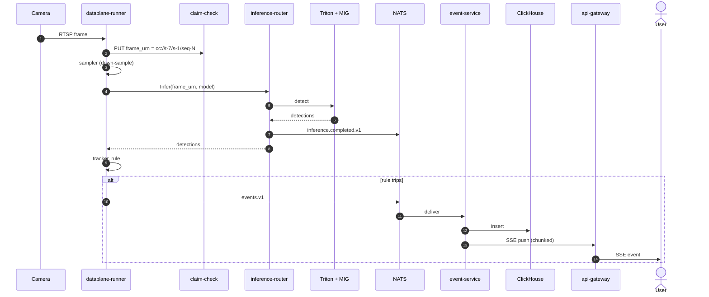
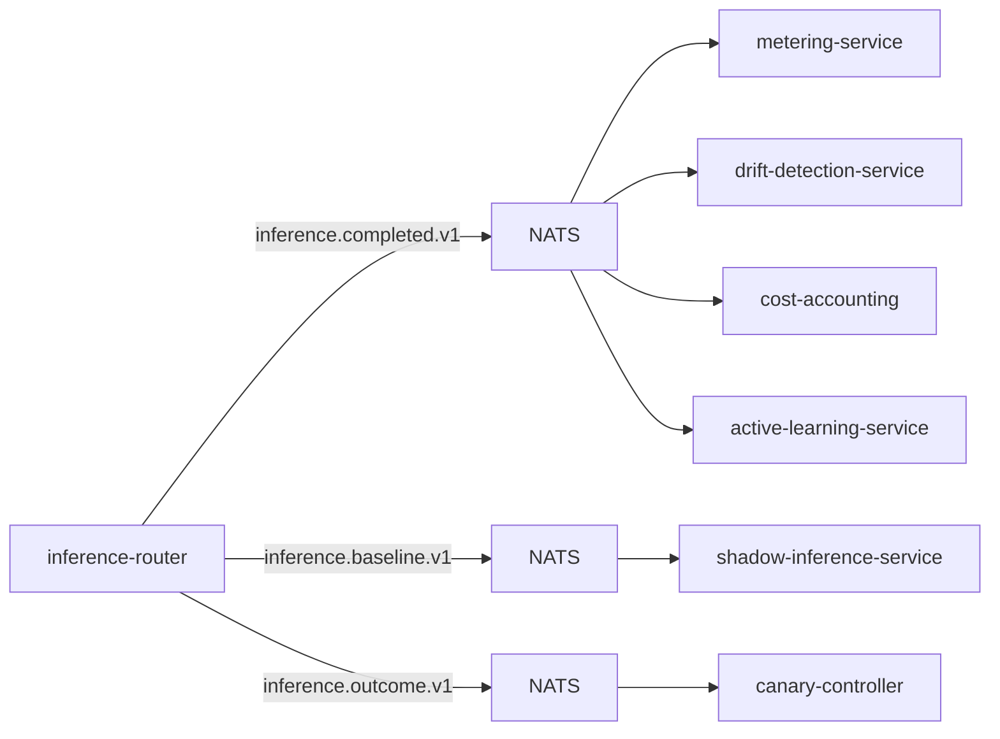
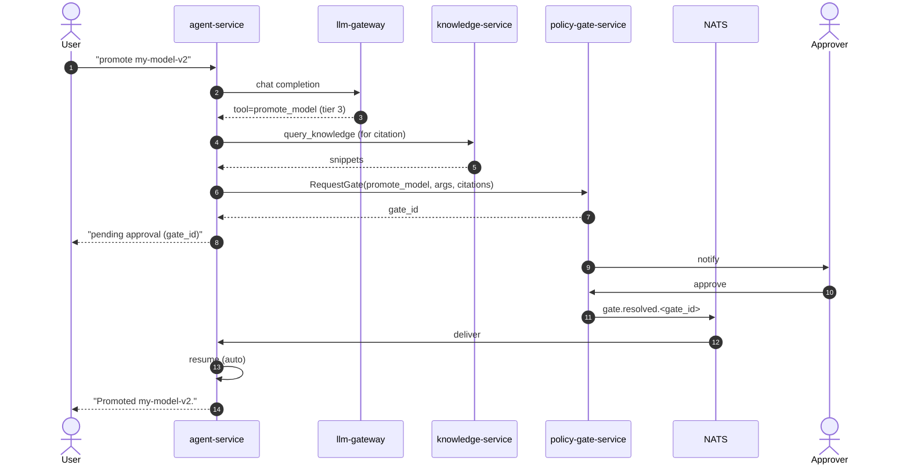
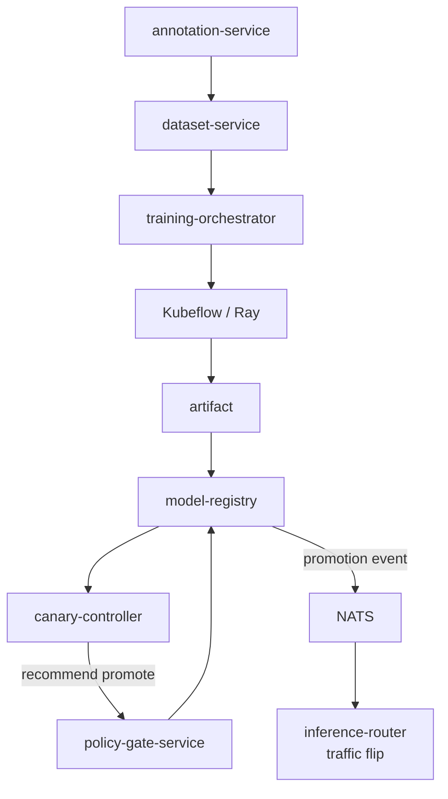
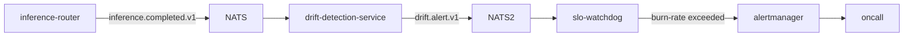
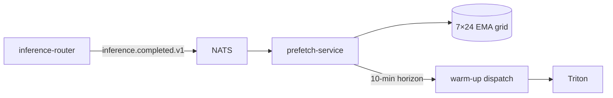

# Data flow

> **End-to-end flow diagrams for every path data takes through the
> platform.**

If you remember nothing else: **frames never go on the bus**. The bus
carries claim-check URNs. ADR-0008.

---

## 1. Glass-to-event (the hot path)

This is the path that defines the platform's latency budget. The
walking-skeleton p95 is 2.7 ms on local hardware; the documented
production target is 300 ms.



**What touches imagery bytes:** camera, dataplane-runner, claim-check,
inference-router → Triton. Everyone else operates on URNs.

---

## 2. Inference fan-out



Each `Infer` call emits up to three bus events. Integration smoke
asserts all three have publishers + consumers.

---

## 3. Bounded-autonomy gate round-trip



---

## 4. Training → registry → canary → promotion



---

## 5. Tenant offboarding (crypto-shredding)

```mermaid
sequenceDiagram
    autonumber
    actor A as Admin
    participant TS as tenant-service
    participant AUD as audit-service
    participant V as Vault transit
    participant NATS as NATS

    A->>TS: DELETE /v1/tenants/{id}
    TS->>AUD: append delete_tenant (fail-closed)
    AUD-->>TS: ok
    TS->>V: delete transit/keys/aegis-tenant-{id}
    V-->>TS: ok
    TS->>NATS: tenant.deleted.v1
    NATS->>OBS[multiple consumers]
    OBS->>OBS: drop indexes / GC caches
```

After this point the tenant's encrypted bytes — in ClickHouse,
Postgres, object store, **including backups** — are unreadable.

---

## 6. Edge → core outbox sync

```mermaid
flowchart LR
    subgraph edge (k3s)
        CAM[camera] --> DR[dataplane-runner]
        DR --> ES[event-service<br/>edge]
        ES --> EG[edge-gateway]
        EG --> OUT[(local outbox)]
    end
    EG -->|periodic sync gRPC| ESC[event-service<br/>core]
    ESC --> CH[(ClickHouse core)]
```

The outbox commits locally first. On partition, edge keeps producing
events; sync drains on recovery.

---

## 7. Drift → SLO → page



---

## 8. Predictive prefetch



---

## What never appears on these diagrams

- **No image bytes on the bus.** Always URNs.
- **No per-frame Postgres calls.** Per-frame work is stateless.
- **No raw LLM calls.** Always through `llm-gateway`.
- **No second agent runtime.** All sessions through `agent-service`.

If you find yourself drawing one of those, that's an ADR-tracked
change — not a feature.

---

## See also

- [`ARCHITECTURE.md`](../ARCHITECTURE.md) — the full architectural view.
- [`concepts.md`](./concepts.md) — what the resources mean.
- [`adr/`](./adr/) — the load-bearing decisions.
