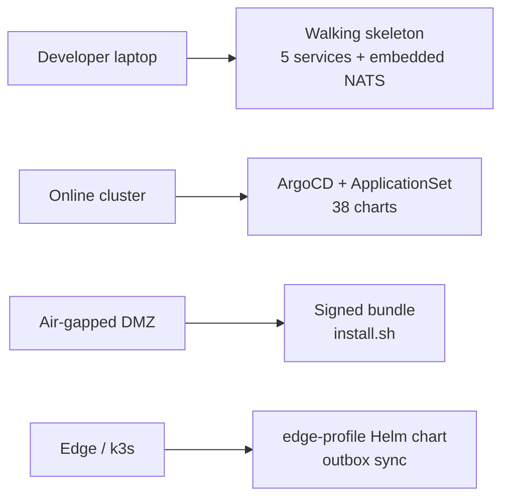
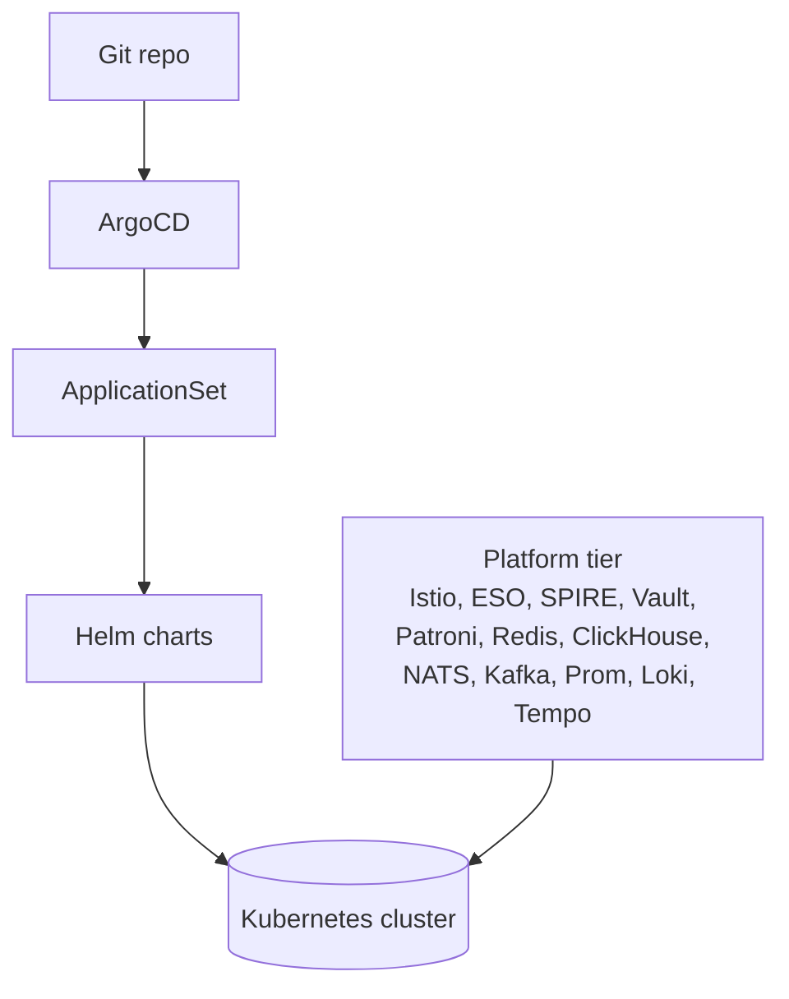
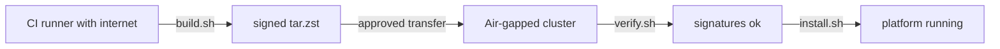

# Deployment

> **Online cluster, air-gapped, edge.** See [`SETUP_GUIDE.md`](../SETUP_GUIDE.md)
> for the full step-by-step.

This doc is the *concept* view. For commands, see SETUP_GUIDE.

---

## Three paths



---

## Online cluster



Steps:

1. Cluster baseline (`deploy/k8s/base`, `policies`, `quotas`).
2. Platform tier (`deploy/platform/`).
3. ArgoCD + ApplicationSet (`deploy/argocd/applicationset.yaml`).
4. ArgoCD reconciles every chart in `deploy/helm/`.

Total first-sync time: 5–10 min on a 6-node cluster.

---

## Air-gapped

The bundle path. See [`air-gap.md`](./air-gap.md).



Total install time: ~30 min including platform-tier bootstrap.

---

## Edge

Reduced operator set + outbox sync to core.

```mermaid
flowchart LR
    subgraph Edge (k3s)
        CAM[camera] --> DR[dataplane-runner]
        DR --> ES[event-service edge]
        ES --> EG[edge-gateway]
        EG --> OUT[(local outbox)]
    end
    EG --> CORE[(core cluster)]
```

Edge runs:

- `stream-manager` (reduced).
- `dataplane-runner` (full).
- `event-service` (with outbox).
- `inference-router` (with local Triton).
- `edge-gateway`.

LLM / agent / canary / drift remain on the core cluster.

---

## Console deploy

The production Next.js console is the 39th Helm chart and ships with
every release:

```bash
helm install console deploy/helm/console -n aegis-system \
  --set apiBaseUrl=http://api-gateway.aegis-system.svc.cluster.local:8080
```

ArgoCD's `ApplicationSet` picks it up automatically. Behind an Istio
Gateway, front it on `console.<your-host>` with `api-gateway` on
`api.<your-host>`. The console is a pure browser app — every call
goes through `api-gateway`. See [`console.md`](./console.md).

---

## Configuration model

The platform's configuration is *layered*:

1. **Per-chart `values.yaml`** — defaults shipped with the chart.
2. **Environment-specific values** — e.g. `values-prod.yaml`.
3. **External Secrets** — per-tenant secrets via Vault.
4. **CRDs** — operator-managed configuration (PeerAuthentication, etc.).

No service hard-codes values that an operator should be able to
change. No service reads from S3 / Postgres / etc. for *configuration*
— only for *data*.

---

## Health + readiness

Every service exposes `/v1/health` and `/v1/ready`. ArgoCD waits on
readiness before marking an Application healthy. Per-service probes
live in chart `values.yaml`.

---

## See also

- [`SETUP_GUIDE.md`](../SETUP_GUIDE.md) — commands.
- [`air-gap.md`](./air-gap.md) — DMZ install.
- [`deploy/README.md`](../deploy/README.md) — deploy directory layout.
- [`runbooks/dr.md`](./runbooks/dr.md) — BCDR.
