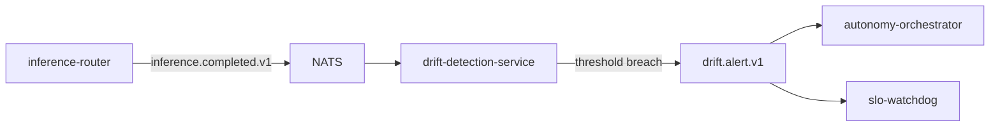
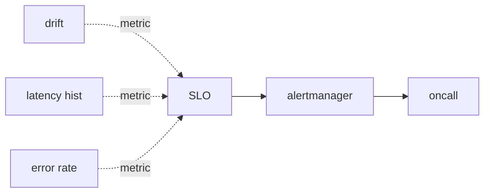

# Drift + SLO

> **JS / KL / TVD divergence + Google SRE multi-window burn-rate.**
> ADR-0025.

This doc covers how the platform decides "something is wrong" — both
at the model layer (drift) and the system layer (SLO).

---

## Drift

Drift = the current class distribution of a model's outputs no longer
matches the reference distribution from training time.

### Three metrics

| Metric | Symmetric | Bounded | Notes |
| --- | --- | --- | --- |
| Jensen-Shannon (JS) | yes | yes | Default. Smooth; works well at small probabilities. |
| Kullback-Leibler (KL) | no | no (we normalise) | Sensitive to tail mass shifts. |
| Total Variation Distance (TVD) | yes | yes (≤ 1) | Interpretable as probability mass moved. |

All three are computed every 5 min over a 1h sliding window. Implementation in `pkg/autonomy/divergence.go`.

### Reference

The reference distribution is the model's training-time empirical
distribution, stored alongside the artifact in `model-registry`. It
doesn't change after the model is registered.

### Alerting

Thresholds are per-tenant per-model. Defaults:

| Metric | Warn | Alert |
| --- | --- | --- |
| JS | 0.05 | 0.10 |
| KL | 0.10 | 0.25 |
| TVD | 0.10 | 0.20 |

---

## SLO

SLOs are evaluated by `slo-watchdog` via Google's MWMBR pattern.

### MWMBR refresher

For an error budget $B$ (1 - SLO), the *burn rate* is the ratio of
*actual error rate* over $B$. A burn rate of 1.0 means the budget
will be exactly consumed by month-end; 14.4 means it will be consumed
in 1 / 14.4 of the month.

Two windows:

- **Fast** — 1 hour. Detects rapid burn.
- **Slow** — 6 hours. Detects sustained burn.

Page only if **both** windows exceed thresholds. This is the standard
double-trigger to filter spikes.

### Default SLOs

| SLO | Target | Fast threshold | Slow threshold |
| --- | --- | --- | --- |
| Glass-to-event p95 | < 300 ms | burn > 14.4 | burn > 6 |
| api-gateway availability | 99.9% / month | burn > 14.4 | burn > 6 |
| Inference p95 | < 500 ms | burn > 14.4 | burn > 6 |
| LLM gateway availability | 99.5% / month | burn > 14.4 | burn > 6 |
| Event durability | 100% (Kafka durable) | any miss → page | any miss → page |

### Why MWMBR

Single-window alerts produce too many false positives or miss real
incidents:

- Short window: noise spikes page constantly.
- Long window: sustained slow burn alerts too late.

Two windows filter both modes. We adopted Google SRE's
recommendation directly. ADR-0025.

---

## Drift + SLO together

`slo-watchdog` treats drift as an SLO input. A model with high JS
divergence is *worse* (probabilistically) and burns the
"prediction-quality" budget faster.

This is the difference between "the model is drifting" (an
observation) and "the platform is going to miss its SLO this month"
(an alert).

---

## Anti-patterns

- **Single-window alerts.** False positives or missed incidents.
- **Magic-number drift thresholds.** Use per-model thresholds keyed
  to the reference distribution.
- **Drift alert without SLO context.** Drift on a low-traffic model
  matters less.
- **Re-using burn-rate windows across SLOs without thought.** The
  standard MWMBR thresholds (14.4 / 6) assume a 1h+6h pair; if you
  use different windows you must re-derive.

---

## Where to see it

- **Console UI** — `/drift` lists runs with JS/KL/TVD pills + breach
  badges + manual trigger; `/slo` is the MWMBR burn-rate board.
  See [`console.md`](./console.md).
- **Grafana** — the long-form view with full time-series.
- **alertmanager** — when MWMBR thresholds breach, this is what pages
  on-call.

## See also

- [`autonomy.md`](./autonomy.md).
- [`observability.md`](./observability.md) — dashboards.
- [`console.md`](./console.md) — drift heatmap + SLO board.
- [`runbooks/drift-spike.md`](./runbooks/drift-spike.md) — runbook.
- [`runbooks/incident-response.md`](./runbooks/incident-response.md) — page response.
- ADR-0025.
