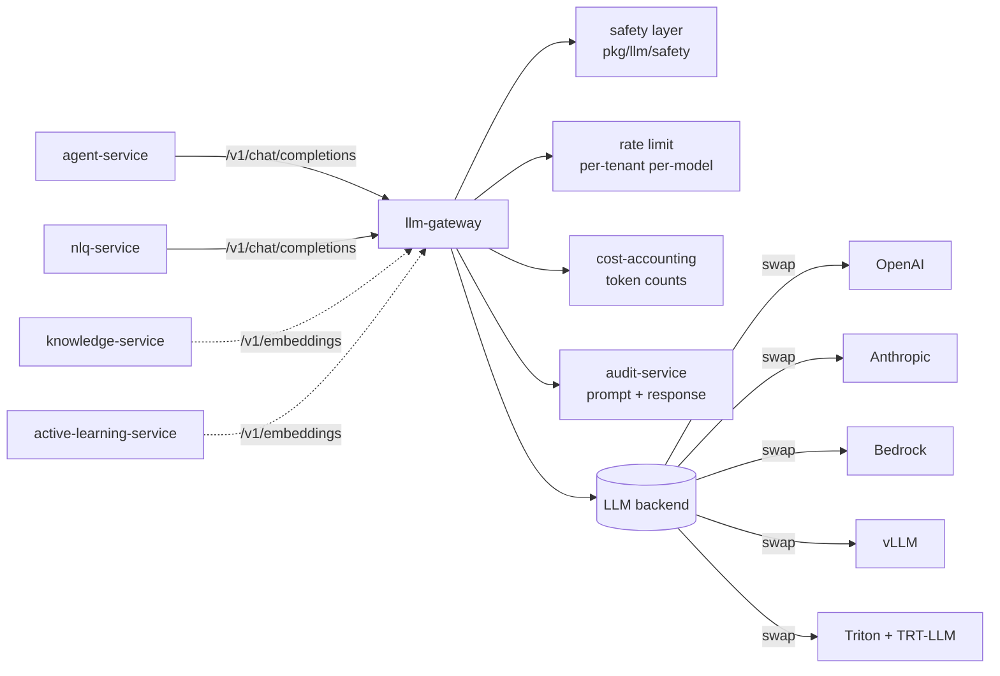
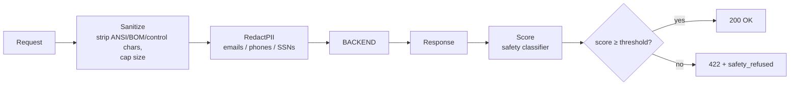

# llm-gateway

> **Why one gateway.** ADR-0018.

This document explains the design of `llm-gateway` — the *only* LLM /
VLM endpoint in AegisVision — and why every architectural property
follows from "one gateway."

---

## The shape



The API is **exactly OpenAI v1**. The wire shape is unchanged. Any
client library (LangChain, the OpenAI SDK, etc.) works without code
changes. This is deliberate: backend portability comes from this
contract.

---

## The safety layer

Every request goes through `pkg/llm/safety`. The pipeline:



Each stage is one function. Each is independently tested. The
integration smoke
(`tools/integration/TestSmoke_LLMSafety_RefusesInjection`) asserts the
refusal path actually triggers on a prompt-injection corpus.

---

## Six reasons one gateway

### 1. Safety in one place

If we had six callers, each calling a backend directly, the safety
layer would either be six copies (drift inevitable) or absent in some.

### 2. Token accounting in one place

Per-tenant token accounting matters for both **billing**
(`metering-service`) and **internal cost** (`cost-accounting`).
Centralising in the gateway means we count the same way for both.

### 3. Rate limit in one place

Per-tenant + per-model. A misbehaving agent calling `gpt-4` 1000×/min
gets throttled before it costs more than the tenant's plan allows.

### 4. Backend swap

Today: `vLLM`. Tomorrow: `Triton + TRT-LLM`. The day after: hosted
Anthropic. Callers don't know.

### 5. Audit in one place

Every prompt + response goes to `audit-service`. Auditors get a single
table to inspect for "what did the agent ever say to a model?"

### 6. Refusal in one place

A single refusal threshold. A single set of safety-refusal categories.
A single way to *explain* a refusal to a user.

---

## Production-shape startup

```python
if AEGIS_ENV == "production":
    require(AEGIS_LLM_BACKEND_URL)              # else panic
    require(AEGIS_LLM_BACKEND_API_KEY_SECRET)   # else panic
```

This is in `pkg/platform/config`. Production-shape services *refuse
unsafe defaults*. The dev backend (`pkg/llm/fake.go`) is unreachable in
prod.

---

## Backends we ship adapters for

| Backend | Adapter | Notes |
| --- | --- | --- |
| OpenAI | `internal/backends/openai.go` | API key, optional org. |
| Anthropic | `internal/backends/anthropic.go` | OpenAI-compatible shim. |
| AWS Bedrock | `internal/backends/bedrock.go` | OpenAI-compatible shim. Sigv4. |
| vLLM | `internal/backends/vllm.go` | Native OpenAI v1. |
| Triton + TRT-LLM | `internal/backends/triton.go` | gRPC + on-cluster. |
| Fake | `pkg/llm/fake.go` | Dev / tests. Deterministic. |

Adding a backend = one Go file + a `Backend` interface implementation
+ a config flag. No callers change.

---

## Per-tenant rate limit

Implemented in `internal/ratelimit`. Token-bucket per (tenant, model).
Defaults:

| Plan | RPM |
| --- | --- |
| free | 10 |
| pro | 60 |
| enterprise | 600 |
| internal (CI / cron) | 60 |

Operators override per tenant via `/v1/admin/ratelimit`.

---

## Per-request audit shape

```json
{
  "tenant_id": "t-7",
  "actor": "agent-service:session-xxx",
  "action": "llm_call",
  "model": "gpt-4-turbo",
  "input_tokens": 412,
  "output_tokens": 188,
  "refused": false,
  "refusal_reason": null,
  "trace_id": "00-abcd-...",
  "ts": "..."
}
```

Audit records do not include the prompt or response *content* by
default (privacy). Operators can opt a tenant into full-content audit
(typically for incident response or compliance review).

---

## Anti-patterns

- **Don't add a "trusted prompt" bypass.** No prompt is trusted.
- **Don't merge per-tenant token quota with per-tenant billing usage.**
  Billing is metering's job; quota is the gateway's.
- **Don't expose a "raw passthrough" mode.** Every call goes through
  safety.
- **Don't call the backend from anywhere else.** ADR-0018.

---

## See also

- [`agents.md`](./agents.md) — the largest consumer.
- [`security.md`](./security.md) — prompt-injection defense.
- [`pkg/llm/README.md`](../pkg/llm/README.md) — the client library.
- ADR-0018, ADR-0021.
