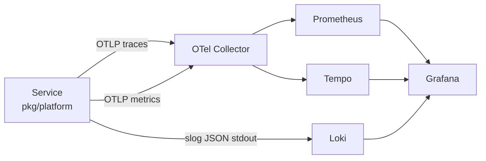

# Observability

> **Logs, metrics, traces, dashboards, alerts.**
>
> The platform is observable by default. Every service speaks the
> same shape, so 35 services produce *one* operational view, not 35.

---

## The triad



---

## Logs

- **Structured** (`slog`).
- **JSON** format.
- **stdout** — collected by Loki via Promtail / Vector.
- Every line carries `tenant_id`, `request_id`, `trace_id`.
- The platform forbids `fmt.Print*` in service code.

Example:

```json
{
  "time":"2026-05-21T14:32:11.412Z",
  "level":"INFO",
  "msg":"stream created",
  "service":"stream-manager",
  "tenant_id":"t-7",
  "request_id":"abc-123",
  "trace_id":"00-abcd-...",
  "stream_id":"str_xyz789",
  "shard":4
}
```

Loki labels are bounded: `{service,namespace,severity}`. Tenant ID is
*in the line*, not a label — cardinality protection.

---

## Metrics (RED)

- **R**ate — `aegis_*_requests_total{service,method,status,tenant}`
- **E**rrors — implied by `status` label.
- **D**uration — `aegis_*_request_duration_seconds{service,method}` histogram.

Standard histogram buckets (`pkg/platform/metrics`):

```
0.005 0.01 0.025 0.05 0.1 0.25 0.5 1 2.5 5 10
```

These are tuned to the platform's typical RPC latency band.

Per-service gauges live under `aegis_<service>_*`. Examples:

- `aegis_dataplane_glass_to_emit_latency_seconds` — end-to-end histogram.
- `aegis_canary_wilson_lower_bound` — gauge per plan/arm.
- `aegis_inference_gpu_reservation_wait_seconds` — histogram.
- `aegis_drift_js_divergence` — gauge per (tenant,model).

**Per-tenant labels** — when `tenant` appears as a label, the
operator must confirm the tenant cardinality is bounded. There are
hundreds of tenants, not millions; if that ever changes, we drop
tenant from these labels and surface it via traces / logs instead.

---

## Traces

- OpenTelemetry over OTLP.
- 100% sampling of errors, 1% sampling of successes (configurable per
  tenant via header).
- Trace IDs flow through bus messages via a `trace-id` header in
  `bus.Message`.
- Spans named after the operation, not the HTTP path.

Stitching a glass-to-event flow:

```mermaid
gantt
    title End-to-end trace example
    dateFormat X
    axisFormat %s
    section api-gateway
    POST /v1/streams      :a1, 0, 1
    section stream-manager
    CreateStream gRPC     :a2, 1, 2
    bus publish           :a3, 2, 3
    section dataplane-runner
    StartStream control   :a4, 3, 4
    ingest+sampler        :a5, 4, 5
    inference call        :a6, 5, 7
    tracker+rule          :a7, 7, 7.5
    emit events.v1        :a8, 7.5, 8
    section event-service
    NATS consume          :a9, 8, 8.2
    ClickHouse insert     :a10, 8.2, 8.5
    SSE push              :a11, 8.5, 8.7
```



---

## Dashboards (Grafana)

Stock dashboards in `deploy/platform/observability/grafana/`:

| Dashboard | Purpose |
| --- | --- |
| `red-per-service` | RED panels for every service (auto-generated). |
| `glass-to-event-latency` | End-to-end histogram + per-stream breakdown. |
| `bus-subject-health` | Lag, redelivery rate, consumer count per subject. |
| `gpu-utilization` | Per MIG slice. |
| `llm-cost-per-tenant` | Token cost over time. |
| `canary-decisions` | Wilson lower bound, decisions per plan. |
| `drift-heatmap` | JS / KL / TVD over time. |
| `slo-burn-rate` | Fast + slow burn rate per SLO. |
| `tenant-usage` | Per-tenant streams + events + inference. |
| `audit-volume` | Audit appends + verification health. |

---

## Alerts

Alerts live in `deploy/platform/observability/prometheus/rules.yaml`:

- **Page** — pageable: ` MultiWindow burn-rate fast > 14.4 AND slow > 6`.
- **Ticket** — actionable but not pageable.
- **Notify** — informational (Slack channel).

Categories:

- **Latency** — glass-to-event p95 / api-gateway p95.
- **Error rate** — 5xx per service.
- **Saturation** — GPU reservation wait, NATS lag.
- **Drift** — divergence over threshold.
- **Audit** — chain verification failure.
- **Cost** — per-tenant token spend deviation.

---

## Trace-to-log-to-metric

Every trace has a `trace_id`. Loki queries support `{trace_id="..."}`.
Prometheus exemplars link metric histograms to representative traces.
Grafana stitches the three in the "Explore" view.

The on-call experience is: page → metric → exemplar trace → log line →
fix.

---

## Console observability

The Next.js console is scraped like every other service:

- **`/api/metrics`** — RED metrics for the Next.js server (route count, p95 latency, error rate).
- **ServiceMonitor** — defined in `deploy/helm/console/templates/servicemonitor.yaml`.
- **Browser-side errors** are *not* sent to Prometheus (cardinality). The
  console parses RFC 9457 problem+json and surfaces `trace_id` toasts —
  the operator pivots from the toast into Tempo.
- **No PII / tenant input** in labels. The same discipline that applies
  to every service applies to the console's metrics.

The console itself also doubles as an **observability surface**: the
dashboard at `/` pulls bus health, SLO burn-rate, canary state, and
drift status from their respective services. For deep dives, Grafana
is still the right tool.

---

## What NOT to instrument

- **Per-frame work.** The data plane operator runtime emits per-stream
  metrics, not per-frame. A `frame_id` label would explode cardinality.
- **User input.** Never put unvalidated user input into a label.
- **Stack traces in metrics.** Use logs.
- **Browser-side telemetry into Prometheus.** Use Sentry or RUM if you
  need it; don't push browser noise into platform metrics.

---

## See also

- [`runbooks/oncall.md`](./runbooks/oncall.md) — what an alert looks like in practice.
- [`runbooks/incident-response.md`](./runbooks/incident-response.md).
- [`pkg/platform/README.md`](../pkg/platform/README.md) — instrumentation primitives.
