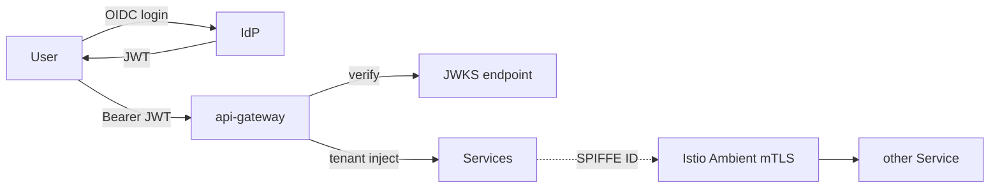
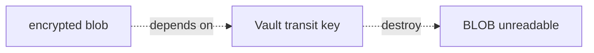
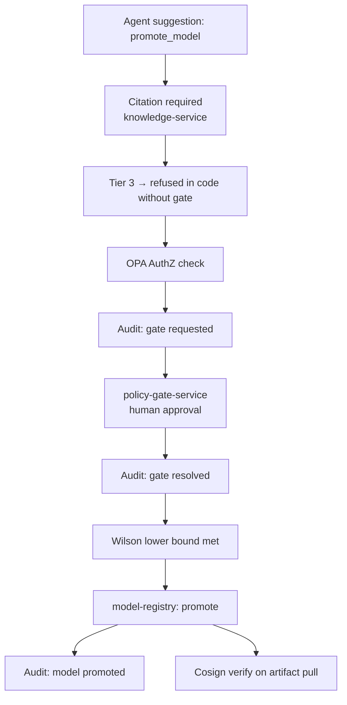

# Security

> **Defense in depth, refuse unsafe defaults, fail closed.**

This document describes the platform's security architecture. Every
control listed here has a corresponding control in the SOC 2 evidence
package (`docs/compliance/soc2/`) and a corresponding pen-test scope
entry (`docs/compliance/pentest-scope.md`).

---

## Threat model

The platform serves:

- Multi-tenant production tenants.
- Air-gapped DMZ deployments (regulated industries).
- Edge installations (on-prem, vehicle, mobile).

Adversaries we design against:

| Adversary | Capability | Mitigation tier |
| --- | --- | --- |
| External, unauthenticated | Internet attacker | api-gateway, mTLS, WAF (deploy-time) |
| External, with leaked JWT | Tenant impersonation | JWKS rotation, JWT lifetime ≤ 1h, audit |
| External, with stolen cosign signing key | Image substitution | Keyless signing, Rekor transparency log |
| Insider, compromised single pod | Lateral movement | mTLS STRICT + OPA AuthZ + NetworkPolicy default-deny + SPIRE |
| Insider, compromised admin | Crypto-shredded data exfiltration | Audit append-only + alert on retention override |
| Supply-chain | Compromised dependency | Cosign + SLSA v1 + SBOM + Kyverno admission |
| Prompt-injection | Agent misuse | Sanitiser + PII redactor + refusal threshold + tier-3 gate |

---

## Identity



- **User identity** — OIDC JWT verified against IdP's JWKS endpoint.
  HS* (HMAC) deliberately not supported (sharing the signing key
  defeats OIDC).
- **Workload identity** — SPIRE issues a SPIFFE ID to every pod.
  Istio uses SPIFFE IDs in `AuthorizationPolicy` ALLOW lists.
- **Tenant identity** — `auth-proxy` reads the `tenant_id` claim and
  injects it as `X-Aegis-Tenant`. Services treat this as authoritative.

---

## Mesh-layer authorization

Every service has:

- `PeerAuthentication` enforcing mTLS STRICT.
- `AuthorizationPolicy` ALLOW list — only the specific SPIFFE IDs that
  may talk to it.
- `NetworkPolicy` default-deny — even if the mesh is compromised, the
  pod network refuses connections.

Example: `pipeline-service` only accepts traffic from
`cluster.local/ns/aegis-system/sa/api-gateway` and
`cluster.local/ns/aegis-system/sa/agent-service`. Everything else: 403
at the mesh layer.

The conformance test asserts every chart has all three resources.

---

## Application-layer authorization

OPA sidecar evaluates Rego per request. Policies live in each chart's
`opa-policy.yaml` ConfigMap. The default pattern:

```rego
default allow = false
allow {
  input.tenant_id == input.resource.tenant_id
  input.user.role in {"owner","admin","operator"}
  input.path matches "/v1/streams/.*"
}
```

Per-tenant model allow-lists, per-project member roles, per-resource
ownership — all evaluated here.

---

## Secrets

- **Vault** is the only secret store. `External Secrets Operator`
  syncs Vault → Kubernetes `Secret`.
- **No secrets in git.** Period.
- **Per-tenant Vault transit keys** for crypto-shredding (ADR-0014).

---

## Encryption

| Where | What | How |
| --- | --- | --- |
| In transit (pod-to-pod) | Istio mTLS | STRICT |
| In transit (pod-to-extern) | TLS | per-service |
| At rest (Postgres) | WAL-G + SSE-KMS | platform key |
| At rest (ClickHouse) | clickhouse-backup + SSE-KMS | platform key |
| At rest (object store) | SSE-KMS | per-tenant key (crypto-shred) |
| Per-tenant data | Vault transit | per-tenant key |

---

## Crypto-shredding (ADR-0014)

Every tenant has a Vault transit key. Encrypted data anywhere in the
platform (and in backups) is unreadable once the key is destroyed.



This is how the platform satisfies GDPR Article 17 deletion requests
at scale: no per-row scan, no backup mutation, one key destruction.

---

## Audit

- **Append-only.** No `UPDATE`, no `DELETE`. Runbook forbids both.
- **Hash-chained.** `tools/audit/` verifies the chain.
- **Fail-closed.** If `audit-service` is unreachable, the operation
  fails. ADR-0014 mandates that audit *failures* count too.

---

## Supply chain

- **Cosign keyless** signing of every image.
- **SLSA v1** provenance attached to every release.
- **Syft SBOM** (SPDX) attached to every image.
- **Kyverno** admission verifies cosign signatures against the
  expected workflow:
  `github.com/hoangsonww/AegisVision-Computer-Vision-System/.github/workflows/build-and-verify.yml@refs/heads/master`.
- **Air-gapped bundle** carries every signature + SBOM + Rekor entry.
  Re-verification on the target is mandatory.

---

## Prompt-injection defense (ADR-0021)

The LLM gateway's safety layer:

1. **Sanitizer** — strips control chars, ANSI escapes, BOM, caps size.
2. **PII redactor** — emails, phones, SSNs (per-tenant configurable).
3. **Refusal threshold** — score the response; refuse if too risky.
4. **Per-tenant rate limit** — defeats large-scale injection probing.
5. **Tier-3 gate** — even if the agent is convinced to call a tier-3
   tool, the runtime refuses without a resolved gate.

The integration smoke
(`tools/integration/TestSmoke_LLMSafety_RefusesInjection`) keeps this
honest in CI.

---

## Pod Security Standards

Cluster-wide PSS = **restricted**.

- No `runAsUser: 0`.
- No `hostNetwork`, `hostPID`, `hostIPC`.
- No `hostPath` mounts.
- No `privileged` containers.
- `readOnlyRootFilesystem: true` everywhere it works.
- `securityContext.capabilities.drop: [ALL]`.

Kyverno admission policies enforce this.

---

## Defense-in-depth example: "promote a model"

Promoting a model is **the** highest-leverage destructive action. The
defenses stack:



Eight checkpoints. Any one of them can refuse.

---

## Console security posture

The Next.js console at [`services/console/`](../services/console) is a
plain browser app — **it has no special trust path**. Specifically:

- **No service-mesh shortcut.** The console pod talks to api-gateway
  over the same in-cluster mesh as any other client, via the same OIDC
  bearer JWT. There is no "trusted UI" SPIFFE allowlist.
- **Same mTLS posture.** PeerAuthentication is STRICT;
  AuthorizationPolicy ALLOWs only api-gateway + istio-ingress (for the
  user) + prometheus (for metrics).
- **No bypass for tier-3 actions.** The UI surfaces a "request
  approval" CTA; it cannot force-execute. The refusal lives in
  `pkg/agent/agent.go`, not in the UI.
- **CSP + headers** are applied in `next.config.mjs`:
  `X-Content-Type-Options: nosniff`, `X-Frame-Options: DENY`,
  `Permissions-Policy: camera=(), microphone=(), geolocation=()`,
  `Referrer-Policy: strict-origin-when-cross-origin`.
- **Read-only rootfs + non-root** at the container level. seccomp
  RuntimeDefault.
- **No tenant data in localStorage.** The Zustand store persists only
  the tenant ID + UI prefs. The JWT lives in an HttpOnly cookie set by
  `auth-proxy` (in prod).
- **`Idempotency-Key` on every mutation** prevents replay attacks from
  the browser layer too.

---

## See also

- [`compliance/`](./compliance/) — SOC 2 / EU AI Act / GDPR.
- [`runbooks/incident-response.md`](./runbooks/incident-response.md) — when a control fires.
- [`console.md`](./console.md) — the UI's full posture.
- ADR-0014, ADR-0017, ADR-0018, ADR-0021.
