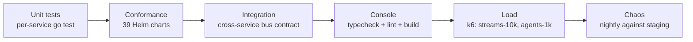

# Testing

> **Unit + integration + conformance + chaos + load.**

The platform has five distinct test layers. Each runs in CI; each
catches a class of bug the others miss.

---

## The six layers



| Layer | What it catches | Who runs it |
| --- | --- | --- |
| Unit | Logic bugs inside one service. | every PR |
| Conformance | Chart shape regressions (missing mTLS, missing NP, etc.) across all 39 charts. | every PR |
| Integration | Cross-service contract drift (bus subjects, gate round-trip). | every PR |
| Console | Next.js typecheck + lint + production build. | every PR |
| Load | Throughput / latency regressions. | nightly + on demand |
| Chaos | Resilience claims that broke. | nightly against staging |

---

## Unit tests

```bash
task test
# → go test -race ./... for every module in go.work
```

Conventions:

- All tests use `-race`.
- No flaky tests. A test that fails 1 / 100 times is fixed or
  deleted.
- Table-driven where the input space is wide.
- One assertion per test where reasonable.

---

## Conformance

```bash
(cd tools/conformance && go test -count=1 ./...)
```

Asserts every chart in `deploy/helm/` has:

- `Deployment` (or `StatefulSet`)
- `Service`
- `ServiceAccount`
- `AuthorizationPolicy` (Istio, ALLOW list)
- `PeerAuthentication` (mTLS STRICT)
- `NetworkPolicy` (default-deny)
- `ServiceMonitor`
- `HorizontalPodAutoscaler`
- `PodDisruptionBudget`
- non-root container, requests + limits, probes, OPA policy where applicable.

Adding a chart without these fields fails CI.

---

## Integration

```bash
(cd tools/integration && go test -race -count=1 ./...)
```

5-test suite using only public `pkg/` packages (Go forbids cross-module
`internal/` imports), in-process `busGateway` helper.

| Test | Asserts |
| --- | --- |
| `TestSmoke_BoundedAutonomy_GateRoundTrip` | A tier-3 tool routed through `policy-gate-service` resumes the agent on `gate.resolved.<id>`. |
| `TestSmoke_PlatformBusSubjects` | All 17 well-known bus subjects have a producer **and** a consumer. |
| `TestSmoke_PlatformWildcardSubjects` | All 7 wildcard pairs match. |
| `TestSmoke_ConcurrentGateResolutions` | 32 parallel approvals resolve correctly under concurrency. |
| `TestSmoke_LLMSafety_RefusesInjection` | Safety layer refuses prompt-injection payloads. |

These tests found three production bugs during the system-integration audit:

1. `inference.completed.v1` had no publisher — metering would have counted zero.
2. `inference.baseline.v1` had no publisher — shadow inference never had a baseline.
3. `gate.resolved.<id>` had no subscriber — bounded-autonomy auto-resume was vaporware.

All three are now caught structurally.

---

## Console build

```bash
cd services/console
npm install
npm run typecheck
npm run lint
npm run build
```

The CI job `console` in `.github/workflows/build-and-verify.yml` runs these on every
PR that touches `services/console/`. A broken typecheck, lint, or build
fails the PR before merge — the production UI doesn't ship broken.

The `container-image` matrix also builds + cosign-signs + Syft-SBOMs +
SLSA-attests the console image on every release, exactly like every Go
service.

---

## Load

```bash
# Against staging:
k6 run tools/loadtest/streams-10k.js --env BASE=https://staging.example.com --env TOKEN=$JWT

# Local fail-fast:
k6 run tools/loadtest/slo-gate.js
```

The SLO gate fails the build if p95 or p99 regress past target.

---

## Chaos

10 experiments live in `deploy/chaos/`. Each carries an assertion
encoded in the manifest. The nightly run applies each, observes for
recovery, and fails the drill if assertions don't pass.

| Drill | Asserts |
| --- | --- |
| `nats-pod-kill.yaml` | NATS recovers in < 10s. |
| `kafka-broker-loss.yaml` | Producers backpressure cleanly. |
| `postgres-failover.yaml` | Patroni promotes within 30s. |
| `clickhouse-rolling-restart.yaml` | No event loss. |
| `gpu-oom-reject.yaml` | Scheduler rejects rather than soft-share. |
| `az-partition.yaml` | Multi-AZ failover, no data loss. |
| `triton-model-evict.yaml` | Cold start < 5s. |
| `llm-gateway-timeout.yaml` | Agent retries with backoff. |
| `policy-gate-down.yaml` | Tier-3 work refused (by design). |
| `webhook-receiver-5xx.yaml` | Retries + DLQ. |

---

## When you add new code

The minimum bar:

1. **Unit tests** for the new logic.
2. **Conformance** stays green (if you added a chart).
3. **Integration** stays green (if you added a bus subject, add it to
   the catalogue).
4. **Load + chaos** as needed for performance-critical or
   resilience-critical changes.

---

## What we don't test

- **External vendor APIs (LLM backends, S3).** Mock at the
  boundary; test our code, not theirs.
- **GPU hardware.** Synthetic detector covers the data plane in tests;
  real GPUs live in staging.

---

## See also

- [`contributing.md`](./contributing.md).
- [`tools/integration/README.md`](../tools/integration/README.md).
- [`tools/conformance/README.md`](../tools/conformance/README.md).
- [`tools/loadtest/README.md`](../tools/loadtest/README.md).
- [`deploy/chaos/README.md`](../deploy/chaos/README.md).
