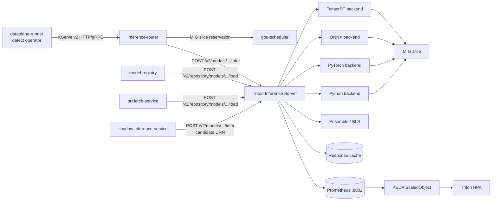

# NVIDIA Triton Inference Server

> **The model-serving substrate that powers every detection in AegisVision.**
> This is the operating manual for the platform's Triton deployment.

NVIDIA Triton Inference Server is a canonical, load-bearing component of
AegisVision. Every `detect` operator in the data plane reaches Triton
through the `inference-router`. Treat the Triton pool as part of the
platform's contract, not as a swappable detail.

This document is the operating manual: model repository layout,
backends, dynamic batching, response caching, model-control modes,
model warm-up, metrics, capacity planning, security posture, and the
runbook for the common failure modes.

---

## Table of contents

1. [Why Triton](#why-triton)
2. [What ships in the template](#what-ships-in-the-template)
3. [Architecture in this platform](#architecture-in-this-platform)
4. [Model repository layout](#model-repository-layout)
5. [Backends supported](#backends-supported)
6. [Model-control modes](#model-control-modes)
7. [Dynamic batching](#dynamic-batching)
8. [Response cache](#response-cache)
9. [Model warm-up](#model-warm-up)
10. [Rate limiting](#rate-limiting)
11. [MIG strategy](#mig-strategy)
12. [The KServe v2 client](#the-kserve-v2-client)
13. [Metrics and SLOs](#metrics-and-slos)
14. [Autoscaling](#autoscaling)
15. [Security posture](#security-posture)
16. [Air-gap and SBOM](#air-gap-and-sbom)
17. [Capacity planning](#capacity-planning)
18. [Common failure modes](#common-failure-modes)
19. [Day-2 operations](#day-2-operations)
20. [References](#references)

---

## Why Triton

Triton is the right substrate for the AegisVision GPU hot path because
it ships production-grade machinery that you would otherwise build:

| Requirement | What Triton gives you |
| --- | --- |
| Multi-framework serving in one process | TensorRT, ONNX Runtime, PyTorch (LibTorch), TensorFlow, Python, ensemble, BLS |
| Dynamic batching across concurrent requests | `dynamic_batching` block in `config.pbtxt` |
| Response caching for deterministic models | Built-in local cache + per-request cache keys |
| Live model load / unload | KServe v2 management API + explicit model-control mode |
| Model warm-up before first request | `model_warmup` section in `config.pbtxt` |
| Per-model + per-tenant rate limiting | `--rate-limit=execution_count` + per-model rate-limiter resources |
| First-class Prometheus metrics | `:8002/metrics` — request, queue, compute, cache hit/miss |
| KServe v2 wire protocol | HTTP + gRPC (streaming) over the same model contract |
| Custom Python operators | `python` backend for non-DL pre/post processing |
| Ensembles | Chain multiple models in a single inference call |

The platform's two-plane architecture (ADR-0001) and claim-check rule
(ADR-0008) together mean every byte that hits Triton came from object
storage via a URN, on a MIG-partitioned slice. That is the property
that lets the platform scale to thousands of concurrent streams without
turning the GPU pool into a noisy neighbourhood.

---

## What ships in the template

The AegisVision template ships:

- A hardened, conformance-clean Helm chart at
  [`deploy/helm/triton/`](../deploy/helm/triton). Includes mTLS STRICT,
  AuthorizationPolicy ALLOW lists, default-deny NetworkPolicy,
  ServiceAccount, PDB, ServiceMonitor scraping Triton's own metrics,
  and a KEDA ScaledObject driving the HPA off
  `nv_inference_queue_duration_us`.
- A native KServe v2 client in
  [`services/inference-router/internal/detector/triton.go`](../services/inference-router/internal/detector/triton.go)
  and the dataplane `Detector` interface in
  [`pkg/dataplane/operators/detector.go`](../pkg/dataplane/operators/detector.go).
- A reference model repository contract (see
  [Model repository layout](#model-repository-layout)).
- A Triton-specific runbook at
  [`docs/runbooks/triton.md`](./runbooks/triton.md).
- A chaos experiment at
  [`deploy/chaos/triton-model-evict.yaml`](../deploy/chaos/triton-model-evict.yaml).

---

## Architecture in this platform



### Key invariants

1. **Triton runs on MIG slices, never on whole GPUs.** Enforced by the
   `nvidia.com/mig-1g.10gb` resource request in `values.yaml` plus the
   `gpu-scheduler` reservation ledger.
2. **Triton does not auto-load models in production.** Production
   deployments use `--model-control-mode=explicit`; models are loaded
   by `model-registry` over the KServe v2 management API.
3. **Triton never sees raw frame bytes from the bus.** The
   `inference-router` dereferences the claim-check URN and POSTs the
   resulting tensor to Triton; bytes never travel the bus (ADR-0008).
4. **All traffic to Triton is mTLS-STRICT.** Enforced by the chart's
   `PeerAuthentication` resource and the Istio Ambient mesh.

---

## Model repository layout

Triton loads models from a "model repository" — a directory tree with
one subdirectory per model. The AegisVision template adopts the
following layout:

```
s3://aegis-models/triton-repo/
├── yolov8-person/
│   ├── config.pbtxt
│   ├── 1/
│   │   └── model.plan          # TensorRT engine
│   └── 2/
│       └── model.plan
├── face-blur-onnx/
│   ├── config.pbtxt
│   └── 1/
│       └── model.onnx
├── caption-ensemble/
│   ├── config.pbtxt           # Ensemble linking vision + LLM models
│   └── 1/                     # No model file — Triton uses the ensemble def
└── tracker-python/
    ├── config.pbtxt
    └── 1/
        ├── model.py            # Python backend implementation
        └── trk.pt              # Auxiliary weight file
```

### Rules

- **Model names are stable, opaque identifiers** registered in
  `model-registry`. Triton's internal name and the platform's product
  noun map 1:1.
- **Versions are integer-named directories.** Never reuse a version
  number — promote a new one and let the canary controller drive
  traffic.
- **Every `config.pbtxt` is checked into the same OCI artifact as the
  model weights.** That way the air-gap bundle has the complete
  serving recipe for every model it carries.
- **`config.pbtxt` is the source of truth for batching, instance
  groups, dynamic batching, and response cache.** Reading it tells
  you exactly how the model will serve.

### Example `config.pbtxt`

```pbtxt
name: "yolov8-person"
platform: "tensorrt_plan"
max_batch_size: 16
input [
  {
    name: "images"
    data_type: TYPE_FP32
    format: FORMAT_NCHW
    dims: [ 3, 640, 640 ]
  }
]
output [
  {
    name: "detections"
    data_type: TYPE_FP32
    dims: [ -1, 6 ]
  }
]
instance_group [
  {
    count: 1
    kind: KIND_GPU
    gpus: [ 0 ]
  }
]
dynamic_batching {
  preferred_batch_size: [ 4, 8 ]
  max_queue_delay_microseconds: 2000
}
response_cache {
  enable: false             # per-frame detector — caching is unsafe
}
model_warmup [
  {
    name: "synthetic-zero"
    batch_size: 1
    inputs {
      key: "images"
      value: {
        data_type: TYPE_FP32
        dims: [ 3, 640, 640 ]
        zero_data: true
      }
    }
  }
]
version_policy { specific: { versions: [ 2 ] } }
```

---

## Backends supported

Triton's backend system is the reason the platform can serve
heterogeneous models with one runtime. The chart ships with these
backends enabled by default; trim the list in `values.yaml` for
supply-chain isolation.

| Backend | When to use |
| --- | --- |
| `tensorrt` | Highest-throughput path for vision models. Compile once with `trtexec`, ship the `.plan`. Hardware-specific — re-compile per GPU SKU. |
| `onnxruntime` | Portable across GPUs and CPUs; good for models you can't (or don't want to) recompile. |
| `pytorch` | LibTorch — for traced TorchScript models. Slightly slower than TensorRT but more flexible. |
| `tensorflow` | SavedModel; useful for legacy models. |
| `python` | Pre/post-processing operators, custom decoders, BLS scripts. Adds Python startup cost — use ensemble to amortize. |
| `ensemble` | Chain backends in a single inference call. Eliminates a network hop between vision + LLM. |
| `BLS` (Business Logic Scripting) | Python backend with the ability to call other models — for conditional logic in the inference graph. |

---

## Model-control modes

| Mode | When | Behaviour |
| --- | --- | --- |
| `none` | Tiny static deployments only | Loads every model in the repository at startup. Risky on big repos. |
| `poll` | Dev only | Polls the repository every N seconds; auto-loads new versions. Eases iteration. |
| `explicit` | **Production** | Loads nothing at startup. Models load via `POST /v2/repository/models/{name}/load`. |

In production-shape values the chart uses `explicit`. Models are loaded
by `model-registry` after registration, recorded in the registry's
state, and warmed before the canary controller is allowed to send
candidate traffic. Cold pods do not serve.

### Loading a model

```bash
curl -X POST \
  http://triton.aegis-inference.svc:8000/v2/repository/models/yolov8-person/load
```

`model-registry` automates this — operators do not call it directly.

---

## Dynamic batching

Triton's dynamic batcher coalesces concurrent requests into a single
GPU invocation. The chart ships sensible defaults:

```pbtxt
dynamic_batching {
  preferred_batch_size: [ 4, 8 ]
  max_queue_delay_microseconds: 2000
}
```

**Tuning:**

- Increase `preferred_batch_size` to amortize per-batch overhead more
  aggressively. Diminishing returns above ~32 for most vision models.
- `max_queue_delay_microseconds` caps the additional latency the
  batcher will inject. Set this in proportion to your glass-to-event
  SLO budget — the default 2 ms is 1% of the 300 ms target.
- Watch `nv_inference_queue_duration_us`. If it sits near
  `max_queue_delay_microseconds` consistently, the batcher is
  saturated — scale out.

---

## Response cache

Triton's response cache is a content-addressed cache of inference
results, keyed by input tensor bytes. The platform enables it by
default with a 1 GiB size:

```
--cache-config=local,size=1073741824
```

**When to enable per-model** (in `config.pbtxt`):

- Deterministic models with bounded input cardinality (e.g.
  caption generation over a fixed clip catalogue).
- Embedding models — same text → same vector.

**When to disable per-model:**

- Per-frame detectors — every input is unique; cache thrashes.
- Models with non-deterministic output (top-k sampling, stochastic
  ensembles).

The `inference-router` surfaces cache hits as a
`X-Triton-Cache-Hit` response parameter, and the metering-service
charges cached calls at the same rate as live ones (cost is the
operator decision — disable cache for that model if you don't want
that).

---

## Model warm-up

Cold-start latency on a freshly loaded model is dominated by CUDA
context initialization and first-batch graph capture. The `model_warmup`
section of `config.pbtxt` pre-runs the model with synthetic inputs
during load, so the *first* real inference is fast:

```pbtxt
model_warmup [
  {
    name: "synthetic-zero"
    batch_size: 1
    inputs {
      key: "images"
      value: {
        data_type: TYPE_FP32
        dims: [ 3, 640, 640 ]
        zero_data: true
      }
    }
  }
]
```

`model-registry` waits for warm-up to complete before marking the model
"ready". Canary traffic does not start until warm-up finishes.

---

## Rate limiting

Triton supports per-instance rate limiting through the `--rate-limit`
flag plus per-model rate-limiter resources. The chart uses
`--rate-limit=execution_count` by default.

For per-tenant limiting, the `inference-router` applies tenant-scoped
budgets *before* the request reaches Triton — Triton's rate-limiter is
the inner backstop.

---

## MIG strategy

Per ADR-0003, production Triton runs **only** on MIG slices.

| MIG profile | Memory | Streams supported (typical) |
| --- | --- | --- |
| `1g.10gb` | 10 GiB | 30–60 |
| `2g.20gb` | 20 GiB | 60–120 |
| `3g.40gb` | 40 GiB | 120–240 |

The NVIDIA GPU Operator advertises each MIG profile as a distinct
extended resource (`nvidia.com/mig-1g.10gb`, etc.). The chart pins to
one profile per pool — different pools run with different
`values.yaml` overlays.

Picking the right slice size is a trade-off: smaller slices = better
isolation but more per-pod overhead; larger slices = more amortized
throughput but bigger blast radius on a node loss.

---

## The KServe v2 client

The platform talks to Triton over the KServe v2 protocol.

### HTTP

The default. Used by `inference-router` today.

```
POST /v2/models/{model}/versions/{version}/infer
Content-Type: application/json

{
  "inputs":  [{"name":"images","shape":[1,3,640,640],"datatype":"FP32","data":[...]}],
  "outputs": [{"name":"detections"}]
}
```

### gRPC

Used by future high-throughput paths. The same wire types, transported
over gRPC streaming for sub-millisecond round trips. Shared-memory
extension is supported so frame tensors do not cross the network when
the operator and Triton co-locate.

### Client features in the AegisVision adapter

The Triton client in
[`services/inference-router/internal/detector/triton.go`](../services/inference-router/internal/detector/triton.go)
is the platform's blessed integration. Features:

- HTTP connection pool with `http.Transport.MaxIdleConnsPerHost`.
- Retries with exponential backoff and jitter on 5xx + network errors.
- Per-request deadline propagation from the calling `context.Context`.
- OpenTelemetry span around every `ModelInfer` call, with the model
  name and version as attributes.
- Response-cache hit/miss surfaced via the `X-Triton-Cache-Hit`
  parameter.
- Graceful drain on shutdown — in-flight requests complete before the
  HTTP client closes.

---

## Metrics and SLOs

Triton emits Prometheus metrics on port `8002`. The ServiceMonitor in
the chart scrapes them every 15s. The metric names we depend on:

| Metric | What it means | Why we care |
| --- | --- | --- |
| `nv_inference_request_success` | Successful inferences | Throughput baseline. |
| `nv_inference_request_failure` | Failed inferences | Page-worthy when > 0 sustained. |
| `nv_inference_queue_duration_us` | Microseconds queued waiting for a batch slot | **HPA scales on this.** Goes up before glass-to-event SLO burns. |
| `nv_inference_compute_input_duration_us` | Time spent preparing inputs | Cold-start indicator. |
| `nv_inference_compute_infer_duration_us` | Pure inference time | Canary regression signal — > 20 % regression trips rollback. |
| `nv_inference_compute_output_duration_us` | Time spent shipping outputs | Network-bound indicator. |
| `nv_inference_pending_request_count` | Requests currently queued | Saturation indicator. |
| `nv_inference_response_cache_hit_count` | Cache hits | Cost-accounting credits these. |
| `nv_inference_response_cache_miss_count` | Cache misses | Drives cache-size tuning. |
| `nv_gpu_utilization` | GPU utilization | Capacity ceiling. |
| `nv_gpu_memory_used_bytes` | GPU memory in use | Drives MIG profile selection. |
| `nv_gpu_power_usage` | Power draw | Cost-accounting. |

### Alerts (production)

| Alert | Condition | Severity |
| --- | --- | --- |
| TritonRequestFailures | `rate(nv_inference_request_failure[5m]) > 0` | page |
| TritonQueueP99High | `nv_inference_queue_duration_us:p99 > 10000` for 5m | page |
| TritonComputeRegression | `nv_inference_compute_infer_duration_us:p95` > 1.2× baseline for 5m | page |
| TritonCacheMissSpike | `rate(cache_miss) > rate(cache_hit) * 10` for 10m | warn |
| TritonGpuUtilizationSaturated | `nv_gpu_utilization > 0.9` for 10m | warn |

---

## Autoscaling

The chart ships a KEDA `ScaledObject` (preferred) and a plain HPA
(fallback for clusters without KEDA). Both scale the Triton deployment
on Triton's own queue duration.

```yaml
autoscaling:
  enabled: true
  minReplicas: 2
  maxReplicas: 50
  targetCPUUtilizationPercentage: 60
  queueDurationTargetMicros: 5000   # p95 budget in microseconds
  useKEDA: true
```

Scale-out is fast (30 s stabilization, 100 %/30 s scaling). Scale-in is
slow (5 min stabilization, 50 %/min scaling) — Triton is expensive to
restart on a cold node, so we err on the side of keeping warm capacity.

---

## Security posture

| Control | Implementation |
| --- | --- |
| mTLS | `PeerAuthentication` mode `STRICT`. All pod-to-Triton traffic is mTLS. |
| AuthZ | `AuthorizationPolicy` ALLOW list. Only `inference-router`, `model-registry`, `shadow-inference-service`, `prefetch-service`, and Prometheus can reach Triton; each is limited to a specific subset of paths. |
| NetworkPolicy | Default-deny per namespace; ingress whitelist mirrors the AuthZ list. |
| SPIFFE | Each pod gets a SPIFFE ID via SPIRE workload attestation. |
| Image signature | `nvcr.io/nvidia/tritonserver:24.10-py3` is verified by Kyverno against NVIDIA's public Cosign key in the air-gap bundle. |
| Pod security | `runAsNonRoot: true`, `readOnlyRootFilesystem: true`, all capabilities dropped, seccomp `RuntimeDefault`. |
| Repository management | Only `model-registry` can call `/v2/repository/*`; the inference router cannot accidentally unload a model. |

---

## Air-gap and SBOM

The Triton container image is pinned to
`nvcr.io/nvidia/tritonserver:24.10-py3` and is included verbatim in the
air-gap bundle (`tools/airgap/build.sh`). The bundle attaches:

- A Cosign signature verifying the upstream NVIDIA image.
- A Syft SBOM (SPDX) for the image layers.
- A SLSA v1 provenance attestation for the bundle.

When the bundle's `install.sh` runs, it re-tags Triton to the operator's
internal registry; Triton pods pull from that registry, not from
`nvcr.io`.

---

## Capacity planning

Procedure:

1. Pick a representative pipeline (model + input shape + batch size).
2. Run `tools/loadtest/streams-10k.js` against a single Triton pod and
   record `nv_inference_compute_infer_duration_us` p95, the saturating
   `nv_inference_pending_request_count`, and the `nv_gpu_utilization`
   ceiling.
3. Divide the target stream count by the per-pod stream capacity to get
   the minimum replica count.
4. Round up by 2 for HA.
5. Multiply the per-pod resource request by the replica count to size
   the inference pool.

The `cost-accounting` service exposes a per-tenant view of these
numbers so you can size per tenant — high-value tenants get their own
instance group via the `inference_router.tenantPool` mapping in
`pipeline-service`.

---

## Common failure modes

| Failure | Detection | Reaction |
| --- | --- | --- |
| Triton model evicted under cache pressure | Cold-start `compute_input_duration_us` spike | `prefetch-service` warms ahead of demand; `inference-router` retries once. |
| Triton OOM on a MIG slice | Pod restarts | PDB caps concurrent eviction; `gpu-scheduler` reissues reservations; right-size the MIG profile. |
| Model load storm on a cold node | `--model-control-mode=explicit` + per-pod `modelLoadThreadCount` cap | Storm is impossible by construction. |
| Response-cache thrash on a high-cardinality model | Hit-rate alert | Disable cache for that model in its `config.pbtxt`. |
| Queue duration spike | KEDA HPA on `nv_inference_queue_duration_us` | Scale out before glass-to-event SLO burns. |
| Model config mismatch | Triton load failure with `Internal: ...` | Strict-mode error; fix the config and re-deploy. |
| TensorRT engine vs GPU SKU mismatch | Triton load failure with `cuDNN error: CUDNN_STATUS_VERSION_MISMATCH` | Re-compile the engine on the target GPU with `trtexec`. |

---

## Day-2 operations

### Loading a new model

```bash
# 1) Upload to S3 model repository.
aws s3 sync ./yolov8-person s3://aegis-models/triton-repo/yolov8-person

# 2) Register in model-registry.
curl -X POST -H 'X-Tenant-Id: t-1' -H 'Content-Type: application/json' \
  -d '{"name":"yolov8-person","triton_name":"yolov8-person","version":"2"}' \
  https://api.example.com/v1/models

# model-registry calls Triton's /v2/repository/.../load, waits for warm-up,
# and marks the model ready. Canary controller can then route traffic.
```

### Verifying a load

```bash
curl http://triton.aegis-inference.svc:8000/v2/repository/index
curl http://triton.aegis-inference.svc:8000/v2/models/yolov8-person/config
curl http://triton.aegis-inference.svc:8000/v2/models/yolov8-person/stats
```

### Unloading a model

Operators do not call unload directly. `model-registry` unloads on
retire via the canary state machine; manual unload is only required in
incident response (see [`runbooks/triton.md`](./runbooks/triton.md)).

### Rolling restart

The chart's RollingUpdate strategy uses `maxUnavailable: 0` and the
PDB caps disruption at 50 %. PreStop sleeps for 10 s so service-mesh
endpoints rotate before Triton starts draining; the
`exit-timeout-secs` then lets in-flight inferences finish.

```bash
kubectl -n aegis-inference rollout restart deploy/triton
kubectl -n aegis-inference rollout status deploy/triton
```

---

## References

- [NVIDIA Triton documentation](https://docs.nvidia.com/deeplearning/triton-inference-server/user-guide/)
- [KServe v2 inference protocol](https://kserve.github.io/website/master/modelserving/data_plane/v2_protocol/)
- [`ARCHITECTURE.md` § NVIDIA Triton — the inference substrate](../ARCHITECTURE.md#nvidia-triton--the-inference-substrate)
- [`docs/adr/0003-mig-default.md`](./adr/0003-mig-default.md) — MIG-default GPU sharing.
- [`docs/adr/0008-claim-check-for-frames.md`](./adr/0008-claim-check-for-frames.md) — no frames on the bus.
- [`docs/adr/0026-predictive-prefetch.md`](./adr/0026-predictive-prefetch.md) — predictive model warm-up.
- [`docs/runbooks/triton.md`](./runbooks/triton.md) — production runbook.
- [`deploy/helm/triton/`](../deploy/helm/triton) — the chart.
- [`services/inference-router/`](../services/inference-router) — the platform's Triton client.
