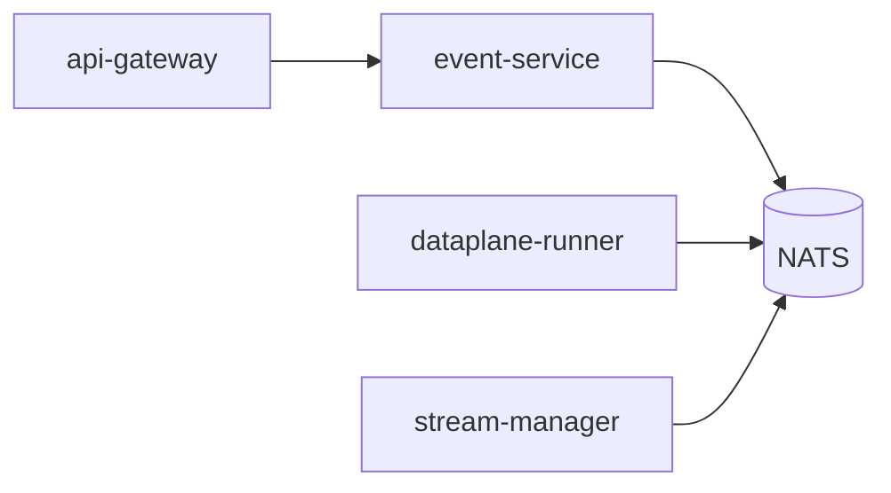

# Troubleshooting

> **When something is wrong, look here.**

This is the diagnostic flow for the most common operational issues.
For incident response, see [`runbooks/incident-response.md`](./runbooks/incident-response.md).

---

## A useful one-liner for any issue

```bash
# 1) Find the trace ID from the user's error response.
echo "$ERR" | jq .trace_id

# 2) Search Tempo for that trace.
# 3) Pivot from the trace's spans to Loki by trace_id.
# 4) Pivot from Loki entries to Prometheus exemplars by request_id.
```

The triple — trace, logs, metrics — covers ~95% of issues.

---

## SSE feed never receives an event (walking skeleton)



Check each link in order:

1. **`event-service` logs** — did it log "consumed events.v1"?
2. **`dataplane-runner` logs** — did it log "published events.v1"?
3. **`stream-manager` logs** — did it log "dispatched operator.control"?
4. `AEGIS_NATS_URL` matches across all 5 terminals.

```bash
nats stream report -s $AEGIS_NATS_URL
```

---

## api-gateway panics on startup

```
auth.AllowAll must not be used outside dev/test (set AEGIS_OPA_ENDPOINT instead)
```

You're running in `AEGIS_ENV=production` (or unset) without setting
the OPA endpoint. The platform refuses unsafe defaults. Either set
`AEGIS_OPA_ENDPOINT` or set `AEGIS_ENV=dev`.

Same pattern for:

- `AEGIS_JWKS_URL` (api-gateway).
- `AEGIS_JWT_ISSUER` (api-gateway).
- `AEGIS_CURSOR_KEY ≥ 32 bytes` (api-gateway).
- `AEGIS_LLM_BACKEND_URL` (llm-gateway).

---

## llm-gateway returns 504

Backend timeout. Look at:

```bash
kubectl logs deploy/llm-gateway -n aegis-system | grep upstream
```

Common causes:

- Backend overloaded → scale it up.
- Tenant rate-limited → check `aegis_llm_rate_limited_total{tenant}`.
- Bad model name → 422 should have been returned; check the request.

Chaos drill: `deploy/chaos/llm-gateway-timeout.yaml`.

---

## agent-service stuck on a tier-3 tool

It's waiting on `gate.resolved.<request-id>`. Check:

```bash
# Is policy-gate-service publishing?
nats sub -s $AEGIS_NATS_URL 'gate.resolved.>'

# Are there pending gates?
curl http://localhost:8410/v1/gates
```

If the gate has been *approved* but agent-service hasn't resumed,
check `aegis_agent_auto_resumed_total` — if it's stuck, the
subscription is broken; restart `agent-service`.

---

## ArgoCD shows `OutOfSync` on every chart

Most common cause: ESO can't reach Vault.

```bash
kubectl -n aegis-platform logs deploy/external-secrets
```

Re-sync:

```bash
argocd app sync aegis-platform --prune
```

---

## inference-router returns 503

`gpu-scheduler` has no reservations. Either:

```bash
# Free a MIG slice.
kubectl -n aegis-gpu describe gpunode <node>

# Or in dev, force the synthetic detector:
AEGIS_TRITON_URL=synthetic://localhost task run:inference-router
```

---

## Conformance test fails for a chart

The chart is missing one of: PeerAuthentication, AuthorizationPolicy,
NetworkPolicy, ServiceMonitor, HPA, PDB, ServiceAccount. The test
output names which.

```bash
(cd tools/conformance && go test -count=1 ./... -v)
```

---

## Air-gapped install: cosign signature mismatch

The bundle was tampered with in transit, or the public key in your
cluster doesn't match the build's keyless signer. Re-download +
re-run `./verify.sh`.

---

## Postgres failover took > 30s

Check Patroni state:

```bash
kubectl exec -ti postgres-0 -n aegis-data -- patronictl list
```

If a replica is `lagging`, that's normal during catch-up. If the
leader is `paused`, manually `resume`.

Quarterly drill: `tools/dr-drills/postgres-restore.sh`.

---

## NATS lag growing

```bash
nats stream report -s $AEGIS_NATS_URL --account aegis
```

Check the consumer that's lagging. Usual culprits:

- Slow downstream (e.g. ClickHouse insert backlog).
- Misconfigured consumer (manual ack not happening).
- Bus partition (rare; check JetStream cluster health).

---

## "I got a 500" but logs show 200

The 500 came from somewhere upstream (load balancer, Istio
gateway, WAF). The api-gateway's 200 means it handled the request
cleanly. Check upstream logs first.

---

## A tenant says "my data is gone"

Check **crypto-shred status**:

```bash
vault read transit/keys/aegis-tenant-<id>
# If returns "key not found" → tenant was deleted (intentional).
```

If the tenant was *not* deleted but data is missing:

1. Check `media-service` retention policy (auto-deleted by retention).
2. Check ClickHouse partition (was a partition dropped?).
3. Check audit log for `delete_*` actions.

---

## "I can't reach service X" (mesh ALLOW issue)

```bash
istioctl analyze
istioctl proxy-config listeners -n aegis-system <pod>
istioctl proxy-config clusters -n aegis-system <pod>
```

Look for ALLOW policies missing the caller's SPIFFE ID. Most common
cause: a service was renamed (e.g. `agent-runtime` → `agent-service`)
and an old ALLOW list references the old name. The integration smoke
catches this in CI.

---

## Console: "api-gateway unreachable" banner

The top bar shows red and the dashboard is empty.

1. Open browser devtools → Network → check the failing request URL.
2. Confirm `NEXT_PUBLIC_AEGIS_API_BASE` was set **at build time** — Next.js
   bakes `NEXT_PUBLIC_*` into the bundle, so a runtime env var change does
   nothing until you rebuild.
3. If you're cross-origin, confirm api-gateway's CORS middleware allows the
   console origin.
4. Check tenant — if your IdP issued a JWT for a tenant the gateway doesn't
   recognise, every call 403s. Use the tenant switcher in the top-right.

## Console: SSE feed shows "disconnected"

`EventSource` errors are silent. Look in devtools → Network → `EventSource`
streams. Most likely:

- `event-service` isn't running, OR
- Istio ingress doesn't pass through chunked `text/event-stream` correctly
  (verify your gateway / load balancer doesn't buffer SSE), OR
- The tenant has no streams emitting events yet.

## Console: chart conformance fails on `helm/console`

The conformance test asserts 9 specific resources. If you deleted or
forgot one, the test names which. Common fixes:

```bash
(cd tools/conformance && go test -v ./... 2>&1 | grep console)
```

## Console: typecheck fails after API client edit

The console's `lib/api.ts` is strictly typed. After adding a new field
to a response, update `lib/types.ts` to match. Run `npm run typecheck` —
it will tell you which call site is now broken.

---

## See also

- [`runbooks/`](./runbooks/) — incident-response, oncall, DR, drift spike, agent incident, canary rollback, chaos game day.
- [`observability.md`](./observability.md) — dashboards.
- [`console.md`](./console.md) — the production UI's full doc.
- [`SETUP_GUIDE.md`](../SETUP_GUIDE.md) — environment variables.
