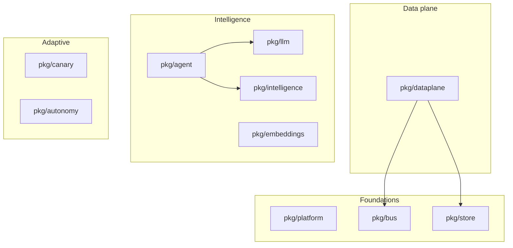

# pkg/

> **The shared Go libraries that all 35 services depend on.**
>
> These are the *golden paths*. If you find yourself rolling your own logger,
> metric helper, idempotency cache, or LLM client, you're off the path —
> come back.

This README is the index. Each library has its own `README.md` with API
docs, examples, and design notes.

---

## What is in here



| Library | Purpose | Used by |
| --- | --- | --- |
| [`platform`](./platform) | Logging, OTel, metrics, problem+json, health, pagination, idempotency, config, auth, middleware, shutdown. **The foundational library every service imports.** | every service |
| [`bus`](./bus) | NATS + Kafka + in-process abstractions, plus DualBus. Subject-routing, message tracing. | most services |
| [`dataplane`](./dataplane) | Streaming operator runtime + DAG + claim-check ring. | dataplane-runner |
| [`store`](./store) | SQL access + migrate runner (Patroni Postgres; SQLite for dev). | most stateful services |
| [`llm`](./llm) | LLM gateway client + safety layer (sanitizer + PII redactor + refusal threshold). | llm-gateway + agent-service |
| [`agent`](./agent) | Bounded-autonomy agent runtime + tool router + gate hook. | agent-service |
| [`embeddings`](./embeddings) | Vector store + chunker + pgvector-compatible. | knowledge-service, semantic-search |
| [`intelligence`](./intelligence) | Active-learning + uncertainty + NLQ types. | active-learning-service, nlq-service |
| [`canary`](./canary) | Wilson lower bound + min-sample floor + traffic split. | canary-controller |
| [`autonomy`](./autonomy) | Cron + signal scheduler + divergence math (JS / KL / TVD). | autonomy-orchestrator, drift-detection-service |

---

## Why a shared-library tier at all?

Three reasons:

1. **Uniformity is operational.** Operators read 35 services on one
   dashboard. If each service logs differently, runs metrics differently,
   handles errors differently, the dashboard becomes 35 dashboards.
2. **Safety in one place.** The LLM safety layer (sanitize + PII + refuse)
   is in `pkg/llm/safety.go`. If we had 6 call sites, the safety layer
   would diverge. By forcing all LLM access through this library + the
   gateway, we get one place to harden.
3. **Bugfix amplification.** When the idempotency middleware had a TTL
   bug, fixing `pkg/platform/middleware/idempotency` fixed every mutating
   endpoint in the platform.

---

## What goes in here vs. a service

A piece of code goes into `pkg/` if and only if:

- It is **used by at least two services**, AND
- It encodes a **platform-wide invariant** (logging shape, bus subject
  taxonomy, RED metric set, RFC 9457 errors), AND
- It does **not depend on a service's internal state**.

Anything else stays in the service. Resist "library creep" — `pkg/`
should grow when there's a real cross-cutting concern, not when you
notice two services have a similar-but-different helper.

---

## Stability commitments

`pkg/platform` is the most-imported library. It carries a **stronger
stability bar** than a regular service:

- Public function signatures don't change without an ADR.
- Removed exports go through a deprecation cycle of ≥1 release.
- The error taxonomy (`pkg/platform/problem`) is frozen.
- Middleware order is documented and tested.

The other libraries follow normal Go semantic versioning. Internal
packages (those under `internal/`) are unstable by definition.

---

## Build & test

```bash
# Build every library.
for d in pkg/*/; do (cd "$d" && go build ./...); done

# Test every library.
for d in pkg/*/; do (cd "$d" && go test -race ./...); done

# Or via the task runner:
task build
task test
```

---

## Anti-patterns

- **Don't import `internal/*` across modules.** Go prohibits it.
- **Don't bypass `pkg/platform` for "just this one log line."** The platform is uniform on purpose.
- **Don't grow per-tenant labels into metrics unbounded.** Cardinality is the silent killer; `pkg/platform/metrics` won't help you here.
- **Don't roll your own LLM client.** Use `pkg/llm` against `llm-gateway`.

See each library's `README.md` for specifics.
