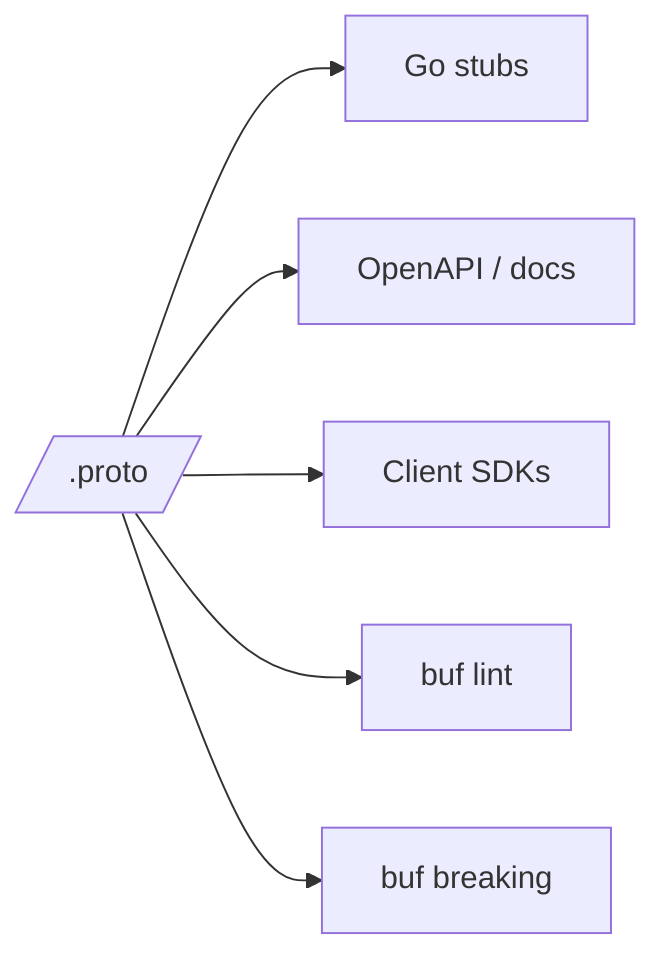

# proto/

> **The source of truth for every public API in AegisVision.**
>
> If it's not in `/proto`, it doesn't exist. ADR-0007.

This directory holds Buf-managed protobuf contracts. Every service-to-service
call (gRPC) and every public REST shape uses a generated stub from one of
these files. Adding a new RPC means **defining it here first**, running
`task proto`, and only then implementing the handler.

This is the most-CODEOWNERS-reviewed directory in the repo. A change here
is a contract change — it ripples through ≥1 service.

---

## Layout

```
proto/
  aegisvision/
    common/v1           Shared types: Tenant, Project, Pagination, Problem.
    control/v1          Control-plane services: pipelines, streams, models,
                        datasets, annotations, training, media, tenants.
    dataplane/v1        Data-plane types: Frame, Detection, Event, Operator.
    intelligence/v1     LLM gateway, agent, knowledge, NLQ, active-learning.
    autonomy/v1         Canary, shadow, drift, SLO, prefetch, autonomy.
  buf.yaml              Buf module config + lint rules.
  buf.gen.yaml          Codegen targets (Go + grpc + grpc-gateway).
  gen/go/               Generated Go stubs (committed for reproducibility).
```

---

## Why protobuf-everywhere



- **One source of truth.** Postgres column names, REST JSON keys, gRPC
  field tags — all derived from here.
- **Lint enforced.** `buf lint` runs in CI with the AegisVision-strict
  ruleset (see [`buf.yaml`](./buf.yaml)).
- **Breaking-change enforced.** `buf breaking` runs in CI against the
  last released tag.
- **Generated SDKs.** Future tenant-facing SDKs (Python, TypeScript) come
  from the same proto files.

---

## The contract discipline

Every contract change goes through:

1. **Open a PR with the proto change.** Nothing else.
2. **CODEOWNERS triggers architecture-WG review.**
3. **Once merged**, regenerate stubs: `task proto`.
4. **Then** implement the handler in the relevant service.
5. **Then** ship the client.

Skipping ahead — implementing the handler before merging the contract —
produces a contract that doesn't match the wire. We've seen this; it
hurts.

---

## Lint rules

`buf.yaml` enables the `DEFAULT` ruleset *plus*:

- `FIELD_LOWER_SNAKE_CASE`
- `PACKAGE_VERSION_SUFFIX`
- `RPC_REQUEST_STANDARD_NAME`
- `RPC_RESPONSE_STANDARD_NAME`

Disabled (deliberately, for our shape):

- None at present. Anything we disable would be ADR-tracked.

---

## Versioning

- Packages are versioned: `aegisvision.control.v1`, `aegisvision.dataplane.v1`, etc.
- Field numbers never collide. Removing a field requires reserving the number.
- A new major version (`v2`) coexists with the old; services support both for ≥2 releases (N-1 compatibility).

---

## Examples

```bash
# Regenerate every stub.
task proto

# Lint.
(cd proto && buf lint)

# Breaking-change check against last release.
(cd proto && buf breaking --against ".git#tag=v0.4.0")

# Open an interactive shell to inspect message shapes.
buf curl --schema proto/aegisvision/control/v1/pipelines.proto \
    grpc://localhost:9091/aegisvision.control.v1.Pipelines/ListPipelines
```

---

## Anti-patterns

- **Defining a new gRPC method in code without an entry here.** The build
  catches this; CI catches the rest.
- **Putting cross-cutting types in a service's `v1` package.** Put them in
  `common/v1` instead.
- **Using `Any` for tenant-facing fields.** It defeats type safety.
- **Adding `oneof` for what should be two separate methods.** `oneof`
  obscures the intent.
- **Reusing a field number for a different type.** Always reserve removed
  numbers.

---

## Where to start

- Read [`buf.yaml`](./buf.yaml) for lint rules.
- Read [`buf.gen.yaml`](./buf.gen.yaml) for codegen targets.
- Each subdirectory's `.proto` files are commented; start with
  `aegisvision/control/v1/pipelines.proto` for the canonical CRUD-with-revisions pattern.
