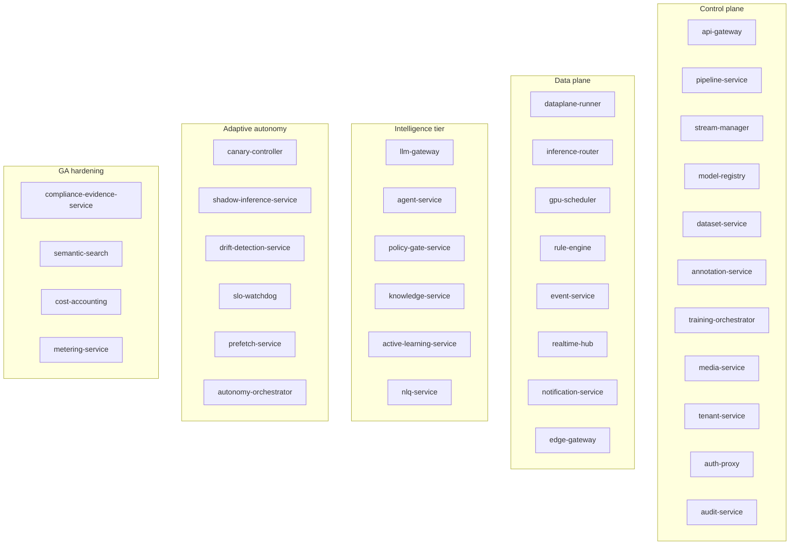

# services/

> **The 35 Go services that make up AegisVision.**

Each directory below is a single Go module (its own `go.mod`), a single
bounded context, a single deployable. They communicate over protobuf
contracts (gRPC + JSON/REST for tenant-facing APIs) and the event bus.
Nothing shares state in memory.

This README is the *index* — each individual service has its own
`README.md` with operating instructions, internal architecture, public
API surface, environment variables, metrics, and failure modes.

---

## How services are organised

Every service follows the same layout:

```
services/<svc>/
  cmd/<svc>/main.go        Entrypoint. Wires pkg/platform, parses config,
                           constructs the service, starts the listeners,
                           wires graceful shutdown.
  internal/
    config/                Service-specific config (extends pkg/platform/config).
    server/                gRPC + HTTP handlers. One file per resource.
    service/               Business logic. Pure functions where possible.
    store/                 Persistence (Postgres / ClickHouse / Redis / in-mem).
    consumer/              (If service consumes bus subjects) bus subscribers.
    publisher/             (If service publishes) bus publishers.
  go.mod                   Per-service module.
  Dockerfile               Distroless base, non-root, statically linked.
```

This is enforced via `tools/conformance/`. Adding a service without
this layout fails the conformance test in CI.

---

## The 35 services + 1 console, grouped by tier



### Control plane (Temporal-friendly, transactional)

- [`api-gateway`](./api-gateway) — Public REST entrypoint. JWT verify, OPA AuthZ, RFC 9457 errors, idempotency, cursor pagination, SSE proxy, browser console.
- [`pipeline-service`](./pipeline-service) — Pipeline DAGs + revisions.
- [`stream-manager`](./stream-manager) — Stream lifecycle. Dispatches control to `dataplane-runner` via `operator.control`.
- [`model-registry`](./model-registry) — Versioned model artifacts + canary planning.
- [`dataset-service`](./dataset-service) — Datasets + dataset versions + lineage.
- [`annotation-service`](./annotation-service) — Labels + label-policy revisions.
- [`training-orchestrator`](./training-orchestrator) — Wraps Kubeflow / Ray training jobs.
- [`media-service`](./media-service) — Recordings + clips + retention policies. Crypto-shredded per tenant key.
- [`tenant-service`](./tenant-service) — Tenants + projects + members + RBAC.
- [`auth-proxy`](./auth-proxy) — JWT verify against JWKS, tenant injection. No HMAC.
- [`audit-service`](./audit-service) — Append-only audit log. Hash-chained.

### Data plane (per-frame, stateless, never on Temporal)

- [`dataplane-runner`](./dataplane-runner) — Operator DAG: ingest → sampler → detect → tracker → rule → emit.
- [`inference-router`](./inference-router) — Routes inference to Triton. Publishes `inference.completed.v1` + `inference.baseline.v1`.
- [`gpu-scheduler`](./gpu-scheduler) — MIG-default reservation ledger. Bounds blast radius.
- [`rule-engine`](./rule-engine) — Rule evaluation (dwell, count, line-cross, zone-enter).
- [`event-service`](./event-service) — Consumes `events.v1`, serves SSE, persists to ClickHouse.
- [`realtime-hub`](./realtime-hub) — Fan-out WebSocket hub for console + integrations.
- [`notification-service`](./notification-service) — Webhooks, email, Slack with replay-safe idempotency.
- [`edge-gateway`](./edge-gateway) — k3s edge profile + outbox sync to core.

### Intelligence tier (Phase 4)

- [`llm-gateway`](./llm-gateway) — One OpenAI-compatible internal endpoint. Sanitizer + PII redactor + refusal threshold + token accounting. ADR-0018.
- [`agent-service`](./agent-service) — Bounded-autonomy agent runtime. Tier-3 tools route through `policy-gate-service`. Auto-resume on `gate.resolved.>`.
- [`policy-gate-service`](./policy-gate-service) — Human-in-the-loop approval gate. Audit on every decision.
- [`knowledge-service`](./knowledge-service) — RAG corpus over docs + ADRs + runbooks. Citation-mandatory. ADR-0020.
- [`active-learning-service`](./active-learning-service) — Uncertainty + diversity sampling. ADR-0019.
- [`nlq-service`](./nlq-service) — Natural-language query → structured queries against event-service / ClickHouse.

### Adaptive autonomy (Phase 5)

- [`canary-controller`](./canary-controller) — Wilson lower-bound + min-sample floor proportion test. ADR-0023.
- [`shadow-inference-service`](./shadow-inference-service) — Same-URN candidate-vs-baseline comparator. ADR-0024.
- [`drift-detection-service`](./drift-detection-service) — JS / KL / TVD divergence vs reference. ADR-0025.
- [`slo-watchdog`](./slo-watchdog) — Multi-window burn-rate. Google SRE workbook.
- [`prefetch-service`](./prefetch-service) — 7×24 EMA grid; warm-ups ahead of demand. ADR-0026.
- [`autonomy-orchestrator`](./autonomy-orchestrator) — Cron + signal-driven agent sessions. ADR-0022.

### GA hardening (Phase 6)

- [`compliance-evidence-service`](./compliance-evidence-service) — Composes per-control evidence; owns no data. ADR-0029.
- [`semantic-search`](./semantic-search) — Cross-tenant semantic search over events + clips.
- [`cost-accounting`](./cost-accounting) — Per-tenant GPU-second + token + storage accounting.
- [`metering-service`](./metering-service) — Billable-event aggregation (consumes `inference.completed.v1`).

### Production console (Phase 7)

- [`console`](./console) — Next.js 14 + TanStack Query + Tailwind. Exposes every public REST endpoint as a usable page. 33 routes covering dashboard, all resource CRUD, agent chat with citations, gate inbox, canary decision board, drift heatmap, SLO burn-rate, prefetch grid, knowledge RAG, audit log + chain verify, and more. Shipped as a Helm chart at [`../deploy/helm/console/`](../deploy/helm/console).

---

## Conventions every service follows

1. **One process, one bounded context.** No "platform-service-that-does-everything." If a service grows two unrelated resource families, split it.
2. **Protobuf-first.** Contract lives in `/proto`. Don't merge code for a new RPC before the contract is merged.
3. **`pkg/platform`-only logging / metrics / health.** No service rolls its own. The golden path is uniform on purpose.
4. **No cross-service in-process state.** Services share state only through declared APIs and the event backbone.
5. **No raw LLM calls.** Talk to `llm-gateway`. Centralized safety + token accounting + rate limit.
6. **No frames on the bus.** Use claim-check (ADR-0008).
7. **Tier-3 actions are gated.** The agent runtime *refuses* tier-3 tools in code without a resolved gate. ADR-0014 / 0017.
8. **Idempotency-Key on every mutating endpoint.** Wired via middleware.
9. **Errors are RFC 9457 problem+json.** Wired via `pkg/platform/problem`.
10. **`AEGIS_ENV=production`-shape services refuse unsafe defaults.** They panic on startup if (for example) `AEGIS_OPA_ENDPOINT` is unset.

---

## Adding a new service

1. Copy the structure of `services/pipeline-service` (smallest reference).
2. Define its API in `/proto` first (ADR-007). Run `task proto`.
3. Wire `pkg/platform` for logging / OTel / metrics / health / shutdown.
4. Add a Helm chart under `deploy/helm/<service>` with mTLS STRICT, OPA `AuthorizationPolicy`, default-deny `NetworkPolicy`, `ServiceMonitor`, `HPA`, `PDB`, `ServiceAccount`.
5. Add it to `go.work`.
6. Add it to the ArgoCD `ApplicationSet` in `deploy/argocd/applicationset.yaml`.
7. Add a per-service `README.md` matching the format used in existing services.
8. Run `task test` + `(cd tools/conformance && go test ./...)` + `(cd tools/integration && go test ./...)` — all must be green.

The scaffolder in `tools/scaffold/` automates steps 1, 3, 4, 5, 6, 7.

---

## How services are tested

- **Unit tests** in each service module — `go test -race ./...`.
- **Conformance** — `tools/conformance/` asserts the chart shape for every service.
- **Integration** — `tools/integration/` asserts cross-service contracts via the bus.
- **Chaos** — `deploy/chaos/` injects faults; each chart's `chaos-attestation.sh` asserts recovery.
- **Load** — `tools/loadtest/` (k6) hits the api-gateway with the documented scale targets.

`task test` runs the first three. Chaos + load are run in CI on a
schedule against staging.
