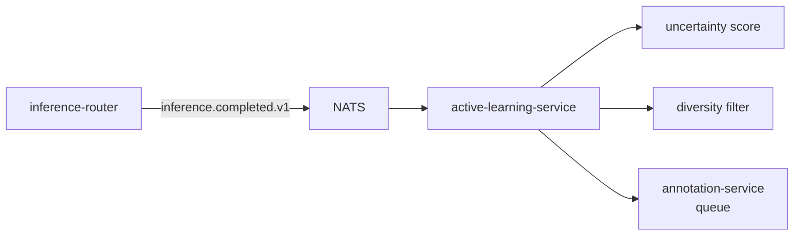

# active-learning-service

> **Uncertainty + diversity sampling.** Never random firehose draw.
> ADR-0019.

`active-learning-service` watches `inference.completed.v1`, scores
detections by **uncertainty** (e.g. low max-class-probability, high
entropy), filters by **diversity** (e.g. cluster-based deduplication),
and queues the highest-value samples for human labelling via
`annotation-service`.

---

## Why never random

Random firehose draw produces redundant labels — six pictures of the
same forklift in the same lane don't teach the model six things. Active
learning's whole job is to direct human attention at samples that
actually move the model.

---

## API

- `GET /v1/active-learning/queue` — peek the queue.
- `POST /v1/active-learning/sample` — pull a sample (sets `claimed_by`).
- `POST /v1/active-learning/policy` — set per-tenant scoring weights.

---

## Configuration

| Var | Purpose | Default |
| --- | --- | --- |
| `AEGIS_AL_UNCERTAINTY_THRESHOLD` | Top-class prob below which a sample qualifies. | `0.6` |
| `AEGIS_AL_DIVERSITY_K` | k-NN distance for dedupe. | `8` |
| `AEGIS_AL_BATCH_PER_HOUR` | Max samples surfaced per hour. | `200` |

---

## See also

- [`../annotation-service/README.md`](../annotation-service/README.md).
- [`../inference-router/README.md`](../inference-router/README.md).
- [`../../pkg/intelligence/README.md`](../../pkg/intelligence/README.md).
- ADR-0019.
