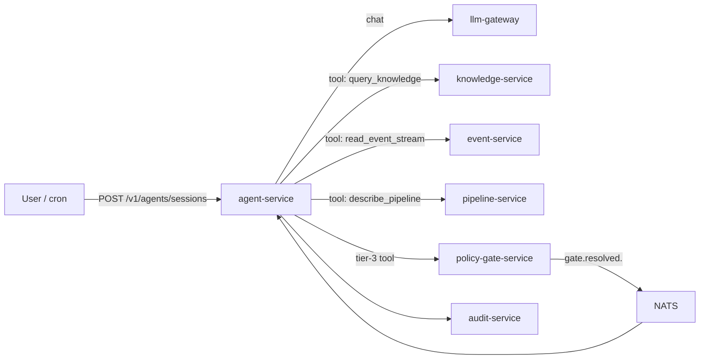
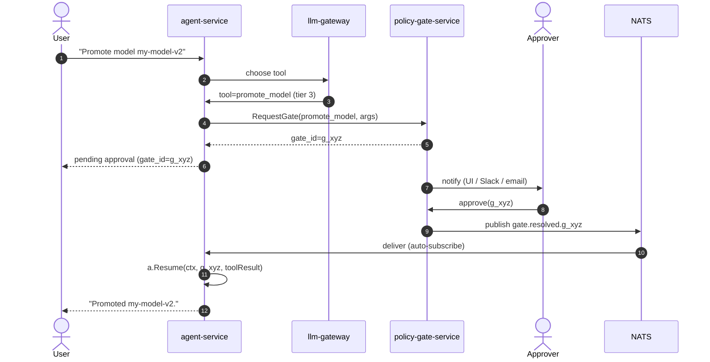

# agent-service

> **The bounded-autonomy agent runtime.** ADR-0014, ADR-0017, ADR-0020,
> ADR-0022.

`agent-service` runs the AegisVision agent loop. The agent has a fixed
toolbox; each tool has a **risk tier**; **tier-3 tools route through
`policy-gate-service`** for human approval — refused in code, not just
in prompts.



---

## The four risk tiers

| Tier | Examples | Behaviour |
| --- | --- | --- |
| 0 | `query_knowledge`, `read_event_stream`, `describe_pipeline`, `list_models` | Auto-execute, read-only. |
| 1 | `summarise`, `compare_distributions`, `predict_dwell` | Auto-execute, advisory. |
| 2 | `propose_retrain`, `propose_canary_plan`, `propose_retention_change` | Auto-execute → returns a *proposal* (no side effect). |
| 3 | `promote_model`, `override_retention`, `force_failover`, `delete_dataset` | **Refused in code** without a resolved gate. Routes through `policy-gate-service`. |

The refusal is in `pkg/agent/agent.go`:

```go
if tool.Tier == Tier3 && req.GateID == "" {
    return Result{}, ErrTier3NeedsGate
}
```

You cannot bypass this with a clever prompt.

---

## How tier-3 actually completes



The `agent-service` `main.go` subscribes to `gate.resolved.>` on
startup; when a resolution arrives it reconstructs the session and
resumes via `a.Resume(ctx, gate.Request.ID, toolResult)`. The metric
`aegis_agent_auto_resumed_total` counts these.

---

## Citation discipline (ADR-0020)

The agent **cannot** answer questions about platform facts without
citing. The `query_knowledge` tool returns snippets with their source
path; the agent's response template embeds them; an answer with no
citations is surfaced as an error by the runtime.

This is the difference between "what stream-IDs are in tenant t-7?"
returning a hallucinated list vs. a cited list from the knowledge
service.

---

## Continuous autonomy (ADR-0022)

`autonomy-orchestrator` does *not* implement its own agent runtime.
On each schedule fire, it opens a **regular agent-service session**
with a role, a goal, and a max-step budget. The bounded-autonomy
constraints bind exactly as they do for interactive sessions.

---

## API

```
POST /v1/agents/sessions          Open a session.
POST /v1/agents/sessions/{id}/messages    Send a message.
GET  /v1/agents/sessions/{id}     Inspect.
DELETE /v1/agents/sessions/{id}   Close.
```

Open-session body:

```json
{
  "role": "operator",
  "goal": "find recent person detections in stream-dock-1",
  "max_steps": 6
}
```

---

## Configuration

| Var | Purpose | Required in prod |
| --- | --- | --- |
| `AEGIS_LLM_GATEWAY_URL` | llm-gateway base URL. | yes |
| `AEGIS_POLICY_GATE_URL` | policy-gate-service base URL. | yes |
| `AEGIS_KNOWLEDGE_URL` | knowledge-service base URL. | yes |
| `AEGIS_NATS_URL` | For `gate.resolved.>` auto-resume. | yes |
| `AEGIS_AGENT_MAX_STEPS` | Hard cap. | `12` |
| `AEGIS_AGENT_DEADLINE` | Per-session deadline. | `5m` |

---

## Metrics

- `aegis_agent_sessions_total{tenant,role,outcome}` — outcome ∈ {success, refused, gated, timeout}.
- `aegis_agent_tool_invocations_total{tier,name}` — tool usage.
- `aegis_agent_tier3_refused_total{reason}` — refused-in-code count.
- `aegis_agent_auto_resumed_total` — gate-resolved auto-resumes.
- `aegis_agent_citation_missing_total{tenant}` — uncited platform-fact answers (P0 if non-zero).

---

## Failure modes

| Failure | Effect | Mitigation |
| --- | --- | --- |
| llm-gateway timeout | session retries | Bounded retry; per-step deadline. |
| policy-gate-service down | tier-3 work blocked | **by design** — refuse > unsafe (ADR-0014). |
| knowledge-service stale | uncited answers refused | Refresh corpus on schedule; alarm on lag. |
| NATS down | auto-resume stops | Periodic poll fallback. |

---

## See also

- [`../llm-gateway/README.md`](../llm-gateway/README.md)
- [`../policy-gate-service/README.md`](../policy-gate-service/README.md)
- [`../knowledge-service/README.md`](../knowledge-service/README.md)
- [`docs/agents.md`](../../docs/agents.md) — design notes.
- ADR-0014, ADR-0017, ADR-0020, ADR-0022.
