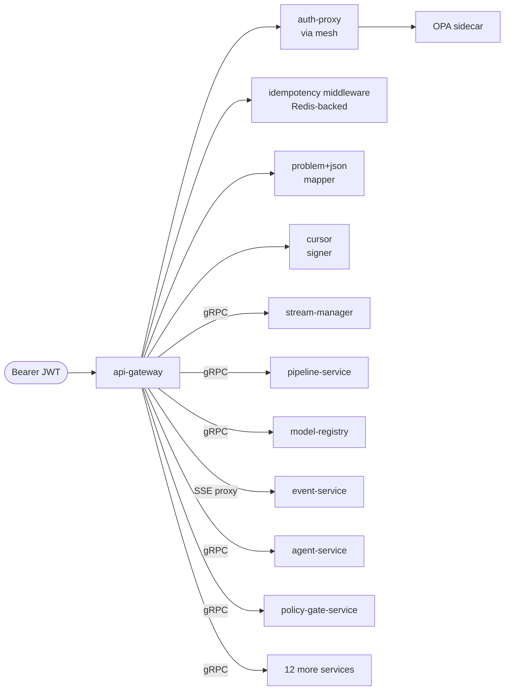
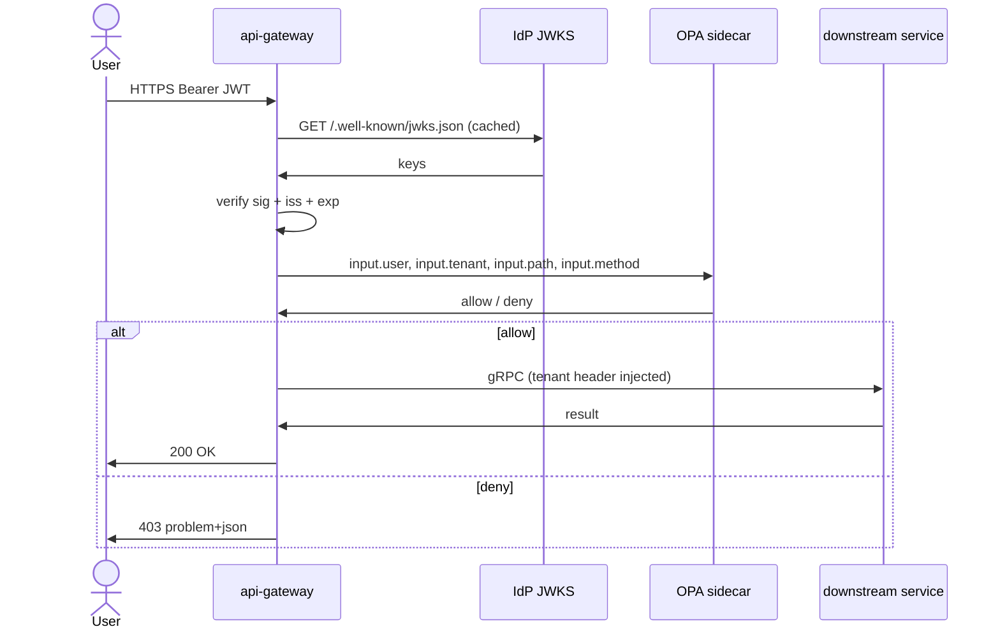

# api-gateway

> **The single, signed, audited front door to AegisVision.** Every
> tenant-facing call enters here.

`api-gateway` is the only AegisVision service that *terminates the public
internet*. It is the boundary at which a Bearer JWT becomes a verified
tenant identity, where opaque RFC 9457 errors are minted, where SSE feeds
proxy, and where the browser console is served.

It runs on a single binary with three listeners:

| Listener | Purpose | Default port |
| --- | --- | --- |
| HTTP (REST) | Tenant-facing v1 API | `:8080` |
| HTTP (SSE) | Server-Sent Events feed (proxied to event-service) | `:8080/v1/events:stream` |
| HTTP (admin) | Health, ready, metrics | `:8081` |

---

## Public API surface

All public API uses **product nouns**, plural paths, opaque IDs. Errors are
**RFC 9457 `application/problem+json`**. Mutating endpoints accept
`Idempotency-Key`. Lists use **cursor pagination** (never offset).

| Path | Method | Purpose |
| --- | --- | --- |
| `/v1/health` | GET | Liveness check. |
| `/v1/ready` | GET | Readiness check (depends on `stream-manager`, `event-service`). |
| `/v1/pipelines` | GET, POST | List + create pipeline DAGs. |
| `/v1/pipelines/{id}` | GET, PATCH, DELETE | Pipeline resource. |
| `/v1/streams` | GET, POST | List + create streams. |
| `/v1/streams/{id}` | GET, PATCH, DELETE | Stream resource. |
| `/v1/models` | GET, POST | List + register model versions. |
| `/v1/datasets` | GET, POST | List + create datasets. |
| `/v1/annotations` | GET, POST | List + create annotations. |
| `/v1/training-jobs` | GET, POST | List + start training. |
| `/v1/media` | GET, POST | Recordings + clips. |
| `/v1/events` | GET | List events (cursor pagination). |
| `/v1/events:stream` | GET (SSE) | Realtime feed. |
| `/v1/agent/sessions` | POST | Open a bounded-autonomy session. |
| `/v1/agent/sessions/{id}/messages` | POST | Send a message. |
| `/v1/gates` | GET, POST | List + resolve approval gates. |
| `/v1/canary-plans` | GET, POST | List + submit canary plans. |
| `/console/` | GET | Browser console (HTML/JS). |

---

## Internal architecture



`api-gateway` is intentionally thin. It does not own resources. It does not
own business logic. It transcodes HTTP↔gRPC, verifies auth, applies AuthZ,
caches idempotency, proxies SSE, and serves static console assets. Every
business decision lives downstream.

---

## Configuration

`api-gateway` refuses to start in `AEGIS_ENV=production` without:

| Var | Why |
| --- | --- |
| `AEGIS_OPA_ENDPOINT` | OPA AuthZ. The gateway panics on `auth.AllowAll` outside dev. |
| `AEGIS_JWKS_URL` | IdP's JWKS endpoint. HS* (HMAC) is deliberately not supported. |
| `AEGIS_JWT_ISSUER` | Expected `iss` claim. |
| `AEGIS_CURSOR_KEY` | HMAC key for opaque cursors (≥32 bytes). |
| `AEGIS_STREAM_MANAGER_ADDR` | gRPC target. |
| `AEGIS_EVENT_SERVICE_URL` | SSE proxy target. |

Optional:

| Var | Default |
| --- | --- |
| `AEGIS_CONSOLE_DIR` | empty (no console served) |
| `AEGIS_IDEMPOTENCY_TTL` | `24h` |
| `AEGIS_RATE_LIMIT_RPM` | `600` per tenant |
| `AEGIS_TRACE_SAMPLE_RATE` | `0.01` (override per tenant via header) |

---

## How it handles auth



**HS* JWTs are refused.** Sharing the signing key with every verifier
defeats the point of OIDC. The platform verifies against the IdP's JWKS
endpoint and caches keys with standard rotation discipline.

---

## How it handles errors

Every error is an **RFC 9457 `application/problem+json`** document:

```json
{
  "type": "https://aegisvision.example.com/problems/idempotency-conflict",
  "title": "Idempotency-Key conflict",
  "status": 409,
  "detail": "A different request body was previously stored under this key.",
  "instance": "/v1/streams",
  "trace_id": "00-abcd-1234-01",
  "tenant_id": "t-7"
}
```

The mapper (`internal/server/errors.go`) maps:

| gRPC code | HTTP status |
| --- | --- |
| `OK` | 200 |
| `INVALID_ARGUMENT` | 400 |
| `UNAUTHENTICATED` | 401 |
| `PERMISSION_DENIED` | 403 |
| `NOT_FOUND` | 404 |
| `ALREADY_EXISTS` / `ABORTED` (etag) | 409 |
| `RESOURCE_EXHAUSTED` | 429 |
| `FAILED_PRECONDITION` | 412 |
| `INTERNAL` | 500 |
| `UNAVAILABLE` | 503 |
| `DEADLINE_EXCEEDED` | 504 |

---

## How it handles pagination

Cursors are **opaque, signed, HMAC-keyed** (`pkg/platform/pagination`). The
cursor encodes:

- `sort_key` — the field being paginated by.
- `sort_value` — the last value seen.
- `etag` — to detect changes.
- `expires_at` — TTL.

Tampered cursors fail signature verification → 400.

---

## How it handles idempotency

Wired via `pkg/platform/middleware/idempotency`. The full response
(status + headers + body) is cached for 24h under
`(tenant_id, key, method, path)`. Replays inside the window return the
cached response byte-identically.

If the client sends the same key with a *different* body → 409
`idempotency-conflict`.

---

## How it serves SSE

The console + tenant SDKs prefer one URL. `api-gateway` proxies the SSE
stream from `event-service`:

```
GET /v1/events:stream?stream_id=...&tenant_id=...
→ event-service /v1/events:stream
```

The proxy:

- Verifies the JWT (once per connection).
- Enforces per-tenant rate limit (concurrent SSE connections).
- Forwards `Last-Event-Id` for resumption.
- Tears down on client disconnect (closes the upstream).

---

## How it serves the console

There are **two** consoles in the repo; api-gateway only serves the
walking-skeleton placeholder.

| Console | Path | Served by | Used for |
| --- | --- | --- | --- |
| Walking-skeleton (Phase 1) | `services/api-gateway/console/` | api-gateway via `AEGIS_CONSOLE_DIR` → `/console/` | The 5-service walking-skeleton demo. Vanilla HTML+JS. |
| Production console (Phase 7) | `services/console/` | A separate Next.js standalone server (its own Helm chart at `deploy/helm/console/`) | Real operator UI for every platform feature. |

For the walking skeleton: set `AEGIS_CONSOLE_DIR` to the Phase-1 path
and the gateway serves it at `/console/` with strict CSP, no inline
scripts, SRI on every external resource.

For production: deploy the [`console`](../console) chart separately;
it talks to api-gateway over the cluster network. See
[`../console/README.md`](../console/README.md) and
[`../../docs/console.md`](../../docs/console.md).

---

## Metrics (RED, plus a few)

- `aegis_apigateway_requests_total{tenant,method,path,status}` — rate.
- `aegis_apigateway_request_duration_seconds{tenant,method,path}` — duration.
- `aegis_apigateway_idempotency_hits_total{tenant}` — replay hits.
- `aegis_apigateway_jwt_verify_failures_total{reason}` — auth failures.
- `aegis_apigateway_sse_active_connections{tenant}` — concurrent SSE.
- `aegis_apigateway_problem_responses_total{tenant,type}` — problem+json counts.

---

## Run locally

```bash
AEGIS_ENV=dev \
AEGIS_STREAM_MANAGER_ADDR=localhost:9092 \
AEGIS_EVENT_SERVICE_URL=http://localhost:8090 \
AEGIS_CONSOLE_DIR=$(pwd)/services/api-gateway/console \
task run:api-gateway
```

Then:

```bash
curl http://localhost:8080/v1/health
curl -H 'X-Tenant-Id: t-demo' http://localhost:8080/v1/streams
```

---

## Failure modes

| Failure | Effect | Mitigation |
| --- | --- | --- |
| JWKS endpoint down | 401 / 503 for new tokens | Cache up to 5 min; alarm on cache miss rate. |
| OPA sidecar crash | 503 for all requests | Multi-replica + PDB; chaos `policy-gate-down.yaml`. |
| Downstream service down | 503 for that resource | Circuit breakers; per-resource. |
| Redis down (idempotency) | Mutating endpoints 503 | Sentinel HA; chaos `redis-failover.yaml`. |
| `AEGIS_CURSOR_KEY` < 32 bytes | Panic at startup | Refused in code. |
| `AEGIS_OPA_ENDPOINT` unset in prod | Panic at startup | Refused in code. |

---

## See also

- [`../auth-proxy/README.md`](../auth-proxy/README.md) — the JWT verifier (often co-located).
- [`docs/api-reference.md`](../../docs/api-reference.md) — full API reference.
- [`ARCHITECTURE.md`](../../ARCHITECTURE.md) — how the gateway fits in.
- [`SETUP_GUIDE.md`](../../SETUP_GUIDE.md) — running locally + on a cluster.
