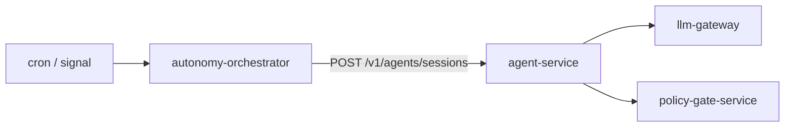

# autonomy-orchestrator

> **Cron + signal-driven agent sessions.** ADR-0022.
>
> *Doesn't* implement its own agent runtime. Opens regular agent-service
> sessions on schedule or on signal.

Why this matters: every constraint that binds interactive agent
sessions (tiered tools, refusal-in-code, citation discipline) **also
binds scheduled autonomy**. There is no parallel agent runtime to
audit. ADR-0022 is the standing answer to "should we just put a
loop in autonomy-orchestrator?"

---

## Triggers

- **Cron** — `internal/cron` evaluates schedules every minute.
- **Signal** — bus subjects (e.g. `drift.alert.v1`, `slo.burn.v1`) trip configured handlers.

---

## Configuration

| Var | Purpose |
| --- | --- |
| `AEGIS_AGENT_SERVICE_URL` | base URL. |
| `AEGIS_NATS_URL` | Bus signals. |
| `AEGIS_AUTONOMY_DRYRUN` | If true, log proposals instead of dispatching. |

---

## See also

- [`../agent-service/README.md`](../agent-service/README.md).
- [`../../pkg/autonomy/README.md`](../../pkg/autonomy/README.md) — cron + scheduler.
- ADR-0022.
