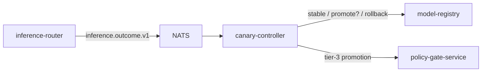

# canary-controller

> **Decides whether to promote or roll back a candidate model.**
> Wilson lower-bound proportion test, minimum sample floor, automatic
> rollback, gated promotion. ADR-0023.



The controller never auto-promotes. It can:

- Recommend **promote** → emit a tier-3 request to `policy-gate-service`.
- Execute **rollback** → flip traffic back to baseline (automatic).
- Hold **stable** → no action.

---

## Statistics

The test:

1. **Minimum sample floor** — at least N outcomes (default 1000) before any decision.
2. **Wilson lower bound** on candidate success rate at α=0.05.
3. **Margin** — candidate must beat baseline by ≥ margin (default 0.5pp) to recommend promotion.
4. **Rollback** — if candidate lower bound is below baseline by ≥ rollback_margin (default 2pp) → automatic rollback.

Implementation in `pkg/canary`.

---

## API

- `POST /v1/canary-plans` — submit a plan.
- `GET /v1/canary-plans/{id}` — inspect.
- `POST /v1/canary-plans/{id}:cancel` — cancel.

Plan body:

```json
{
  "candidate_model": "my-model-v2",
  "baseline_model": "my-model-v1",
  "traffic_pct": 5,
  "min_samples": 1000,
  "wilson_alpha": 0.05,
  "promotion_margin_pp": 0.5,
  "rollback_margin_pp": 2.0
}
```

---

## Why no force-promote endpoint

By design. ADR-0023. The platform refuses to ship a button that
bypasses statistical evidence. Promotion routes through the gate, so
the audit trail records *who* approved a promotion *with what
evidence*.

---

## Metrics

- `aegis_canary_outcomes_total{plan,arm,outcome}` — outcome counter.
- `aegis_canary_wilson_lower_bound{plan,arm}` — gauge.
- `aegis_canary_rollbacks_total{plan,reason}` — auto-rollbacks.
- `aegis_canary_promotions_requested_total{plan}` — gate requests.

---

## Failure modes

| Failure | Effect | Mitigation |
| --- | --- | --- |
| Outcome bus down | Plans freeze | Backfill via NATS replay. |
| Model registry down | Promotion blocked | Retry; alarm. |
| Stale baseline metrics | Wrong recommendation | Daily reset of baseline metrics. |

---

## See also

- [`../../pkg/canary/README.md`](../../pkg/canary/README.md) — Wilson lower bound + split.
- [`../shadow-inference-service/README.md`](../shadow-inference-service/README.md) — companion for tenant-traffic-free comparisons.
- ADR-0023.
