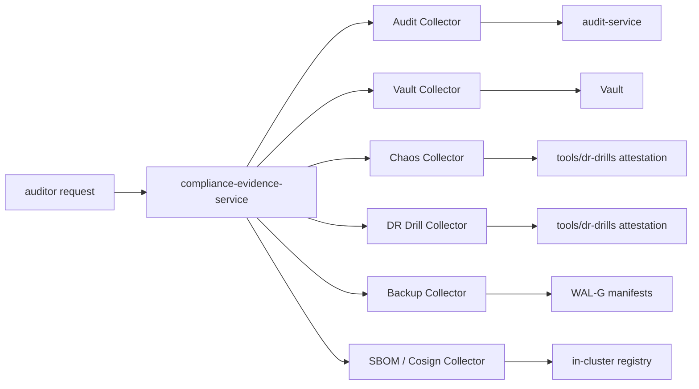

# compliance-evidence-service

> **Composes per-control evidence from authoritative stores.** Owns no
> data. ADR-0029.

`compliance-evidence-service` is **deliberately stateless**. It does not
store evidence. It assembles evidence on demand from other services
(audit, ESO, Vault, Patroni, ClickHouse, chaos attestations, DR drill
results) via a `Collector` interface.

Why this shape: storing copies of evidence drifts. Composing on demand
guarantees the evidence is *current* — and the auditor can re-verify
by running the same Collector themselves.

---

## API

- `POST /v1/evidence:bundle` — produce a signed bundle for a control set.
- `GET /v1/controls` — list available controls.
- `GET /v1/controls/{id}` — describe a control.

---

## Control catalogue

Out of the box:

- **SOC 2** Common Criteria (CC1-CC9), Trust Service Criteria (security, availability, processing integrity, confidentiality, privacy).
- **EU AI Act** Annex IV conformity assessment.
- **GDPR DPIA**.
- **CIS Kubernetes Benchmark**.

Each is in `internal/controls/`; adding a new framework is a new
Collector plus a YAML mapping.

---

## See also

- [`docs/compliance/`](../../docs/compliance/) — control narratives and templates.
- ADR-0029.
