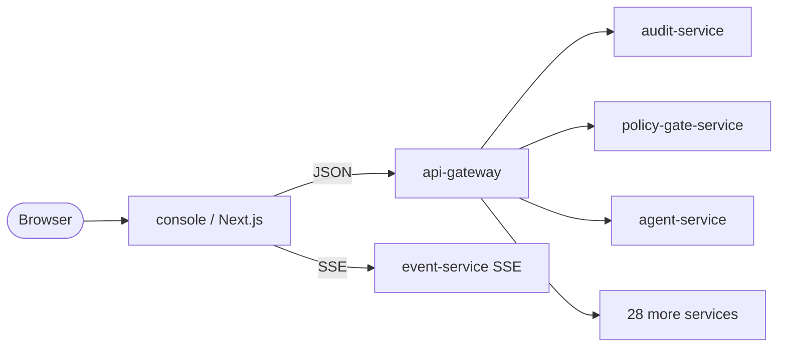

# console

> **The AegisVision production UI.** Next.js 14 + TanStack Query + Tailwind.
> Exposes every platform feature.

<p align="center">
  <a href="../../docs/console.md">
    
  </a>
  <br/>
  <sub><em>Mission control with the Canary / Drift / SLO triptych. Full doc at
  <a href="../../docs/console.md"><code>docs/console.md</code></a>.</em></sub>
</p>

A single Next.js app that talks to `api-gateway` and surfaces every public
endpoint as a usable, themed page. Dashboard, live SSE event feed,
pipelines + revisions, streams with pause/resume, models + gated promotion,
agent chat with tier-3 gate inbox, canary decisions, drift heatmap, SLO
burn-rate board, knowledge RAG query, NLQ parser, active-learning queue,
semantic search, tenant + project + member admin, cost dashboards,
compliance evidence bundles, append-only audit viewer, and more.



---

## Stack

| Layer | Choice | Why |
| --- | --- | --- |
| Framework | Next.js 14 (App Router) | Server components for SEO/cold-start, client components for interactivity, file-based routing. |
| Language | TypeScript (strict) | Type-safe across the API client. |
| Styling | Tailwind CSS | Matches the project's design language (matches `index.html` landing page). |
| Server state | TanStack Query v5 | Caching, polling, SSE-compatible. |
| Client state | Zustand | Tiny; persists tenant + JWT. |
| Forms | react-hook-form | The right tradeoff for forms with Zod schemas. |
| Charts | Recharts | When needed (cost, drift, prefetch grids). |
| Icons | lucide-react | Consistent stroke + free. |
| Realtime | Native `EventSource` | SSE is part of the platform contract (ADR-friendly). |

---

## Layout

```
services/console/
├── package.json
├── next.config.mjs
├── tailwind.config.ts
├── tsconfig.json
├── Dockerfile                       multi-stage → distroless-ish node:20
├── public/favicon.svg
└── src/
    ├── app/
    │   ├── layout.tsx               root layout: sidebar + topbar + providers
    │   ├── globals.css              tailwind layer + design tokens
    │   ├── providers.tsx            React Query client
    │   ├── page.tsx                 dashboard (live SSE + KPIs + canary/drift/SLO)
    │   ├── pipelines/               + [id]/
    │   ├── streams/                 + [id]/
    │   ├── models/                  + [id]/
    │   ├── datasets/                + [id]/
    │   ├── annotations/
    │   ├── training/
    │   ├── media/
    │   ├── rules/
    │   ├── events/
    │   ├── agents/                  + [id]/ (chat UI + gate banner)
    │   ├── gates/                   approval inbox
    │   ├── canary/                  + [id]/ (Wilson decision board)
    │   ├── shadow/
    │   ├── drift/
    │   ├── slo/
    │   ├── prefetch/                7×24 EMA heatmap
    │   ├── knowledge/               RAG query
    │   ├── nlq/                     natural-language → structured query
    │   ├── active-learning/
    │   ├── semantic-search/
    │   ├── tenants/                 + [id]/
    │   ├── cost/
    │   ├── compliance/              evidence bundles
    │   ├── audit/                   append-only chain viewer
    │   └── settings/
    ├── components/
    │   ├── Sidebar.tsx
    │   ├── TopBar.tsx
    │   ├── PageHeader.tsx
    │   ├── Primitives.tsx           Button / Card / Input / Modal / Pill / …
    │   ├── DataTable.tsx
    │   └── Toast.tsx
    └── lib/
        ├── api.ts                   typed client for every public endpoint
        ├── types.ts                 wire types
        ├── auth.ts                  tenant + JWT store
        ├── hooks.ts                 useQueries / useMutations + SSE hook
        └── utils.ts                 cn, fmt helpers, severity classes
```

---

## Running locally

```bash
cd services/console
npm install              # or pnpm install / yarn / bun
npm run dev              # http://localhost:8090
```

By default the console points at `http://localhost:8080` for `api-gateway`.
Override:

```bash
NEXT_PUBLIC_AEGIS_API_BASE=http://localhost:8080 npm run dev
```

In the top-right, click the tenant pill to switch tenants. In production
this is set automatically from the JWT `tenant_id` claim by `auth-proxy`.

---

## Building + shipping

```bash
npm run build
npm start
```

Or via Docker:

```bash
docker build -f services/console/Dockerfile -t aegisvision/console:dev .
docker run -p 8090:8090 \
  -e NEXT_PUBLIC_AEGIS_API_BASE=http://host.docker.internal:8080 \
  aegisvision/console:dev
```

Or via Helm:

```bash
helm install console deploy/helm/console -n aegis-system
```

ArgoCD's ApplicationSet at `deploy/argocd/applicationset.yaml` reconciles
this chart automatically — no extra wiring.

---

## Tenant-scoped, prod-safe

- Every request carries `X-Aegis-Tenant` set to the active tenant.
- Mutations attach `Idempotency-Key` (random UUID) automatically.
- Errors are parsed as RFC 9457 problem+json and surfaced as toasts with `trace_id`.
- List endpoints paginate with opaque cursors (no offset).
- The dashboard polls cautiously (5–10 s) — no per-frame work in the UI.
- The SSE event feed reconnects on error and dedupes via `event_id`.

---

## What every page exposes

| Page | Endpoints surfaced |
| --- | --- |
| `/` Dashboard | health, streams, gates, canary, drift, SLO, agents + live SSE |
| `/pipelines` | list/create/delete + revisions + promote |
| `/streams` | list/create/pause/resume/delete + per-stream SSE |
| `/models` | register + versions + gated promotion (routes via policy-gate) |
| `/datasets` | list/create + cut versions + sample browse |
| `/annotations` | label policies + revisions + annotation queue + review |
| `/training` | start + cancel jobs, lineage |
| `/media` | request clips, retention policies (redact + refuse-raw enforcement) |
| `/rules` | dwell / count / line-cross / zone-enter editor |
| `/events` | live SSE feed + historical search + JSON viewer |
| `/agents` | sessions list + open + chat with citations + gate banner |
| `/gates` | approval inbox + decision history |
| `/canary` | submit plan + decision board with Wilson lower bound |
| `/shadow` | overview of same-URN comparison |
| `/drift` | runs + JS/KL/TVD trend + breach alerts |
| `/slo` | burn-rate board (MWMBR) |
| `/prefetch` | 7×24 EMA heatmap per (tenant, model) |
| `/knowledge` | RAG query with cited snippets + re-ingest |
| `/nlq` | natural-language → structured query |
| `/active-learning` | uncertainty + diversity queue + claim |
| `/semantic-search` | vector search over events + clips |
| `/tenants` | tenants + projects + members + RBAC + crypto-shred delete |
| `/cost` | usage rollups + invoices |
| `/compliance` | SOC 2 / EU AI Act / GDPR evidence bundle generator |
| `/audit` | append-only hash-chain viewer + chain verify |
| `/settings` | tenant + bearer + identity (dev) |

---

## Conventions

- **Tenant-aware queries.** The `useTenantOpts` helper sources tenant from `useAuth`.
  Every hook in `lib/hooks.ts` uses it.
- **Toast on mutate.** `useMutateWithToast` wraps `useMutation` with success/error toasts that surface `trace_id`.
- **Gate UX.** Anywhere that can request a tier-3 action surfaces a clear "request approval" CTA + a link to `/gates`.
- **Citation discipline.** The agent chat UI **renders citations inline** for every step and visually marks uncited platform-fact answers.
- **No force-promote button.** Anywhere that promotes (models, pipelines) routes through `policy-gate-service`.
- **Empty / loading / error states are first-class.** Every page uses `EmptyState`, `LoadingState`, `ErrorState`.

---

## See also

- [`/lib/api.ts`](./src/lib/api.ts) — the typed client.
- [`/lib/hooks.ts`](./src/lib/hooks.ts) — every hook backing the UI.
- [`../api-gateway/README.md`](../api-gateway/README.md) — the API surface.
- [`../../docs/api-reference.md`](../../docs/api-reference.md) — public REST reference.
- [`../../deploy/helm/console/`](../../deploy/helm/console/) — chart.

---

## Author

**Son Nguyen** — <hoangson091104@gmail.com> · [@hoangsonww](https://github.com/hoangsonww) · [sonnguyenhoang.com](https://sonnguyenhoang.com)
