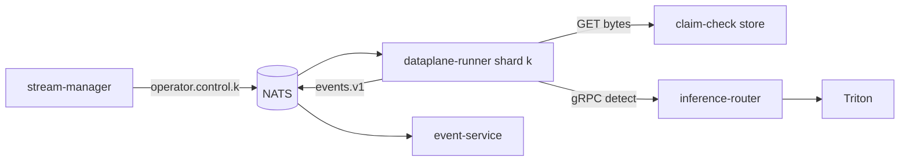
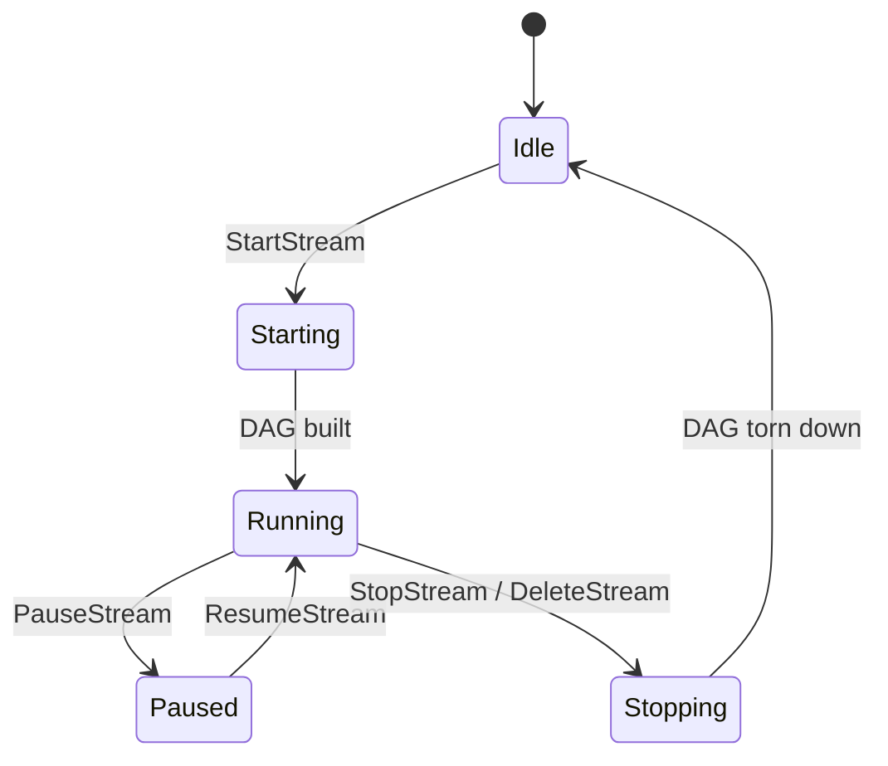

# dataplane-runner

> **The data plane.** Hosts the streaming operator DAG that turns frames
> into events. The *only* service that touches imagery bytes.

This is the per-frame engine. It receives control messages from
`stream-manager` (via `operator.control.<shard>`), builds an in-process
operator DAG per stream, and runs:

`ingest → sampler → detect → tracker → rule → emit`

at the configured frame rate. Every emitted event lands on `events.v1`.

---

## Position



---

## Operator DAG

Operators live in `pkg/dataplane/operators/`. Each is a small Go file
implementing `Operator`:

```go
type Operator interface {
    Name() string
    Process(ctx context.Context, in <-chan Frame, out chan<- Frame) error
}
```

| Operator | Purpose |
| --- | --- |
| `ingest` | Pull from RTSP / RTMP / file / WebRTC / synthetic. |
| `sampler` | Down-sample to per-stream target rate. |
| `detect` | Call inference-router. Returns detections. |
| `tracker` | bytetrack / DeepSORT — stable IDs. |
| `rule` | Apply rule predicates (dwell, count, line-cross, zone-enter). |
| `emit` | Publish `events.v1`. |

The DAG runner (`pkg/dataplane/dag`) wires operators with bounded
channels. Channel size = `AEGIS_DAG_BUFFER` (default 16). Backpressure
drops at the sampler.

---

## Frames are descriptors, not bytes

```go
type Frame struct {
    StreamID   string
    TenantID   string
    SeqNum     uint64
    Timestamp  time.Time
    BytesURN   string   // claim-check URN
    Width      int
    Height     int
    PixFormat  string
}
```

The bytes live in the **claim-check store** (object storage; pluggable
via `pkg/dataplane/claimcheck`). The runner stores bytes on ingest,
references them by URN through the DAG, and lets the lifecycle policy
GC them after retention.

**No bytes ever travel on the bus** (ADR-0008).

---

## Sharding

Each runner pod owns a deterministic subset of streams. The shard
assignment comes from `stream-manager`. Re-sharding is graceful: the
old runner drains before the new one takes over.

---

## Per-stream lifecycle



---

## Configuration

| Var | Purpose |
| --- | --- |
| `AEGIS_NATS_URL` | Bus. |
| `AEGIS_SHARD_IDS` | Comma-separated shards this pod owns (or `auto`). |
| `AEGIS_CLAIMCHECK_URL` | Object store URL (s3://..., file://... in dev). |
| `AEGIS_INFERENCE_ROUTER_ADDR` | gRPC target. |
| `AEGIS_DAG_BUFFER` | Operator channel buffer. |
| `AEGIS_DETECTOR_FALLBACK` | `synthetic` in dev. |

---

## Metrics

- `aegis_dataplane_frames_ingested_total{tenant,stream}` — rate.
- `aegis_dataplane_detect_duration_seconds{model}` — duration.
- `aegis_dataplane_dag_drops_total{operator}` — backpressure drops.
- `aegis_dataplane_events_emitted_total{kind,severity}` — rate.
- `aegis_dataplane_glass_to_emit_latency_seconds` — end-to-end.

---

## Failure modes

| Failure | Effect | Mitigation |
| --- | --- | --- |
| Inference timeout | frame dropped, metric inc | Per-stream deadline. |
| Claim-check write failure | frame dropped | Retry once; alarm on rate. |
| Tracker drift | stale IDs | Periodic reset; metric. |
| Rule misconfig | spurious events | Schema validation at create. |

---

## See also

- [`../../pkg/dataplane/README.md`](../../pkg/dataplane/README.md) — operator runtime + claim-check ring.
- [`../inference-router/README.md`](../inference-router/README.md) — the GPU side.
- [`ARCHITECTURE.md`](../../ARCHITECTURE.md) — data plane in detail.
