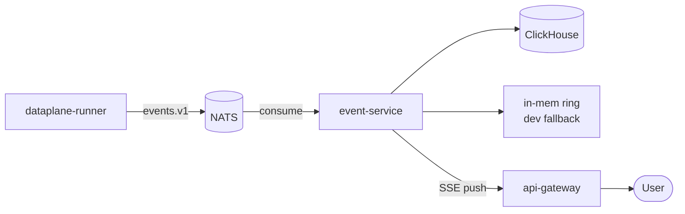

# event-service

> **The event tier.** Consumes `events.v1` from the bus, persists to
> ClickHouse, and serves the realtime SSE feed.

`event-service` is the only consumer of the `events.v1` subject. It does
two things:

1. **Persist** — every event lands in ClickHouse, partitioned by
   `(tenant_id, ts)`. Backed by the ClickHouse Operator (3×2 replicated).
2. **Push** — every event fans out to a per-tenant SSE subscriber set so
   the console and tenant SDKs get realtime updates.

In `AEGIS_EMBED_NATS=true` dev mode, it embeds a NATS server so the
walking-skeleton runs with zero external dependencies.

---

## Position



---

## API surface

### gRPC

- `ListEvents(ListEventsRequest) returns (ListEventsResponse)`
- `GetEvent(GetEventRequest) returns (Event)`

### HTTP (proxied by api-gateway)

- `GET /v1/events` — cursor-paginated list.
- `GET /v1/events:stream` — SSE feed.

The SSE stream supports `?stream_id=...`, `?since=...`, and
`Last-Event-Id` for resumption.

---

## Storage

```sql
CREATE TABLE events ON CLUSTER aegis (
  event_id        String,
  tenant_id       String,
  stream_id       String,
  pipeline_id     String,
  ts              DateTime64(3),
  kind            Enum('DETECTION', 'RULE', 'DWELL', 'COUNT', 'INFER'),
  severity        Enum('INFO', 'LOW', 'MEDIUM', 'HIGH', 'CRITICAL'),
  payload         String,
  trace_id        String,
  frame_urn       String
) ENGINE = ReplicatedMergeTree(...)
PARTITION BY (tenant_id, toYYYYMMDD(ts))
ORDER BY (tenant_id, stream_id, ts, event_id);
```

`frame_urn` is the **claim-check URN** — never the bytes themselves
(ADR-0008).

Retention policy is per-tenant, configurable via `media-service`'s
retention objects.

---

## SSE fan-out

In-process, no external pub/sub. Each subscription is a goroutine with
a bounded channel; producers drop on overflow with a metric increment.

```go
type subscriber struct {
    tenantID string
    streamID string  // "" = all
    out      chan Event
}
```

The hub is `internal/hub`. It supports thousands of concurrent
subscribers per pod; for high fan-out, scale `event-service` horizontally
(consumer group on NATS).

---

## Dev mode

```bash
AEGIS_EMBED_NATS=true task run:event-service
# Prints: embedded NATS listening on nats://127.0.0.1:54321
```

Embedded NATS is **dev-only**. The production deployment uses a 3-replica
JetStream cluster.

---

## Configuration

| Var | Purpose | Required in prod |
| --- | --- | --- |
| `AEGIS_NATS_URL` | Bus. | yes |
| `AEGIS_CLICKHOUSE_DSN` | ClickHouse target. | yes |
| `AEGIS_EMBED_NATS` | Dev only. | no |
| `AEGIS_RING_SIZE` | In-memory ring fallback size. | `4096` |
| `AEGIS_SSE_BUFFER_PER_SUB` | Per-subscriber buffer. | `64` |

---

## Metrics

- `aegis_events_consumed_total{tenant}` — bus consume rate.
- `aegis_events_persist_duration_seconds` — ClickHouse insert duration.
- `aegis_events_sse_subscribers{tenant}` — concurrent subscribers.
- `aegis_events_sse_drop_total{tenant}` — overflow drops.
- `aegis_events_ring_size` — in-mem ring length.

---

## Failure modes

| Failure | Effect | Mitigation |
| --- | --- | --- |
| ClickHouse unavailable | Persist 503; events buffered in NATS | JetStream durable consumer; replay on recovery. |
| NATS unavailable | Consume stops | JetStream cluster + chaos drill. |
| SSE backpressure | Subscriber dropped + metric | Tenant SDK reconnects with `Last-Event-Id`. |
| Embed-NATS in prod | Refused at startup if `AEGIS_ENV=production` | Code check. |

---

## See also

- [`../dataplane-runner/README.md`](../dataplane-runner/README.md) — producer.
- [`../realtime-hub/README.md`](../realtime-hub/README.md) — WebSocket alternative for high-fan-out clients.
- [`ARCHITECTURE.md`](../../ARCHITECTURE.md) — event tier.
