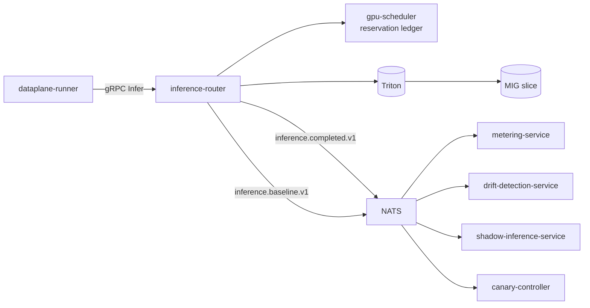

# inference-router

> **The GPU front door.** Routes inference requests to NVIDIA Triton
> Inference Server over the KServe v2 protocol, applies per-tenant
> model allow-lists, surfaces Triton response-cache hits, and publishes
> `inference.*` events for downstream consumers (metering, drift,
> canary, shadow).

For the platform's Triton operating manual see
[`docs/triton.md`](../../docs/triton.md); for the production runbook
see [`docs/runbooks/triton.md`](../../docs/runbooks/triton.md).



---

## gRPC API

```
Infer(InferRequest) returns (InferResponse);
ListModels(...) returns (...);
GetModelHealth(...) returns (...);
```

`InferRequest`:

```protobuf
message InferRequest {
  string tenant_id = 1;
  string frame_urn = 2;          // claim-check URN
  string model = 3;              // model name
  string version = 4;            // model version
  google.protobuf.Struct params = 5;
}
```

`InferResponse`:

```protobuf
message InferResponse {
  repeated Detection detections = 1;
  google.protobuf.Duration latency = 2;
  string model_id = 3;
}
```

---

## What happens on every Infer

1. **Tenant allow-list check.** Reject if the tenant cannot use the
   model. 403 problem+json.
2. **GPU reservation.** Ask `gpu-scheduler` for a MIG slice. 503 if
   unavailable.
3. **Triton call** over the KServe v2 protocol. The platform client
   pools HTTP connections, retries with exponential backoff + jitter
   on 5xx + transient network errors, surfaces response-cache hits via
   `LastStats().CacheHit`, and emits an OpenTelemetry span around
   every `ModelInfer`.
4. **Publish `inference.completed.v1`** — for metering + drift +
   cost-accounting. Carries `cache_hit` so metering can credit cached
   calls.
5. **Publish `inference.baseline.v1`** — for shadow-inference-service
   (same URN, baseline model identity).
6. **Return** detections.

If the tenant has a canary plan attached to the model, the router
splits traffic between baseline and candidate per the plan
(`pkg/canary`). On the candidate path it publishes
`inference.outcome.v1` for the canary-controller.

---

## Bus subjects published

| Subject | Trigger | Consumer |
| --- | --- | --- |
| `inference.completed.v1` | every successful Infer | metering, drift, cost-accounting |
| `inference.baseline.v1` | every successful Infer | shadow-inference-service |
| `inference.outcome.v1` | every canary candidate response | canary-controller |

(All three were verified by `tools/integration/TestSmoke_PlatformBusSubjects` —
the test asserts each has both producer and consumer.)

---

## Configuration

| Var | Purpose | Required in prod |
| --- | --- | --- |
| `AEGIS_TRITON_URL` | NVIDIA Triton Inference Server base URL. | yes |
| `AEGIS_TRITON_TIMEOUT_SEC` | Per-Triton-request timeout (incl. retries). | default `5` |
| `AEGIS_TRITON_MAX_RETRIES` | Triton retries on 5xx + transient network errors. | default `2` |
| `AEGIS_GPU_SCHEDULER_URL` | gpu-scheduler gRPC. | yes |
| `AEGIS_NATS_URL` | Bus. | yes |
| `AEGIS_INFER_TIMEOUT` | Per-request deadline (caller-visible). | `2s` |
| `AEGIS_DETECTOR_FALLBACK` | `synthetic` in dev. | empty |

---

## Dev mode

In dev, `AEGIS_TRITON_URL=synthetic://localhost` returns a fixed
"person at (0.5, 0.5)" detection with 0.95 confidence. Use this when
testing the data plane end-to-end without GPUs.

---

## Metrics

- `aegis_inference_requests_total{tenant,model,status}` — rate.
- `aegis_inference_latency_seconds{model}` — duration.
- `aegis_inference_gpu_reservation_wait_seconds` — scheduler wait.
- `aegis_inference_canary_split_total{tenant,model,arm}` — A/B split.
- `aegis_inference_published_total{subject}` — bus publish rate.

---

## Failure modes

| Failure | Effect | Mitigation |
| --- | --- | --- |
| Triton 5xx | 503 + retry | Per-tenant retry budget; circuit breaker. |
| GPU OOM | 503 from scheduler | Reservation ledger refuses; chaos `gpu-oom-reject.yaml`. |
| Triton model evicted | cold start latency | Prefetch service + retry once. |
| NATS down (publish) | metering counts drop | Local outbox; replay on recovery. |

---

## See also

- [`../gpu-scheduler/README.md`](../gpu-scheduler/README.md) — the reservation ledger.
- [`../canary-controller/README.md`](../canary-controller/README.md) — canary plans.
- [`ARCHITECTURE.md`](../../ARCHITECTURE.md) — data plane + adaptive autonomy.
