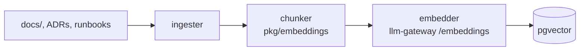

# knowledge-service

> **The RAG corpus.** Owns the indexed knowledge the agent cites from.
> ADR-0020.

`knowledge-service` ingests:

- `docs/` — every markdown doc in this repo.
- `docs/adr/` — Architecture Decision Records.
- `docs/runbooks/` — operational runbooks.
- Per-tenant uploaded docs (optional).

It chunks, embeds (`pkg/embeddings`), stores in pgvector, and exposes
a retrieval API. The agent's `query_knowledge` tool returns snippets
with their source path; the agent **must** cite, or the runtime
surfaces an error (ADR-0020).

---

## API

- `POST /v1/knowledge:query` — text query → top-k cited snippets.
- `POST /v1/knowledge:ingest` — explicit re-ingest of a path.
- `GET /v1/knowledge/index` — index stats.

Query response:

```json
{
  "snippets": [
    {
      "text": "MIG is the default GPU sharing mode for production inference. …",
      "source": "docs/adr/0003-mig-default.md",
      "score": 0.91
    },
    …
  ],
  "trace_id": "…"
}
```

---

## Indexing



Chunking is markdown-aware: it preserves headings as context and keeps
chunks ≤ 1200 tokens. Embeddings are produced via `llm-gateway`'s
`/v1/embeddings` endpoint (ADR-0018 — no raw LLM/embed calls
anywhere else).

---

## Configuration

| Var | Purpose |
| --- | --- |
| `AEGIS_PG_DSN` | pgvector-enabled Postgres. |
| `AEGIS_LLM_GATEWAY_URL` | embedder source. |
| `AEGIS_KNOWLEDGE_INGEST_PATHS` | Comma-separated paths to ingest at boot. |
| `AEGIS_KNOWLEDGE_INGEST_INTERVAL` | Re-ingest cadence. Default `1h`. |

---

## Metrics

- `aegis_knowledge_queries_total{tenant}` — rate.
- `aegis_knowledge_top_k_score` — histogram of top-k scores.
- `aegis_knowledge_index_size_chunks` — gauge.
- `aegis_knowledge_ingest_duration_seconds{path}` — duration.

---

## Failure modes

| Failure | Effect | Mitigation |
| --- | --- | --- |
| Embedder down | Query falls back to BM25 | Hybrid retrieval. |
| Stale index | Citation says "as of …" date | Periodic re-ingest. |
| Tenant doc missing | 404 | Surface clearly. |

---

## See also

- [`../agent-service/README.md`](../agent-service/README.md) — only caller of `:query`.
- [`../../pkg/embeddings/README.md`](../../pkg/embeddings/README.md) — vector store + chunker.
- ADR-0020.
