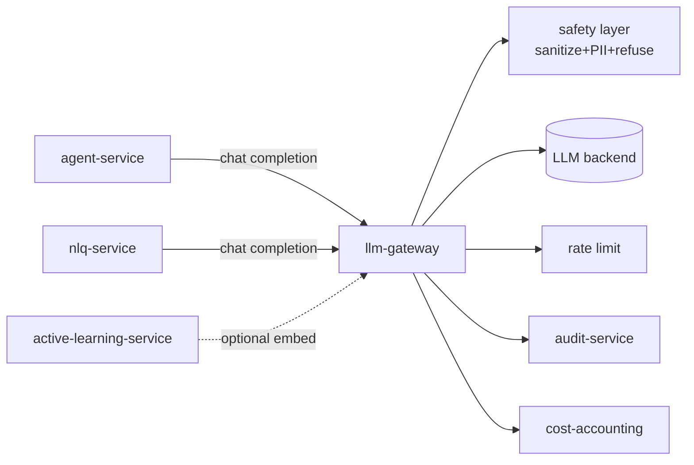
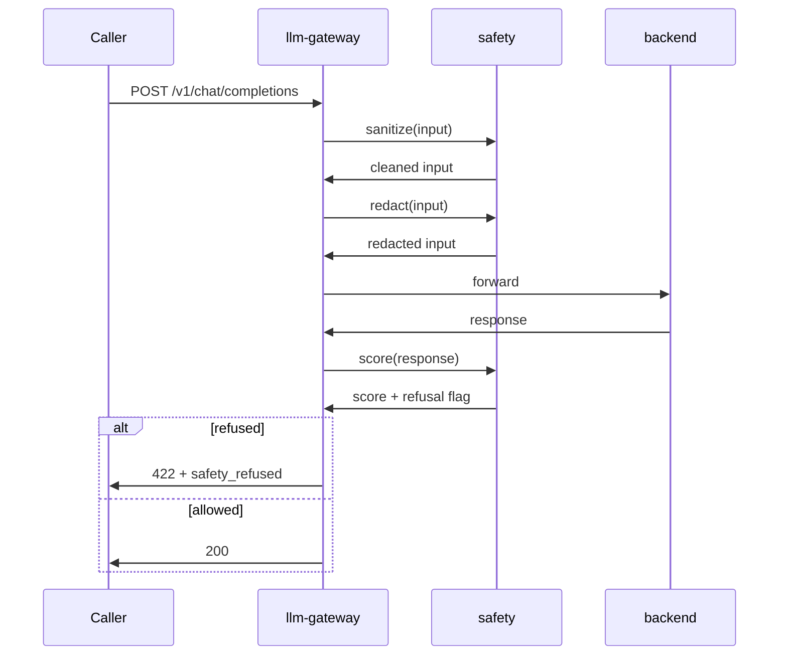

# llm-gateway

> **The one LLM endpoint.** Every LLM / VLM call in AegisVision goes
> through here. ADR-0018.

`llm-gateway` exposes an **OpenAI-compatible** internal endpoint and
adapts it to whichever backend you wire (vLLM, hosted OpenAI/Anthropic/
Bedrock-with-shim, or Triton+TRT-LLM). Callers don't know which.

It applies the **safety layer** (`pkg/llm/safety`) on every request:

1. **Sanitizer** — strips control characters, normalises whitespace,
   removes ANSI escapes, caps input size.
2. **PII redactor** — removes emails, phone numbers, SSNs (configurable
   per tenant; default on).
3. **Refusal threshold** — score the response; refuse if below the
   threshold.

Plus **token accounting** (publishes to `cost-accounting`), **per-tenant
rate limiting**, and **audit on every prompt + response**.

---

## Position



---

## API

OpenAI-compatible. The contract is exactly OpenAI v1, so any client
library works without code changes (LangChain, the OpenAI SDK, etc.).

- `POST /v1/chat/completions`
- `POST /v1/embeddings`
- `POST /v1/moderations`

All requests require `X-Aegis-Tenant` header. The platform's
`Idempotency-Key` is honoured.

---

## Why one gateway

Six reasons. Each is load-bearing.

1. **Safety in one place.** A bug fix in `pkg/llm/safety` fixes every LLM caller.
2. **Token accounting in one place.** Per-tenant accounting.
3. **Rate limit in one place.** Per-tenant + per-model.
4. **Backend swap.** Future model providers don't touch agent/nlq/active-learning code.
5. **Audit in one place.** Every prompt + response → audit-service.
6. **Refusal in one place.** A single refusal threshold across the platform.

---

## Configuration

`llm-gateway` **refuses to start** in `AEGIS_ENV=production` without:

| Var | Purpose |
| --- | --- |
| `AEGIS_LLM_BACKEND_URL` | OpenAI-compatible upstream. |
| `AEGIS_LLM_BACKEND_API_KEY_SECRET` | File path to API key. |

Optional:

| Var | Default |
| --- | --- |
| `AEGIS_LLM_REFUSAL_THRESHOLD` | `0.8` |
| `AEGIS_LLM_PII_REDACT` | `true` |
| `AEGIS_LLM_RATE_PER_TENANT_RPM` | `60` |
| `AEGIS_LLM_MAX_INPUT_TOKENS` | `32768` |
| `AEGIS_LLM_REQUEST_TIMEOUT` | `30s` |
| `AEGIS_NATS_URL` | for cost-accounting + audit |

---

## Dev mode

`AEGIS_ENV=dev` uses a **fake echo backend** (`pkg/llm/fake.go`) that
returns deterministic responses. Useful when iterating on the agent
loop without spending tokens.

```bash
AEGIS_ENV=dev task run:llm-gateway
```

---

## Safety layer details



The refusal threshold is documented in
[`docs/llm-gateway.md`](../../docs/llm-gateway.md).

---

## Metrics

- `aegis_llm_requests_total{tenant,model,status,refused}`
- `aegis_llm_tokens_total{tenant,model,direction}` — `direction` ∈ {prompt, completion}
- `aegis_llm_request_duration_seconds{model}`
- `aegis_llm_safety_refusals_total{tenant,reason}`
- `aegis_llm_rate_limited_total{tenant}`

---

## Failure modes

| Failure | Effect | Mitigation |
| --- | --- | --- |
| Backend timeout | 504; metric | Chaos `llm-gateway-timeout.yaml`. Agent retries with backoff. |
| Backend 5xx | 502 + retry budget | Per-tenant retry; circuit breaker. |
| Safety refused | 422 to caller | Audit record + metric. |
| `AEGIS_LLM_BACKEND_URL` unset in prod | panic at startup | Code check. |

---

## See also

- [`../agent-service/README.md`](../agent-service/README.md) — the largest caller.
- [`../../pkg/llm/README.md`](../../pkg/llm/README.md) — client + safety library.
- [`docs/llm-gateway.md`](../../docs/llm-gateway.md) — design notes.
- ADR-0018 — uniformity decision.
- ADR-0021 — prompt-injection defense.
