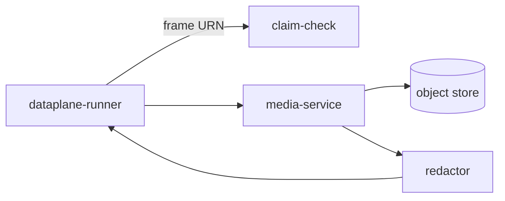

# media-service

> **Recordings + clips + retention policies.** Crypto-shredded per
> tenant key.

`media-service` owns:

- **Recordings** — continuous video for a stream, segmented by time.
- **Clips** — short event-bracketed video segments.
- **Retention policies** — per-tenant TTL + redaction rules.

Storage is object store, encrypted with the **tenant's Vault transit
key**. Destroying the key renders the bytes unreadable
(crypto-shredding, ADR-0014).

---

## Redaction

If a tenant's policy demands redaction (face blur, license plate
blur), `media-service` invokes the redactor *before* writing the
clip. **Even when the redaction operator is not on the DAG**, the
dataplane will **refuse to emit raw-imagery sinks** for tenants whose
policy demands redaction. This refusal is in code.

---

## API

- `POST /v1/media/clips` — request a clip around an event.
- `GET /v1/media/clips/{id}` — get signed download URL.
- `GET /v1/media/recordings` — list recordings.
- `POST /v1/media/retention-policies` — set per-tenant retention.

---

## See also

- ADR-0014.
