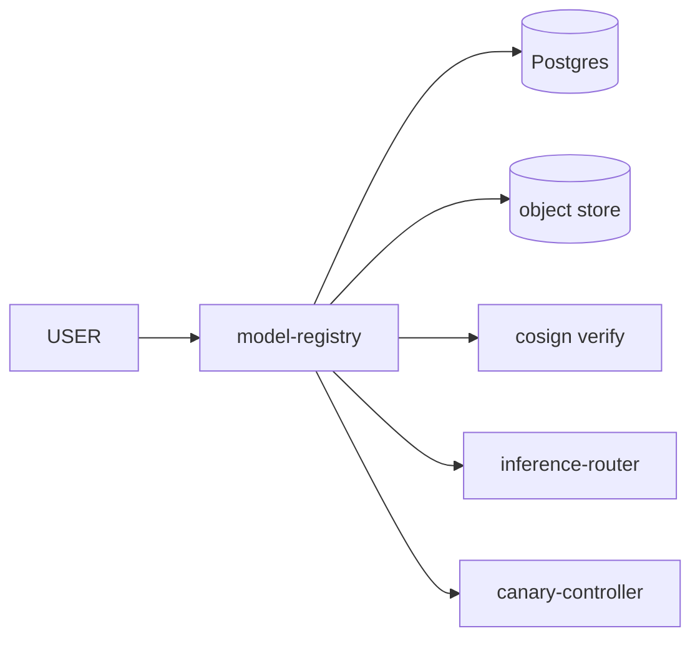

# model-registry

> **Versioned model artifacts + canary planning.**

`model-registry` owns:

- Model identities + versions.
- Cosign-signed artifacts (in object storage).
- Per-model **reference distribution** (for drift detection, ADR-0025).
- Canary plans (delegated execution to `canary-controller`).
- Per-tenant model allow-lists.



---

## API

```
POST /v1/models                  Register a new model.
GET  /v1/models                  List.
GET  /v1/models/{id}             Read.
POST /v1/models/{id}/versions    Add a version.
POST /v1/models/{id}/promote     (Gated) Promote a candidate.
GET  /v1/models/{id}/distribution    Reference distribution.
```

`POST /v1/models/{id}/promote` requires a resolved gate from
`policy-gate-service`. There is **no force-promote endpoint** (ADR-0023).

---

## Storage

Postgres metadata + object-store artifacts. Artifacts have cosign
signatures; loading them through `inference-router` verifies the
signature against the platform's signer key.

---

## See also

- [`../canary-controller/README.md`](../canary-controller/README.md).
- [`../inference-router/README.md`](../inference-router/README.md).
- ADR-0023.
