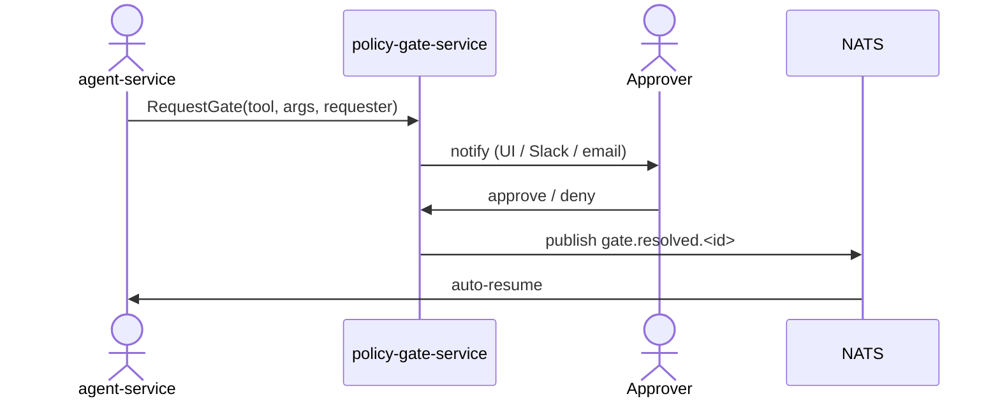

# policy-gate-service

> **Human-in-the-loop approval gate.** ADR-0014, ADR-0017.
>
> When the agent runtime is about to execute a **tier-3** tool
> (`promote_model`, `override_retention`, `force_failover`, …), it
> *cannot* proceed without an approval routed through here.

The gate is **synchronous from the agent's perspective**: the tool
call doesn't return until the gate resolves. The agent runtime
implements this by subscribing to `gate.resolved.<id>` and resuming
the session.

---

## API

- `POST /v1/gates` — open a gate (called by agent-service).
- `POST /v1/gates/{id}:approve` — approver action.
- `POST /v1/gates/{id}:deny` — approver action.
- `GET /v1/gates/{id}` — inspect status.
- `GET /v1/gates` — list pending gates.

Approver identity is verified against the JWT; the approver must have
the platform role permitted for the requested tool tier.

---

## Audit

**Every** gate request, approval, and denial writes an audit record
via `audit-service`. The chain is hash-linked. ADR-0014 mandates
that audit *failures* count too — if `audit-service` is unreachable,
the gate refuses to resolve.

---

## Configuration

| Var | Purpose |
| --- | --- |
| `AEGIS_PG_DSN` | Postgres DSN for gate state. |
| `AEGIS_AUDIT_URL` | Audit-service base URL. |
| `AEGIS_NATS_URL` | For `gate.resolved.>` publish. |
| `AEGIS_NOTIFY_SLACK` | Slack webhook for approver pings. |
| `AEGIS_GATE_TIMEOUT` | Max time pending before auto-deny. Default `4h`. |

---

## Failure modes

| Failure | Effect | Mitigation |
| --- | --- | --- |
| Audit service down | Gate refuses to resolve | **by design** — fail-closed. |
| NATS down | Auto-resume blocked | Agent polls `/v1/gates/{id}` as fallback. |
| Approver overload | Backlog | Per-tool rate limit on requests. |

---

## See also

- [`../agent-service/README.md`](../agent-service/README.md) — caller.
- [`../audit-service/README.md`](../audit-service/README.md) — audit sink.
- ADR-0014, ADR-0017.
