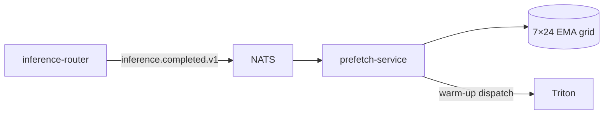

# prefetch-service

> **Predictive model warm-up.** 7×24 EMA grid; warm-ups dispatched at
> horizon ahead of expected demand. ADR-0026.

`prefetch-service` watches `inference.completed.v1` and maintains a
per-(tenant, model) **7×24 grid of exponentially-moving-averaged
demand**. The grid records "how often this model was used at this
hour-of-week."

A scheduler dispatches **model warm-ups** to Triton at a configurable
horizon ahead of expected demand — typically 10 minutes. The warm-up
loads the model into a MIG slice so the first real request doesn't
pay cold-start latency.

---

## Why EMA, not raw counts

Tenants drift. A stream that ran at 14:00 last Tuesday may not run at
14:00 this Tuesday. EMA with a half-life of ~2 weeks weights recent
behaviour without ignoring the longer pattern.

---

## Configuration

| Var | Purpose |
| --- | --- |
| `AEGIS_NATS_URL` | Bus. |
| `AEGIS_TRITON_URL` | Warm-up target. |
| `AEGIS_PREFETCH_HORIZON` | Lookahead. Default `10m`. |
| `AEGIS_PREFETCH_EMA_ALPHA` | EMA smoothing. Default `0.1`. |
| `AEGIS_PREFETCH_THRESHOLD` | Min predicted demand. Default `1.0` (call per cell). |

---

## Metrics

- `aegis_prefetch_warmups_dispatched_total{tenant,model}`
- `aegis_prefetch_cold_start_avoided_total{tenant,model}` — estimated.
- `aegis_prefetch_grid_cells{tenant,model}` — gauge.

---

## See also

- [`../inference-router/README.md`](../inference-router/README.md).
- ADR-0026.
