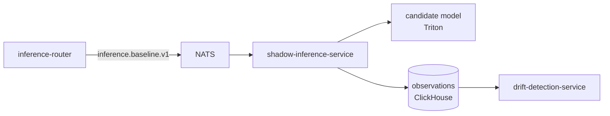

# shadow-inference-service

> **Same-URN candidate-vs-baseline comparator.** ADR-0024.
>
> Shadow inference never publishes a tenant-facing detection. Only
> observations + metrics.



For every successful Infer, `inference-router` publishes
`inference.baseline.v1` (the URN + baseline model + baseline result).
`shadow-inference-service` runs the candidate against the **same URN**,
compares against the baseline, and records the comparison.

The candidate result **never reaches the tenant.** Only the comparison
metric flows downstream.

---

## Why same-URN

Because comparing two different frames tells you nothing about model
quality. To know "does the candidate detect what the baseline detects
on the same image?" you must run both against the same bytes. The
claim-check store (`pkg/dataplane/claimcheck`) makes this possible.

---

## Comparison record

```json
{
  "frame_urn": "cc://t-7/s-1/seq-94312",
  "baseline_model": "my-model-v1",
  "candidate_model": "my-model-v2",
  "iou_bbox_mean": 0.84,
  "class_agreement": 0.91,
  "candidate_added": ["forklift"],
  "candidate_dropped": [],
  "latency_delta_ms": 2.1
}
```

---

## Configuration

| Var | Purpose |
| --- | --- |
| `AEGIS_NATS_URL` | Bus. |
| `AEGIS_TRITON_URL` | Candidate-model server. |
| `AEGIS_CLICKHOUSE_DSN` | Observation sink. |
| `AEGIS_SHADOW_BUDGET_RPS` | Per-tenant rate cap (default 100). |

---

## Metrics

- `aegis_shadow_comparisons_total{tenant,model_pair,outcome}`
- `aegis_shadow_iou_mean{model_pair}`
- `aegis_shadow_class_agreement{model_pair}`
- `aegis_shadow_latency_delta_seconds{model_pair}`

---

## See also

- [`../canary-controller/README.md`](../canary-controller/README.md) — sibling.
- [`../drift-detection-service/README.md`](../drift-detection-service/README.md) — consumer of comparison records.
- ADR-0024.
