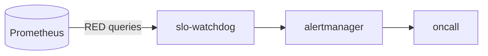

# slo-watchdog

> **Multi-window burn-rate SLO monitoring.** Google SRE workbook
> implementation. ADR-0025.

`slo-watchdog` evaluates Service Level Objectives against a
short-window (fast) and long-window (slow) burn rate. When *both*
burn rates exceed thresholds, it pages. False-positive resistant by
design.

---

## SLOs configured by default

- **Glass-to-event** p95 < 300 ms.
- **api-gateway** availability > 99.9% / month.
- **Inference latency** p95 < 500 ms.
- **LLM gateway** availability > 99.5%.
- **Event durability** zero loss (Kafka durable).

Each is configured in `internal/config/slos.yaml`.

---

## Burn-rate math

Standard MWMBR (Multi-Window, Multi-Burn-Rate):

- Fast window: 1h.
- Slow window: 6h.
- Page if both: fast_burn > 14.4 AND slow_burn > 6.
- Ticket if both: fast_burn > 1 AND slow_burn > 1 for 12h.

---

## Metrics

- `aegis_slo_burn_rate_1h{slo}` — gauge.
- `aegis_slo_burn_rate_6h{slo}` — gauge.
- `aegis_slo_alerts_total{slo,severity}` — counter.

---

## See also

- [`docs/runbooks/incident-response.md`](../../docs/runbooks/incident-response.md).
- ADR-0025.
