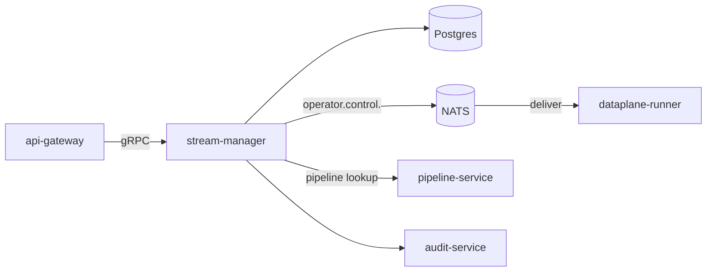

# stream-manager

> **Owns stream lifecycle and dispatches control to the data plane.**
>
> A stream is "a thing producing frames over time": a camera feed, a
> recorded file, an RTSP URL, a WebRTC connection. `stream-manager`
> turns a stream resource into a running operator DAG in the data plane.

---

## Position in the architecture



When a stream is created, `stream-manager`:

1. Validates the stream config + the referenced pipeline revision.
2. Persists the stream + claims a deterministic shard.
3. Publishes `operator.control.<shard>` `StartStream` on NATS.
4. Waits for ack (or times out).
5. Returns 201 to the caller.

---

## gRPC API

```
ListStreams(...);
GetStream(...);
CreateStream(...);
UpdateStream(...);
DeleteStream(...);
PauseStream(...);
ResumeStream(...);
```

`CreateStream` payload:

```json
{
  "name": "dock-1",
  "project_id": "p1",
  "protocol": "rtsp",
  "url": "rtsp://camera-7/stream",
  "pipeline_id": "pl_abc",
  "pipeline_revision_id": "rev_xyz",
  "tags": {"site":"warehouse"}
}
```

---

## Sharding

Streams shard deterministically by `hash(tenant_id, stream_id) mod N`,
where `N = AEGIS_DATAPLANE_SHARDS`. Each shard is one NATS subject
suffix: `operator.control.0`, `operator.control.1`, ...

Each dataplane-runner pod subscribes to one or more shards. Adding a
runner pod expands shard coverage; the manager re-computes via a
stable consistent-hashing ring.

---

## Configuration

| Var | Purpose | Required in prod |
| --- | --- | --- |
| `AEGIS_PG_DSN` | Postgres DSN. | yes |
| `AEGIS_NATS_URL` | Bus. | yes |
| `AEGIS_PIPELINE_SERVICE_ADDR` | gRPC target. | yes |
| `AEGIS_DATAPLANE_SHARDS` | Shard count. | yes, default 16 |
| `AEGIS_STREAM_START_TIMEOUT` | Ack timeout. | default `15s` |

---

## Failure modes

| Failure | Effect | Mitigation |
| --- | --- | --- |
| NATS down | CreateStream times out | Buffer in DB; reconcile on NATS recovery. |
| Pipeline lookup fails | 400 | Cache pipeline revisions for 5 min. |
| Runner doesn't ack | 503 + audit | Reconcile loop retries every 30s. |
| Shard reassignment | brief pause | StatefulSet ordering; graceful drain. |

---

## Metrics

- `aegis_stream_active_streams{tenant,shard}` — gauge.
- `aegis_stream_starts_total{tenant,status}` — rate.
- `aegis_stream_start_duration_seconds{status}` — duration.
- `aegis_stream_reconcile_drift_total{shard}` — discrepancy gauge.

---

## See also

- [`../dataplane-runner/README.md`](../dataplane-runner/README.md) — consumer of `operator.control`.
- [`../../pkg/dataplane/README.md`](../../pkg/dataplane/README.md) — operator runtime.
- [`ARCHITECTURE.md`](../../ARCHITECTURE.md) — two-plane separation.
