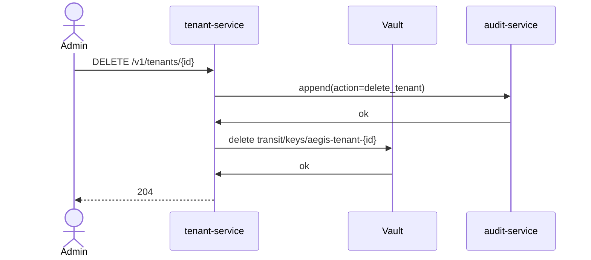

# tenant-service

> **Tenants, projects, members, RBAC.**

`tenant-service` owns the resource hierarchy:

```
Tenant
 └─ Project
     ├─ Member (role: owner | admin | operator | viewer)
     └─ Resources (pipelines, streams, models, datasets, …)
```

Plus per-tenant entitlements (plan, model allow-list, retention,
encryption-key reference).

---

## API

```
POST /v1/tenants                Create.
GET  /v1/tenants/{id}           Read.
PATCH /v1/tenants/{id}          Update.
DELETE /v1/tenants/{id}         Crypto-shred (fail-closed audit).
GET  /v1/tenants/{id}/projects
POST /v1/tenants/{id}/projects
GET  /v1/tenants/{id}/members
POST /v1/tenants/{id}/members
```

---

## Onboarding

Creating a tenant kicks off:

1. **Vault transit key** — generated via the Vault provider.
2. **KMS key** — for SSE on storage (S3, ClickHouse).
3. **Namespace template** — `aegis-tenant-<id>` if isolated.
4. **Audit record** — fail-closed.

---

## Crypto-shredding (ADR-0014)



After this point, every encrypted blob for the tenant — in
ClickHouse, Postgres, object store, **including backups** — is
unreadable.

---

## See also

- [`../audit-service/README.md`](../audit-service/README.md).
- ADR-0014.
