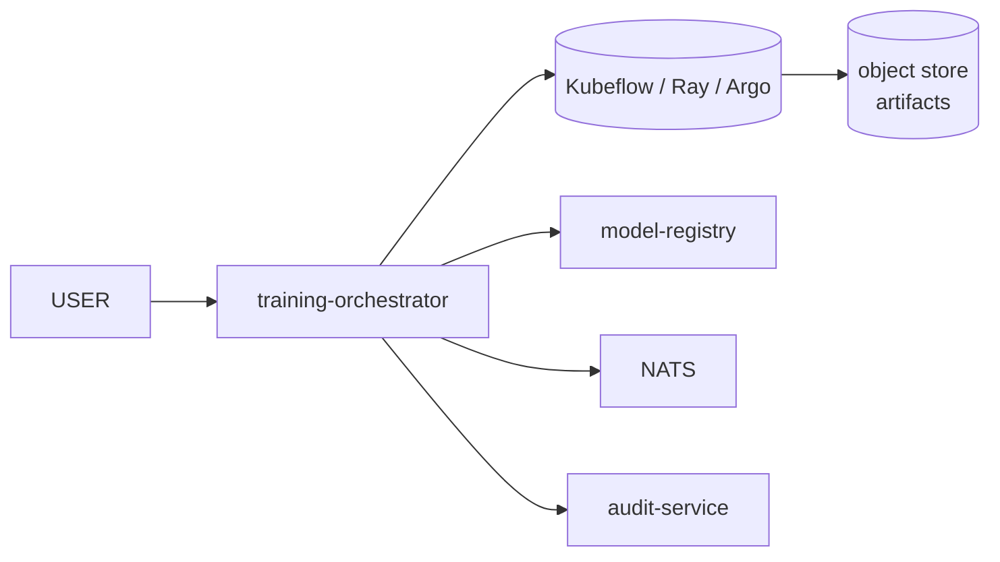

# training-orchestrator

> **Wraps training jobs.** Kubeflow / Ray / Argo Workflows; the API is the
> same.

`training-orchestrator` accepts training requests, dispatches them to
the configured execution backend, records artifacts in
`model-registry`, and emits `training.completed.v1` on the bus.



---

## API

```
POST /v1/training-jobs                Start.
GET  /v1/training-jobs                List.
GET  /v1/training-jobs/{id}           Read.
POST /v1/training-jobs/{id}:cancel    Cancel.
```

Request body:

```json
{
  "dataset_id": "ds_abc",
  "dataset_version": "v3",
  "base_model": "yolov8n",
  "hyperparameters": { … },
  "gpu_request": "1xA100-40g",
  "tags": {"experiment":"q4-2026"}
}
```

---

## Lineage

`training-orchestrator` records:

- `dataset_id` + `dataset_version` (from dataset-service).
- `label_policy_revision` (from annotation-service).
- `base_model` (from model-registry).
- `result_model` (artifact URN).
- `metrics` (final eval metrics).

This is the input to `model-registry`'s lineage view.

---

## See also

- [`../dataset-service/README.md`](../dataset-service/README.md).
- [`../model-registry/README.md`](../model-registry/README.md).
- [`../active-learning-service/README.md`](../active-learning-service/README.md).
