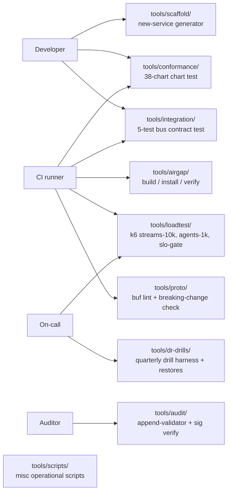
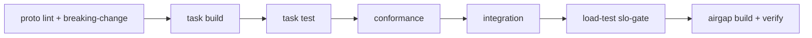

# tools/

> **Operational tooling that lives outside the runtime services.**
>
> These are not platform components. They are the *toolbox* — bundle the
> world for offline install, run the conformance test, fire chaos drills,
> exercise the SLO gate, restore from backup, scaffold a new service.



---

## Contents

| Tool | Purpose |
| --- | --- |
| [`airgap/`](./airgap) | Build, verify, install the air-gapped bundle. ADR-0027. |
| [`audit/`](./audit) | Audit-log append validator + cosign signature verifier. |
| [`conformance/`](./conformance) | Helm-chart shape test (every chart conforms to the platform contract). |
| [`dr-drills/`](./dr-drills) | Quarterly DR drill harness + per-component restore scripts (Postgres, ClickHouse, Vault, NATS JetStream, chaos attestation). |
| [`integration/`](./integration) | Cross-service contract smoke test (bus subjects, wildcards, gate round-trip, LLM safety). |
| [`loadtest/`](./loadtest) | k6 load tests: streams-10k, agents-1k, SLO gate, api-gateway smoke. |
| [`proto/`](./proto) | Buf lint + breaking-change check for `/proto`. |
| [`scaffold/`](./scaffold) | Generate a new service scaffold (cmd/internal/Helm/ArgoCD/go.work). |
| [`scripts/`](./scripts) | Miscellaneous operational scripts. |

---

## Run order in CI



Each step blocks the next. A red `conformance` test stops the pipeline
before any cluster work happens.

---

## Quick reference

```bash
# Build the air-gapped bundle.
./tools/airgap/build.sh --version 0.5.0 \
    --registry-out ghcr.io/hoangsonww \
    --output dist/aegisvision-airgap-0.5.0.tar.zst

# Run the chart conformance test.
(cd tools/conformance && go test -count=1 ./...)

# Run the cross-service integration smoke.
(cd tools/integration && go test -race -count=1 ./...)

# Run the streams-10k load test against staging.
k6 run tools/loadtest/streams-10k.js --env BASE=https://staging.example.com

# Run the SLO gate (fail-the-build).
k6 run tools/loadtest/slo-gate.js

# Run the quarterly DR drill.
./tools/dr-drills/run-quarterly.sh

# Verify the audit-log chain.
./tools/audit/verify.sh --since 2026-01-01

# Lint + breaking-change-check protobuf.
(cd tools/proto && ./check.sh)

# Scaffold a new service.
./tools/scaffold/new-service.sh my-thing-service
```

---

## Conventions

- Tools that have a `go.mod` are independent modules and are listed in `go.work`.
- Shell scripts use `set -euo pipefail` at the top. No `set +e` anywhere.
- Scripts that need destructive permissions (DR restores, cosign signing, image pushes) print a clear "DRY RUN" banner and require `--apply` to actually do the work.
- Output is machine-readable on stdout (`jq`-friendly) and human-readable on stderr.
